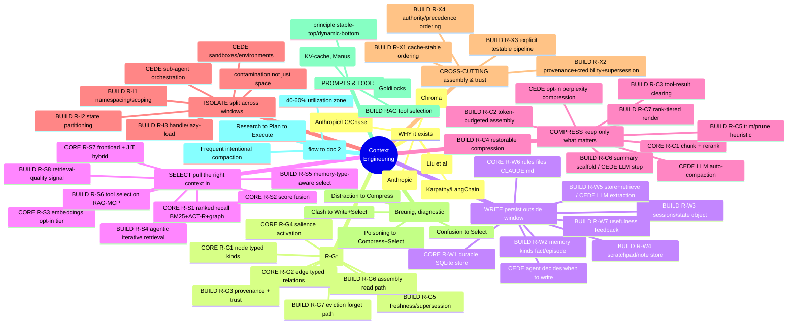

# The Context-Engineering Tree (doc #1) — the mental model

> **What this is.** One legible map of *what context engineering (CE) is, as of mid-2026* —
> the whole story at a glance, organized with the **four core primitives (Write / Select /
> Compress / Isolate) as the trunk**. Everything related branches off, each with a 1–2 line
> description. Every leaf is **marked** for what it means to litectx (build map below), so
> this tree directly **drives the litectx PRD requirements** (doc #3).
>
> **Method (the whole point).** *Derive specs from the leaders in CE, not from guesses.*
> Every claim is grounded in the primary sources the field's leaders published (Anthropic,
> LangChain, Chroma, Drew Breunig, Manus, Google ADK, Slack, OpenAI, HumanLayer, the arXiv
> papers). Where leaders **differ**, we show the breakdown **per author** rather than
> collapsing to one. Where the source video ([`ctx-ifra.md`](ctx-ifra.md)) diverged from the
> primary sources, the source wins and the gap is logged in [§7](#7-corrections-ledger).
>
> **Companions:** [`ce-flow.md`](ce-flow.md) (doc #2 — the **recommended flows**: how the
> leaders flow work, every behavior mapped to the four primitives). **Source transcript:**
> [`ctx-ifra.md`](ctx-ifra.md) (kept intact; its flows are mirrored into doc #2).

---

## 0. Legend — how to read every leaf (this is also the build map)

| Mark | Meaning | Drives |
|---|---|---|
| 🧩 **CORE** | already in litectx's scope/plan (the code+context memory engine) | PRD: confirm |
| 🔧 **BUILD** | a CE primitive/tool litectx must *add* to become the comprehensive CE lib | **PRD requirement** |
| ⊘ **CEDE** | deliberately out of scope — belongs to the harness / bareagent / bareguard | **PRD non-goal** |
| *(plain)* | a concept, principle, or empirical finding — explains *why*, nothing to build | context only |

Read the **🔧 + 🧩** leaves as the litectx requirement list, the **⊘** leaves as the
non-goals. A leaf can be split (`🔧 store / ⊘ the LLM step`) — litectx owns the
deterministic substrate; the probabilistic/orchestration half is ceded. Many techniques
serve **two primitives**; cross-links are stated, not forced.

```
Context Engineering  (the mental model)
├── WHY it exists ............... the problem the four primitives solve        → §1
├── FOUNDATION ................. the context graph the primitives ride on (R-G*) → §3.0
├── WRITE ...................... persist context OUTSIDE the window            → §3.1
├── SELECT ..................... pull the RIGHT context IN                     → §3.2
├── COMPRESS ................... keep only the tokens that matter             → §3.3
├── ISOLATE ................... split context across windows                  → §3.4
├── CROSS-CUTTING ............. assembly ordering & trust (R-X*)              → §3.5
├── FAILURE MODES ............. how context breaks → which primitive fixes it → §4
├── PROMPTS & TOOLS .......... the two heaviest context components           → §5
└── METHODOLOGY .............. a flow that chains all four (→ doc #2)         → §6
```

---

## 1. Why context engineering exists (the problem)

**Definition — Anthropic (verbatim):** *"Context refers to the set of tokens included when
sampling from an LLM. The engineering problem at hand is optimizing the utility of those
tokens against the inherent constraints of LLMs in order to consistently achieve a desired
outcome."* [A] The operating principle, restated 3× in their essay: *"finding the **smallest
possible set of high-signal tokens** that maximize the likelihood of some desired outcome."*

- **CE = the successor to prompt engineering.** Prompt eng optimizes the wording of *one*
  instruction; CE curates the **entire evolving context state** across a long-running agent.
  [A][LC]
- **LLM = a new kind of OS; the context window = its RAM** (Karpathy, via LangChain) — CE is
  the OS deciding what fits in working memory. [LC]
- **Why agents force it:** an agent acts autonomously over dozens of steps; every tool
  result and reasoning trace piles into a finite window the user never asked to fill. [video]

### 1.1 The degradation problem (what the primitives fight)

- **Context rot** *(Chroma)* — 18 frontier models all degrade as input grows, *well below*
  the window limit; **"the decline is continuous, not a cliff."** [Chroma] Anthropic: a
  **"performance gradient, not a hard cliff,"** with an **"attention budget"** every token
  depletes. [A]
- **Lost in the middle** *(Liu et al.)* — U-shaped attention: start & end used well, middle
  missed; ~75%→~55% as the answer moves to the middle (up to **30+ pts**); a middle answer
  can score *below* the no-document baseline. [LitM]
- **The n² caveat** — transformers compute n² pairwise relations (a real **compute** cost),
  but Chroma & Lost-in-the-Middle attribute the *accuracy* rot **empirically/positionally**,
  not to n². Treat n² as latency, not the proven cause. *(§7)*

### 1.2 The anatomy of context — *per author* (industry standards, not the video's "7")

There is **no single canonical list** of "what competes for the window." Each leader frames
it differently; here are the actual breakdowns side by side (use these, not the video's 7):

| Leader | How they decompose the context | Source |
|---|---|---|
| **Anthropic** | system prompt · tools · examples (few-shot) · message history · MCP · external data — *deliberately no fixed count* | [A] |
| **LangChain** | **Instructions** (prompts, memories, few-shot, tool descriptions) · **Knowledge** (facts, memories) · **Tools** (tool feedback) | [LC] |
| **Harrison Chase** (via Pinecone) | tool use · instructions · task data (retrieval) · memory (short + long) · agentic architectures (sub-agent / intermediate outputs) | [Pinecone] |
| **Marina Wyss** (the video) | 7 categories: system prompt · tool defs · tool results · RAG · history · memory · agent state | [video] |

> **Reading:** the four leaders agree on the *substance* (instructions, tools, retrieved
> knowledge, history, memory, state) and disagree only on *grouping*. litectx's job is the
> **memory / retrieved-knowledge / state** slice; instructions & tool-feedback are the
> harness's. The video's "7" is a fine teaching lens but is one author's grouping — cite the
> leaders.

---

## 2. The trunk — the four primitives (LangChain's framework)

LangChain's widely-adopted claim: **every CE technique fits into Write, Select, Compress, or
Isolate.** [LC] Verbatim definitions anchor each branch. This is the spine of the mental
model and of the build map.

---

## 3. The primitives in detail — foundation · the four · cross-cutting (every leaf marked)

### 3.0 FOUNDATION — the context graph the primitives ride on *(R-G\*; see [litectx-ce-prd](../01-product/litectx-ce-prd.md) §1.1, substrate in [litectx-memory-prd](../01-product/litectx-memory-prd.md))*
> The four primitives are **views over one typed graph.** These are the substrate IDs — mostly 🧩 the memory engine already provides them; a few 🔧 generalize beyond code.

- 🧩 **CORE (🔧 promote reserved kinds)** — **R-G1 Node.** Typed unit of context (`kind`: code · doc · **fact** · **episode**). [ledger §10]
- 🧩 **CORE (🔧 add edge types)** — **R-G2 Edge.** `calls`·`imports`·`depends_on` (have) + **`supersedes`·`derived_from`·`references`·`belongs_to`** (add). [ledger §4]
- 🔧 **BUILD / ⊘ split** — **R-G3 Provenance.** Every node knows its source + a trust label; label = litectx, content-verdict = ⊘ bareguard (this is what R-X2/R-G5 build on). [§10.1]
- 🧩 **CORE (🔧 generalize)** — **R-G4 Salience.** Relevance-to-intent score driving assembly (ACT-R activation generalized beyond code; powers R-S8). [ledger §2–6]
- 🔧 **BUILD** — **R-G5 Freshness / supersession.** Recency + "v2 replaces v1" so stale facts retire deterministically (the path R-X2 uses). [ledger §3]
- 🔧 **BUILD** — **R-G6 Assembly (read path).** Given a step + budget, select the minimal relevant subgraph, ordered for cache reuse — the `assemble()` headline call that R-C2 / R-X1 / R-X4 ride on. [§3.3/§3.5]
- 🔧 **BUILD** — **R-G7 Eviction / decay (forget path).** What leaves/archives the graph — **author-controlled, never agent-authored**. [ledger §3]

### 3.1 WRITE — persist context *outside* the window
> **[LC]** *"Writing context means saving it outside the context window to help an agent perform a task."* — solves: agents forget when the window compacts.

- 🧩 **CORE** — **R-W1 Durable store outside the window.** litectx already *is* this: a single-file SQLite substrate that holds context across turns/sessions. [litectx PRD §9]
- 🔧 **BUILD** — **R-W2 Memory kinds (`fact`, `episode`).** Semantic facts + episodic events as first-class node kinds (schema already reserves them) so litectx stores non-code memory, not just code/doc. [litectx PRD §3.1]
- 🔧 **BUILD** — **R-W3 Sessions / state object.** A schema'd, versioned runtime-state record read/written across turns (milestones, plan, profile) — LangChain's "state" + LangGraph's checkpoint/thread model. [LC]
- 🔧 **BUILD** — **R-W4 Scratchpad / note store API.** A place the agent writes intermediate notes (`NOTES.md`, `progress.md`, to-do recitation) that survives compaction. [A][LC]
- 🔧 **BUILD / ⊘ split** — **R-W5 Cross-session memory extraction.** litectx owns the deterministic **store + retrieve + supersede**; the **LLM "fact extraction" step is CEDE** (Mem0/Graphiti pay an LLM per write — the heaviness we refuse). [survey][LC]
- 🧩 **CORE** — **R-W6 Rules / procedural memory (`CLAUDE.md`).** Indexed & served as `kind=doc`; the agent loads them every session. [A][LC]
- 🔧 **BUILD** — **R-W7 Usefulness feedback.** Boost activation of nodes that *helped* a successful answer (+0.2 / +0.05) beyond automatic recall — the harness signals success, litectx applies the boost. [aurora ledger §13.3]
- 🔧 **BUILD (full entry §3.5)** — **R-X4 Authority ordering** (System > Retrieved > History) — the *Clash* fix; cross-cuts WRITE+SELECT, see §3.5 / §4.
- ⊘ **CEDE** — **The agent's *decision* to write / when to recite.** That is agent-loop policy (bareagent / harness), not substrate.

**Leaders:** Anthropic (think-tool scratchpad, memory tool, NOTES.md) · LangChain (Reflexion, Generative Agents, ChatGPT/Cursor/Windsurf auto-memory).

### 3.2 SELECT — pull the *right* context *in*
> **[LC]** *"Selecting context means pulling it into the context window to help an agent perform a task."* — don't give everything; give what *this step* needs.

- 🧩 **CORE** — **R-S1 Ranked retrieval (recall).** BM25 + ACT-R activation + 1-hop graph spreading over the code+context graph — litectx's existing differentiator. [litectx PRD §4–5]
- 🧩 **CORE** — **R-S2 Score fusion.** Chunk-kind-aware weighting across signals (BM25/activation/semantic) — the hybrid re-rank litectx already does. [litectx PRD §5]
- 🧩 **CORE** — **R-S3 Embeddings as opt-in tier.** sqlite-vec / ONNX; off by default (dual-hybrid ≈85%). [litectx PRD §8]
- 🔧 **BUILD** — **R-S4 Agentic (iterative) retrieval API.** Let the *agent* drive query refinement / "do I have enough yet" — recall as an iterative loop, not one-shot. [video][LC]
- 🔧 **BUILD** — **R-S5 Memory-type-aware selection** (episodic / semantic / procedural — **LangChain's** taxonomy, from CoALA; *not* Pinecone's, §7): select by `kind`, so few-shot examples, facts, and rules are retrievable distinctly. [LC]
- 🔧 **BUILD (candidate)** — **R-S6 Tool selection (RAG over tool defs).** Semantic-search just the relevant tools for the step (RAG-MCP: **13.62%→43.13%** accuracy, **>50%** fewer tokens). Natural extension of litectx's retrieval to a non-code corpus. [RAG-MCP][LC]
- 🧩 **CORE (pattern)** — **R-S7 Frontload + just-in-time hybrid** (Anthropic): load essentials up front (`CLAUDE.md`), retrieve the rest on demand (glob/grep). litectx is the index for both halves. [A]
- 🔧 **BUILD** — **R-S8 Retrieval-quality signal.** recall returns a trust label (NONE/WEAK/GOOD) off the **activation distribution**, so the caller knows when context is too weak to act on vs. hallucinate over it. litectx-original (aurora *designed* it but never built it — thresholds are untested priors). [aurora ledger §13.2][Arize]

**Leaders:** Anthropic (JIT/hybrid, progressive disclosure) · LangChain (memory types, RAG-on-tools ~3×) · Windsurf (grep + knowledge-graph + rerank at scale).

### 3.3 COMPRESS — keep only the tokens that matter
> **[LC]** *"Compressing context involves retaining only the tokens required to perform a task."* — the direct counter to context rot. Compress before / during / after.

- 🧩 **CORE** — **R-C1 Chunking + reranking** (before context): coherent chunks, surface only the best. litectx's chunker + re-rank. [litectx PRD §5–6]
- 🔧 **BUILD** — **R-C2 Token-budgeted assembly.** Given a token budget, return the highest-activation subset — a *ranking* problem litectx is already built for, **deterministic, no LLM**. The flagship lite-Compress primitive. [survey]
- 🔧 **BUILD** — **R-C7 Rank-tiered render.** Compact code *by rank*: top-N **verbatim** · tail **signature+docstring** · drop past a cap. The deterministic compaction unit (tree-sitter); pairs with budgeted assembly. [aurora ledger §13.1][copy-pattern-studies §1]
- 🔧 **BUILD** — **R-C3 Tool-result clearing / context editing.** Drop raw payloads already acted on (keep a one-line stub) — deterministic; Anthropic productized it (+29% alone; 84% token cut on a 100-turn eval). [A]
- 🔧 **BUILD** — **R-C4 Restorable compression.** Drop a payload but keep a cheap handle (URL/path/id) to `rehydrate` on demand — Manus "file-system as context"; the safe way to clear (irreversible compression is risky). [Manus][copy-pattern-studies §3]
- 🔧 **BUILD** — **R-C5 Trimming / pruning (heuristic).** Recency/size heuristics to drop old turns — LangChain's "trim" (vs summarize); deterministic. [LC]
- 🔧 **BUILD (scaffold) / ⊘ split** — **R-C6 Running summary** ("last-N verbatim + rolling summary of older," LlamaIndex `ChatSummaryMemoryBuffer`). litectx ships the **deterministic scaffold** (what to keep, when to roll); the **LLM summarization call is CEDE / opt-in tier**. [LC][survey][Arize] *(Arize: LLM-summary-as-default failed — validates the deterministic scaffold + keeping handles to summarized turns.)*
- ⊘ **CEDE** — **LLM auto-compaction** (Claude Code summarizes the trajectory near the limit, preserving architectural decisions/bugs + 5 most-recent files). The *summarizer* is harness; litectx supplies the *ranking/selection* it summarizes. [A] *(95% is a UX detail, not Anthropic's number — §7)*
- ⊘ **CEDE (opt-in)** — **Perplexity/LLM token compression** (LLMLingua, up to 20×) — pulls an ML model; behind the same line as embeddings. [survey]

**Two mechanisms (LangChain):** *Summarize* = LLM distills (recursive/hierarchical; Cognition uses a fine-tuned model at agent boundaries) · *Trim/Prune* = heuristic filter or trained pruner (**Provence**). [LC]

### 3.4 ISOLATE — split context across windows
> **[LC]** *"Isolating context involves splitting it up to help an agent perform a task."* — the deep issue isn't space, it's **contamination** (research-phase noise polluting the build phase).

- 🔧 **BUILD** — **R-I1 Namespacing / scoping.** A scope column (per-agent / per-session / per-user) + filtered queries so contexts don't bleed — cheap, deterministic (Memary multi-graph, Letta blocks done lite). [survey]
- 🔧 **BUILD** — **R-I2 State partitioning.** Expose one field of the state object to the LLM while isolating the rest for selective use. [LC]
- 🔧 **BUILD** — **R-I3 Handle / lazy-load.** Return a lightweight name+summary (`peek`); fetch the raw payload only on explicit request (`load`), then offload — ADK's handle pattern; pairs with restorable compression (R-C4). [ADK][copy-pattern-studies §2]
- ⊘ **CEDE** — **Sub-agent orchestration.** A parent delegating to sub-agents with clean windows, returning 1–2k-token summaries (Anthropic; +90.2% vs single-agent; ~15× tokens) — this is **bareagent / harness** territory, not substrate. [A][DB][LC]
- ⊘ **CEDE** — **Sandboxes / environments.** Running tool calls as code in a sandbox (HuggingFace CodeAgent), passing back only selected returns — runtime concern. [LC]
- *(concept)* — **Contamination vs space** — the *why* behind isolation; the litectx scope column is the lite expression of it.

**Leaders:** Anthropic (multi-agent researcher, 1–2k returns) · LangChain (Swarm, sandboxes, state schema) · Slack/ADK (per-call scoping — see doc #2).

### 3.5 CROSS-CUTTING — assembly ordering & trust *(mirrors [litectx-ce-prd](../01-product/litectx-ce-prd.md) §6)*
> The primitives above produce *content*; these decide how the assembled payload is **ordered, trusted, and built.** All deterministic, all litectx — the *content-trust verdict* is the one ⊘ to bareguard.

- 🔧 **BUILD** — **R-X1 Cache-stable ordering.** Emit stable-first / dynamic-last, append-only, deterministic serialization — the **cross-vendor consensus** (Manus + ADK). [Manus][ADK]
- 🔧 **BUILD / ⊘ split** — **R-X2 Provenance + credibility + supersession.** Carry a source + salience label; retire stale/refuted facts. litectx stores the label + shape-verdict; the **content** trust judgment is ⊘ bareguard. [Slack]
- 🔧 **BUILD** — **R-X3 Explicit, testable assembly pipeline.** Context built by named, ordered processors — not string concat — so it's observable & testable. [ADK]
- 🔧 **BUILD** — **R-X4 Authority / precedence ordering.** Order + label blocks by trust class (rule > fresh fact > episode > history) so the model resolves conflicts predictably — the **Context-Clash** fix (§4), distinct from cache-order (R-X1) and freshness (R-X2). [DB]

**Leaders:** Manus + Google ADK (cache-stable order) · Slack (provenance/credibility channels) · Drew Breunig (authority ordering for clash).

---

## 4. Failure modes (Breunig) → which primitive fixes them
Drew Breunig's **four failure modes** [DB]. **Honest mapping:** he lists **six fixes**, and
they don't map 1:1 onto four buckets — the tidy "4→4→4" is a video simplification (§7).
These are **diagnostic concepts** (nothing to build), but each tells litectx *which primitive
earns its keep*.

| Failure mode | What it is | Fixing primitive(s) | Breunig's tactic(s) |
|---|---|---|---|
| **Context Poisoning** | a hallucination/error enters context and is referenced repeatedly; errors compound | **Compress + Select** | Pruning · RAG · Offloading |
| **Context Distraction** | context so long the model over-relies on history, repeats instead of synthesizing (Gemini >100k; Llama-3.1-405B ~32k) | **Compress** (+ Isolate) | Summarization · Quarantine |
| **Context Confusion** | superfluous content → low quality; classic = **tool confusion** (Berkeley FCL: *every* model worse with >1 tool; 46→19 tools) | **Select** | Tool Loadout · RAG |
| **Context Clash** | new info conflicts with existing (sharded prompts −39%; o3 98.1→64.1) | **Write + Select + R-X4** (authority/precedence ordering — §3.5) | Pruning · Quarantine |

**The six fixes → trunk:** RAG → *Select* · Tool Loadout → *Select* · Quarantine → *Isolate*
· Pruning → *Compress* · Summarization → *Compress* · Offloading → *Write*. [DB]

---

## 5. Prompts & tools — the two heaviest components

### 5.1 System prompts — "right altitude" (Anthropic)
*(concept — prompt authoring is the user's / harness's job; ⊘ for litectx, but it shapes how memory is presented.)*
The **Goldilocks zone** for *system prompts* [A]: **too prescriptive** (hardcoded brittle
rules) → fragile; **too vague** ("be helpful") → no signal; **sweet spot** = specific
heuristics, still flexible. Tips: XML/markdown sections (matters less as models improve);
start minimal, iterate on failures ("minimal ≠ short"); diverse canonical few-shot.

### 5.2 Tool definitions — masking vs RAG selection *(Select ∩ Compress)*
Tool schemas are heavy; MCP makes bloat easy (4–5 servers = thousands of tokens). Two scaling
paths:
- ⊘ **CEDE** — **Tool masking (Manus):** keep all defs stable at the top (KV-cache prefix
  stable → ~10× cheaper cached turns), mask unavailable tools via logit/prefill. This is an
  **inference-runtime** technique, not substrate. *(doc #2)* [Manus]
- 🔧 **BUILD (candidate)** — **RAG-based tool selection** (= §3.2 tool-RAG): litectx *can*
  serve this since it's retrieval over a corpus. [RAG-MCP]
- *(principle)* — **Stable content first, dynamic appended last** (KV-cache ordering) —
  cross-vendor consensus (Manus + Google ADK). litectx should emit context in a
  **cache-stable order** when it assembles. *(doc #2 leads with this.)*

---

## 6. Methodology — frequent intentional compaction *(a flow → doc #2)*
HumanLayer's method [HL]: split work into phases, each emitting a **compacted markdown
artifact**; on phase change, **reset the window** to just the artifact; stay in the **40–60%**
utilization zone. Research → Plan → Execute, with `research.md` / `progress.md` (**Write**),
sub-agent research (**Isolate**), context reset (**Compress**), human-review checkpoint.
Result: ~35k lines of *changes* into a 300k-LOC Rust codebase in ~7h (2 PRs, 1 merged; §7).
**litectx's role:** 🧩/🔧 store + serve the artifacts and rank what survives a reset; the
*orchestration of phases* is ⊘ CEDE (harness). **Full flow lives in [`ce-flow.md`](ce-flow.md).**

---

## 7. Corrections ledger (video ⟶ primary sources)

| # | Video says | Source says | Action |
|---|---|---|---|
| 1 | episodic/semantic/procedural is **Pinecone's** | it's **LangChain's** (from CoALA); the Pinecone page never uses those terms | cite LangChain |
| 2 | 4 failures → 4 fixes → 4 buckets | Breunig lists **6 fixes**; Select & Compress absorb 2 each; failure→fix pairing is editorial | show honest mapping (§4) |
| 3 | RAG-MCP "14%→43%", id 2501.09136 | **13.62%→43.13%**, >50% token cut; correct id **2505.03275** | fix numbers + id |
| 4 | auto-compaction at **95%** | Anthropic says "nearing the limit" + preserve architectural decisions/bugs + **5 most-recent files**; 95% is a Claude Code UX detail | don't cite 95% as Anthropic |
| 5 | **n²** causes degradation | n² is a compute cost; accuracy rot is empirical/positional | footnote n² as compute-only |
| 6 | "**7 categories**" is the taxonomy | one author's grouping; leaders differ (§1.2) | use per-author anatomy |
| 7 | think-tool = best practice (+54%) | +54% is airline-only, relative, optimized-prompt, pass^1, Claude 3.7; **de-emphasized Dec 2025** (prefer extended thinking) | caveat heavily |
| 8 | HumanLayer shipped "35k LOC" | 35k = **diff** into a 300k-LOC codebase; 2 PRs, 1 merged | don't conflate |
| 9 | "COLLECT→…→ASSEMBLE" pipeline | the video's synthesis; ADK is closest real instance; KV-cache ordering is the cross-vendor part | reframe in doc #2 |

---

## 8. Sources (the leaders)

| Tag | Source | URL |
|---|---|---|
| `[A]` | Anthropic — *Effective context engineering for AI agents* | https://www.anthropic.com/engineering/effective-context-engineering-for-ai-agents |
| `[A]` | Anthropic — *Managing context* (context editing + memory tool) | https://claude.com/blog/context-management |
| `[A]` | Anthropic — *The "think" tool* (updated Dec 15 2025) | https://www.anthropic.com/engineering/claude-think-tool |
| `[LC]` | LangChain — *Context Engineering for Agents* | https://blog.langchain.com/context-engineering-for-agents/ |
| `[Pinecone]` | Pinecone — *What is Context Engineering?* | https://www.pinecone.io/learn/context-engineering/ |
| `[DB]` | Drew Breunig — *How Long Contexts Fail* | https://www.dbreunig.com/2025/06/22/how-contexts-fail-and-how-to-fix-them.html |
| `[DB]` | Drew Breunig — *How to Fix Your Context* | https://www.dbreunig.com/2025/06/26/how-to-fix-your-context.html |
| `[Chroma]` | Chroma — *Context Rot* (18 models) | https://research.trychroma.com/context-rot |
| `[Manus]` | Manus — *Context Engineering: Lessons from Building Manus* | https://manus.im/blog/Context-Engineering-for-AI-Agents-Lessons-from-Building-Manus |
| `[ADK]` | Google — *Architecting an efficient, context-aware multi-agent framework* | https://developers.googleblog.com/architecting-efficient-context-aware-multi-agent-framework-for-production/ |
| `[Slack]` | Slack — *Managing context in long-running agentic applications* | https://slack.engineering/managing-context-in-long-run-agentic-applications/ |
| `[OpenAI]` | OpenAI — *Computer-Using Agent* / *Introducing Operator* | https://openai.com/index/computer-using-agent/ |
| `[Arize]` | Arize — *How we solved Context Management in Agents* (Sally-Ann Delucia; the "Alex" agent) | https://www.youtube.com/watch?v=esY99nYXxR4 |
| `[HL]` | HumanLayer — *Advanced Context Engineering for Coding Agents* | https://github.com/humanlayer/advanced-context-engineering-for-coding-agents/blob/main/ace-fca.md |
| `[LitM]` | *Lost in the Middle* — Liu et al. | https://arxiv.org/abs/2307.03172 |
| `[RAG-MCP]` | *RAG-MCP* — tool selection via RAG | https://arxiv.org/abs/2505.03275 |
| `[ACE]` | *Agentic Context Engineering* (evolving contexts; brevity bias, context collapse) | https://arxiv.org/abs/2510.04618 |
| `[CE-OSS]` | *Context Engineering for AI Agents in OSS* (466 projects) | https://arxiv.org/abs/2510.21413 |

---

## 9. The whole tree (Mermaid) — 🧩 core · 🔧 build · ⊘ cede


```
