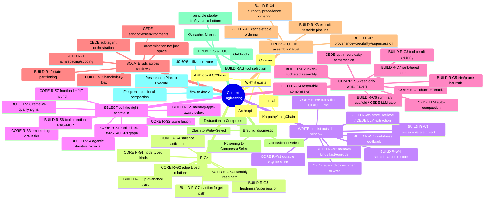

# litectx — Context-Engineering PRD (DERIVED from the build-map)

> **What this is.** The requirement list for litectx as the **comprehensive context-engineering
> library** — *derived* from the build-map marks in **Appendix CE-T** (the CE tree, below)
> and [`build-studies.md` Part D](../02-engineering/build-studies.md) (the recommended flows), which are themselves grounded in the CE
> leaders (Anthropic, LangChain, Manus, Google ADK, Slack, OpenAI, Drew Breunig, Chroma,
> HumanLayer, arXiv). **Specs derived from leaders, not guessed** (goal #5).
>
> **Scope decision this encodes:** litectx absorbs all four CE primitives and serves
> **long-running, specialized agents**; baresuite (bareagent/bareguard) serves lightweight
> one-shot automation. **Two separate PRDs — no fold:** [`litectx-memory-prd.md`](litectx-memory-prd.md)
> owns **the memory engine (all memory: recall, impact, graph, ACT-R, kinds, indexing)**; **this
> doc owns the CE primitives** built on top. This PRD **references** the memory engine and names
> what it provides (§1.0) — it does **not** re-spec, absorb, or rewrite it. `barecontext-prd.md`
> is **superseded by the two together** (§9).
>
> **Status:** DERIVED, lift-checked & borrow-confirmed. CE requirements derived from the
> build-map and **checked against the existing bareagent/bareguard primitives we copy/adapt**
> (§10, file:line). Aurora/SOAR borrows confirmed at file:line (ledger §13); external-library
> patterns studied (copy-pattern-studies). `barecontext-prd.md` superseded banner: done.
> Only remaining: the *optional* CLAUDE.md pointer, deferred until CE build begins (§9 #4).
>
> **Method reminder:** requirements point at their source of truth — where litectx already has a
> validated mechanism, the [aurora borrow ledger](../02-engineering/build-studies.md) (build-studies
> **Part A**; borrow the calibration, don't reinvent — [[borrow-aurora-dont-restart]]); for the net-new
> patterns we adapt from CE leaders, the
> [copy-pattern studies](../02-engineering/build-studies.md) (build-studies **Part B** — real API surface + the
> litectx adaptation delta).

---

## 0. How to read a requirement

Each requirement carries: **ID** · **primitive** · **what** (1–2 lines) · **derives-from**
(the leader) · **surface** (litectx API shape) · **determinism** (🟢 deterministic core / 🟡
deterministic scaffold + ⊘ ceded LLM step / ⊘ fully ceded) · **precedent** (aurora ledger or
net-new) · **delta** (vs current `litectx-memory-prd.md`).

> **Lite line (binds every requirement).** No service/daemon · no external graph DB · no
> LLM-on-write/index · single-file SQLite · embeddings & any LLM step are **opt-in tiers** ·
> one prod-dep bar (`better-sqlite3`). A requirement that can't be met within this line is
> **⊘ ceded**, not bent. (Grounded in the competitive survey: every graph-memory competitor
> pays an LLM-per-write and/or mandates a graph DB — that heaviness is the thing we refuse.)
>
> **Standalone, copy-don't-depend (binds every lift).** litectx is a **standalone** library —
> baresuite *consumes* litectx, never the reverse (the dependency direction is fixed). So any
> primitive lifted from bareagent/bareguard is **copied/adapted into litectx's own
> implementation**, never a runtime dependency on baresuite. **If a lifted primitive doesn't
> fully fit, or needs enhancement to fit litectx's needs, we adapt it** so litectx stands alone;
> when litectx runs *inside* baresuite it composes with the originals (§10). The §6 thesis still
> binds: litectx never makes bareguard judge content (§7).

---

## 1. Foundation — the context graph as data structure (first-class)

### 1.0 What the memory engine already provides (reference — see [`litectx-memory-prd.md`](litectx-memory-prd.md))

litectx's **memory engine is specified in its own PRD**; this doc builds the CE primitives **on
top of** it and **references** it — it does not re-spec it. Provided today / by the memory build
(the 🧩 **CORE** marks below): the **code+context graph** (typed nodes + `calls`/`imports`/
`depends_on` edges), **recall** (BM25 + ACT-R activation + 1-hop spreading, kind-aware hybrid),
**impact** (blast-radius / risk bucket), **incremental git-aware indexing**, the **`kind`/
`format` schema** (`code`/`doc` live; `fact`/`episode` reserved), **embeddings as the one opt-in
tier**, **single-file SQLite/FTS5** storage. *Details live in the memory PRD — not duplicated
here.* Below, 🧩 = provided by that engine (cited, not re-specced); 🔧 = the CE additions this
PRD specs.

### 1.1 The context-graph primitives

The substrate the four primitives ride on. These promote `barecontext-prd.md` §4.2 from SEED
to requirement, unified with the existing code+context graph (`litectx-memory-prd.md` §2–3).

| ID | What | Surface | Det. | Precedent | Delta |
|---|---|---|---|---|---|
| **R-G1 Node** ✅ **SHIPPED** | typed unit of context (`kind`: code · doc · **fact** · **episode**) | `getNode(id)` | 🟢 | ledger §10 (`chunk_types`) | **BUILT 2026-06-12** — kind-agnostic structure accessor (`chunks` + exact import-edge counts); written memory = zero-chunk/zero-edge node. Path-keyed (file-granular). `test/graph.test.js`; design `docs/plans/2026-06-12-graph-substrate-design.md` |
| **R-G2 Edge** ✅ **SHIPPED (import)** | typed relation: `imports` (persisted) · `calls` (impact, on-demand) + reserved **`supersedes`·`derived_from`·`references`·`belongs_to`** | `related(id,{edge,dir,hops})` | 🟢 | ledger §4 (spreading) | **BUILT 2026-06-12** — BFS over persisted `import` edges, `dir` out/in/both, hops capped at 3, deduped. `edge` is a **generic type** so the reserved non-code edges slot in with no migration once a producer emits them (NOT built — no producer yet; would be speculative). `calls` stays impact()'s job (over-counts by design — kept off the exact graph) |
| **R-G3 Provenance** | every node knows its source (tool · doc · sub-agent · session) + a trust label | `node.source`, `node.trust?` | 🟢 / ⊘ content-verdict | label = litectx; shape-gate = **bareguard** (§10.1) | new |
| **R-G4 Salience** | relevance-to-intent score driving assembly (ACT-R activation generalized beyond code) | internal; surfaced in `recall().signals` | 🟢 | ledger §2–6 (ACT-R) | generalize activation to all kinds |
| **R-G5 Freshness / supersession** | recency + "v2 replaces v1" so stale facts retire deterministically | `supersede(oldId,newId)`; freshness in salience | 🟢 | ledger §3 (decay/churn) | **net-new supersession path** |
| **R-G6 Assembly (read path)** ✅ **SHIPPED (v1=FIT)** | given a step + budget, select the minimal relevant subgraph, ordered for cache reuse | `assemble(units, ctx)` → `{ units, dropped, tokens }` | 🟢 | §5 below | **SHIPPED v0.11.0 (2026-06-13)** — the CE headline API, **FIT** half first: budget-fits a neutral unit array (grammar-stripped `{id,role,content,kind?,pinned?,atomic?,tokensApprox?}`) recency-anchored + cache-stable, `pinned`/`atomic` invariants, `dropped[]`-with-handle (no silent loss). SELECT (recall-inject) **KILLED** this round (§4.1 of `baresuite-litectx-prd.md` — agents already fetch own code, no demand, ~75% noise). **COMPRESS budget tier SHIPPED (2026-06-13):** a code/doc unit FIT would drop is recovered as its `compress()` **signature** before eviction (`compressed:true`, body recoverable by id) — rank/recency-driven (reuses FIT's order, NOT positional: lost-in-the-middle refuted at scale, `lost-in-middle-poc.mjs`), fires only when the signature both saves and fits. validated by **two** POCs — `compress-middle-poc.mjs` (rendering: signature 6/6 vs drop 0/6, 0 hallucination) **and `assemble-compress-seam-poc.mjs`, the integration on REAL functions through the SHIPPED verb + live model** (seam mechanic 8/8; **PARAMS retrieval signature 8/8 vs drop 0/8** — signature preserves the API eviction loses, even for doc-less bare-header functions; mean real saving **81%**, 51–97%). assemble is now **async** (the only await is the pure tree-sitter render). FIT path verified byte-identical post-change (19%/3.8% on 1059 real deps, `assemble-verify-shipped.mjs`). `poc/assemble-{fit,compress-seam}-*.mjs` + `test/assemble.test.js` (17). |
| **R-G7 Eviction / decay (forget path)** | what leaves/archives the graph, author-controlled | `evict(policy)` | 🟢 | ledger §3 | net-new explicit policy |

> **Retention is author-owned, never agent-authored** (barecontext §6 #4; the M1 lesson). The
> agent may *request* writes/evictions as gated actions; the policy that could drop a governing
> fact is the operator's.

---

## 2. WRITE — persist context outside the window

| ID | What | Derives-from | Surface | Det. | Delta |
|---|---|---|---|---|---|
| **R-W1 Durable store** | single-file SQLite memory across turns/sessions | (all leaders) | the store | 🟢 | 🧩 have (PRD §9) |
| **R-W2 Memory kinds** | `fact` (semantic) + `episode` (episodic) as queryable nodes | LangChain memory types [LC] | `kind` on write/recall | 🟢 | promote PRD §3.1 reserved → built |
| **R-W3 Session / state object** | schema'd, versioned per-session state (plan, milestones, profile) read/written across turns | LangChain "state" + LangGraph checkpoint [LC]; Slack Director's Journal | `session(id)`, `state.get/set` | 🟢 | net-new |
| **R-W4 Scratchpad / note store** | durable notes that survive compaction (`NOTES.md`/`progress.md`/recitation) | Anthropic note-taking [A]; Manus `todo.md` | `note.append/read` | 🟢 | net-new |
| **R-W5 Cross-session memory write** | store + retrieve + supersede facts/preferences across sessions | LangChain memories [LC]; Mem0 (survey) | `remember(fact,{source})` | 🟡 store 🟢 / ⊘ LLM fact-extraction | net-new; **extraction is ceded** |
| **R-W6 Rules / procedural memory** | index & serve `CLAUDE.md`-style rules (`kind=doc`) | Anthropic/LangChain [A][LC] | recall(`kind:doc`) | 🟢 | 🧩 have |
| **R-W7 Usefulness feedback** | boost activation of nodes that *contributed to a successful answer* (+0.2 if conf≥0.8 / +0.05 if ≥0.5 / skip below), beyond automatic base-level use | aurora `record.py:282-283` ✅ confirmed (ledger §13) | `recordUseful(ids,weight)` | 🟢 boost / ⊘ success-verdict | **net-new** (boost is litectx; the success *verdict* — LLM confidence — is ceded) |

**Ceded (⊘):** the agent's *decision* of when to write/recite (agent-loop policy → bareagent);
the LLM that *extracts* a fact from prose (→ harness, opt-in); the *verdict* that an answer
succeeded (R-W7 input) → harness/bareagent.

---

## 3. SELECT — pull the right context in

| ID | What | Derives-from | Surface | Det. | Delta |
|---|---|---|---|---|---|
| **R-S1 Ranked recall** | BM25 + ACT-R + 1-hop spreading over the graph | aurora (validated) | `recall(q,{topK,kind})` | 🟢 | 🧩 have (ledger §1–7) |
| **R-S2 Score fusion** | kind-aware hybrid weighting across signals | aurora hybrid [LC echoes] | `recall().signals` | 🟢 | 🧩 have (ledger §7) |
| **R-S3 Embeddings tier** | semantic re-rank, **off by default** (dual-hybrid ≈85%) | aurora; survey | config `embeddings:on` | 🟡 opt-in tier | 🧩 have (PRD §8) |
| **R-S4 Agentic / iterative retrieval** | agent-driven query refinement + "enough yet?" — recall as a loop, not one-shot | Agentic RAG [video][LC] | `recall` re-entrant + cursor | 🟢 | net-new (thin) |
| **R-S5 Memory-type-aware select** | select by `kind` so episodic/semantic/procedural are retrievable distinctly | LangChain/CoALA [LC] | `recall({kind})` | 🟢 | follows R-W2 |
| **R-S6 Tool selection (RAG over tool defs)** | semantic-search the relevant tools for a step (RAG-MCP 13.6→43.1%, >50% tokens) | RAG-MCP [RAG-MCP]; LangChain [LC] | `selectTools(intent,defs)` | 🟢 | net-new **candidate** (a corpus litectx can rank) |
| **R-S7 Frontload + JIT** | serve both the up-front index and on-demand retrieval | Anthropic hybrid [A] | (composition of R-S1) | 🟢 | 🧩 have (pattern) |
| **R-S8 Retrieval-quality signal** | recall returns a trust label (NONE/WEAK/GOOD) off the **activation distribution** — *design*: ≥3 nodes at activation ≥0.3 = GOOD; tells the caller when context is too weak to act on | aurora SOAR Phase 4 — **design only, NOT built** (ledger §13); Arize "principled quality metric" gap [Arize] | `recall().quality` | 🟢 | **net-new, litectx-original** (only litectx owns the activation scores; 0.3/0.7/3 are *untested priors* — validate on the bench) |

**Ceded (⊘):** which tools the *agent* ultimately invokes (agent-loop); tool *execution*.

---

## 4. COMPRESS — keep only the tokens that matter

| ID | What | Derives-from | Surface | Det. | Delta |
|---|---|---|---|---|---|
| **R-C1 Chunk + rerank** | coherent chunks; surface only the best (before-context) | aurora; LangChain [LC] | internal to recall | 🟢 | 🧩 have (ledger §1/§7) |
| **R-C2 Token-budgeted assembly** | given a token budget, return the highest-salience subset — *the* lite-Compress primitive | survey; ADK budget | `assemble({budget})` (= R-G6) | 🟢 | **net-new, flagship** |
| **R-C3 Tool-result clearing** | drop raw payloads already acted on, keep a 1-line stub | Anthropic context-editing [A] | `clear(nodeId)` / auto-policy | 🟢 | net-new |
| **R-C4 Restorable compression** | drop a payload but keep a cheap handle (URL/path/id) to restore on demand | Manus file-system-as-context [Manus] | `stash(id,text)` + `peek(id)` + `get(id)` + `evict(...)` | 🟢 | ✅ **SHIPPED v0.6.0** — dedicated non-fts5 `stash` table (never indexed → recall-invisible, never pruned → restore always works). **API-only by §10.5** (orchestration mechanic, not a model-reasoning verb → no CLI/MCP). Deletion is **`evict`** (R-G7), the stash-only deleter — `forget` is memory-only and never reaches the stash table. (Manus pattern, done right; [study §3, Part B](../02-engineering/build-studies.md)) |
| **R-C5 Trim / prune (heuristic)** | recency/size heuristics to drop old turns | LangChain trim [LC]; Provence | `trim(policy)` | 🟢 | net-new |
| **R-C6 Running-summary scaffold** | "last-N verbatim + rolling summary of older" — litectx decides *what/when*; LLM does the prose | LlamaIndex buffer [LC]; ADK compaction | `summaryWindow(n)` + hook | 🟡 scaffold 🟢 / ⊘ LLM step | net-new ([study §1, Part B](../02-engineering/build-studies.md) — keep handles to summarized turns) |
| **R-C7 Rank-tiered render** | compact code **by rank**: top-N **verbatim code** · next tier **signature+docstring** · **drop** past a cap (aurora `CHUNK_LIMITS` (top-N, max) per complexity). The docstring render is the unit; R-C2 budget picks the tier | aurora `decompose.py:243-310` ✅ confirmed — *inlined in `_build_context_summary`, reimplement not extract* (ledger §13); Arize "LLM-summary failed" [Arize] | `compress(node,{level})`; `assemble()` tiers by rank | 🟢 | ✅ **SHIPPED 2026-06-12** — `compress(node,{level})` → `verbatim` \| `signature` (header + doc, body elided) \| `drop`; tree-sitter signature extraction (+ method-chunk wrapping), saves **~82% bytes with the doc kept** on 627 real symbols. Pure library export (no DB/ranking), like `stash`/`peek`. De-risks `assemble()` (the render half it composes). 16 tests. (extraction's chunker dependency in memory PRD §2; pairs with R-C2) |

**Ceded (⊘):** the LLM that writes the summary (auto-compaction prose); perplexity/LLM token
compression (LLMLingua) — opt-in tier behind the embeddings line.

---

## 5. ISOLATE — split context across windows

| ID | What | Derives-from | Surface | Det. | Delta |
|---|---|---|---|---|---|
| **R-I1 Namespacing / scope** | a scope key (agent/session/user) + filtered queries so contexts don't bleed | Memary/Letta (survey); ADK scope-by-default [ADK] | `owner`/`session` on `LiteCtx` (kind-aware) | ✅ **SHIPPED** (§4.4; gate #1) | net-new; **built** |
| **R-I2 State partitioning** | expose one field of state to the LLM, isolate the rest | LangChain state [LC] | `state.view(fields)` | 🟢 | follows R-W3 |
| **R-I3 Handle / lazy-load** | return a lightweight handle; fetch raw only on explicit request, then offload | ADK handle pattern [ADK]; Manus | `peek(id)` (`{id,bytes,head,tail,createdAt,truncated}`) vs `get(id)` (= load) | 🟢 | ✅ **SHIPPED** (stash-only) — `peek` previews **head+tail** via SQL first-N/last-N `substr` + octet `length`; `load`==`get` already. **Win = bounded RESULT** (only ~head+tail bytes reach the caller → payload stays out of the context/token budget), **NOT** bounded compute — grounding measured peek wall-time *scales* with payload (≈`get`, slower past a few MB; SQLite reads the column to slice it). An O(1) peek would need byte-size stored at write (deferred column). **Head+tail, not head-only**: the conclusion (exit code, failing frame, closing structure) lives at the END — borrows SmartCrusher's start+end split (Part B study §4, R-C7 prior), but *only* the cheap structural slice, NOT the anomaly-keep (full-scan → stays in R-C7). **POC-validated** (`poc/ri3-handle-poc.mjs`, 17 assertions): byte-length via `CAST(text AS BLOB)` not `length(text)`; tail via negative `substr`. `summary`/`scope` columns stay **deferred** — head+tail covers logs/traces/text/code; opaque blobs would need a caller-supplied summary, added only when a real caller passes one. (pairs with R-C4; [study §2, Part B](../02-engineering/build-studies.md)) |

**Ceded (⊘):** sub-agent **orchestration** (fork/lifecycle) and **sandboxes** → **bareagent**
owns spawning (`tools/spawn.js`); litectx supplies each child's scoped store (§10.2). Phase
control / human-in-the-loop gating → harness.

---

## 6. Cross-cutting — assembly ordering & trust

| ID | What | Derives-from | Surface | Det. | Delta |
|---|---|---|---|---|---|
| **R-X1 Cache-stable ordering** | emit assembled context stable-first / dynamic-last, append-only, deterministic serialization | **cross-vendor consensus**: Manus + ADK [Manus][ADK] | `assemble()` output contract | 🟢 | net-new (the strongest field rule) |
| **R-X2 Provenance + credibility** | source + salience/credibility; supersession retires stale/refuted facts; **floor supremacy on writes** | Slack Critic channels [Slack] | R-G3 + R-G5 + bareguard gate | 🟢 / ⊘ content-verdict | shape-verdict + floor = **bareguard lift** (§10.1); content-verdict = litectx/guardrails tier |
| **R-X3 Explicit, testable assembly pipeline** | context built by named, ordered steps — not string concat (observable, testable) | ADK "explicit transformations" [ADK] | internal `processors[]` | 🟢 | net-new (architecture) |
| **R-X4 Authority / precedence ordering** | order **and label** assembled blocks by a trust/authority class (procedural rule > fresh fact > episode > history) so the model resolves conflicts predictably — the **Context-Clash** fix, distinct from cache-order (R-X1) and freshness (R-X2) | Breunig "Context Clash" → *establish authority ordering: System > Retrieved Facts > History* [DB] | precedence class on `assemble()` blocks | 🟢 | **net-new** (closes the 4-failure-mode matrix) |

> **How X1 / X2 / X4 compose (not contradictory):** they're three ordering *axes*. **R-X1** fixes
> the prefix/suffix split for KV-cache (stable-first, append-only). **R-X4** ranks blocks by
> *authority* — but authoritative content (rules) is also the most stable, so it naturally lands in
> the R-X1 prefix; within the dynamic suffix, blocks are ordered by authority then salience. **R-X2**
> decides which blocks are even eligible (retire stale/refuted). *Positioning note (lost-in-the-
> middle, [DB]/[Chroma]/[LitM]):* place highest-salience content at the **edges** — head = rules
> (R-W6), tail = most-salient/recited (R-W4) — so this is **mostly emergent** from R-W6+R-W4+R-X1;
> the only net-new sliver is "order the dynamic selected block by salience, most-salient at the
> tail." Build it as a heuristic in `assemble()`, not a separate requirement.

---

## 7. Non-goals (⊘) — the CE-scope non-goals (the memory PRD keeps its own §13)

These are *this* doc's non-goals; `litectx-memory-prd.md` keeps its own §13 (memory-engine
scope) — the two are separate, not merged. litectx is the **substrate**; these belong to the
harness / bareagent / bareguard:

- **Sub-agent orchestration, agent loop, sandboxes, phase control** → bareagent / harness.
- **The LLM step** in fact-extraction, summarization, auto-compaction, perplexity compression
  → opt-in tier / harness (litectx feeds it deterministically, never requires it).
- **Tool masking / KV-cache logit control** → inference runtime.
- **Prompt authoring** ("right altitude") → user / harness.
- **Content-trust *judgment*** (is this fact safe / a secret / an injection?) → bareguard;
  litectx carries the provenance label, bareguard renders the verdict.
- **Visual/GUI substrate** (screenshots as tokens, CUA) → out of scope.
- Plus all current PRD §13 carry-overs: no LSP, no token *budgeting policy* (litectx does
  budget-*aware assembly*, not budget *enforcement*), no multi-provider LLM clients as default.

---

## 8. Requirement rollup — the build surface (one public API, opt-in tiers)

```
litectx (one importable lib, one config, safe defaults)
  index()            — 🧩 incremental, git-aware            (slices 0–1 shipped)
  recall()           — 🧩 ranked select  (R-S1..S7)
  impact()           — 🧩 blast-radius   (PRD slice 6)
  getNode/related    — 🧩 graph substrate (R-G1..G2)
  ── CE expansion (this doc) ─────────────────────────────
  remember/forget    — 🔧 Write          (R-W2..W5, R-G7)
  recordUseful       — 🔧 Write feedback (R-W7)  ← boost what helped (aurora Record)
  session/state      — 🔧 Write+Isolate  (R-W3, R-I2)
  supersede          — 🔧 freshness      (R-G5)
  recall().quality   — 🔧 Select signal  (R-S8)  ← trust label off activation dist.
  assemble()         — 🔧 Compress+order (R-G6, R-C2, R-X1, R-X4)  ← the CE headline call
  compress(node)     — 🔧 Compress       (R-C7)  ← signature/docstring render
  clear/trim/rehydrate — 🔧 Compress     (R-C3..C6)
  scope / peek/load  — 🔧 Isolate        (R-I1, R-I3)
  selectTools()      — 🔧 Select (cand.) (R-S6)
  [tiers] embeddings | summarizer-hook | extractor-hook   — opt-in, ⊘ by default
```

---

## 8.1 Build order — adopter-pulled vs factory-independent

The [validation bench](benches-prd.md) (the ON-vs-OFF A/B) and the optional factory spike that
harvests its traces are litectx's first adopter. The standing doctrine is *adoption-first*: don't
speculatively grind an API — let a real consumer pull its contract. **But that doctrine governs
*ambiguous shapes*, not *universal primitives*.** The factory spike is **one** adopter exercising
one or two flows; it will not surface every CE need. Conflating the two would make primitives whose shape is already fixed wait
on a consumer that adds nothing to their design — procrastination dressed as discipline.

The discriminator: **does the contract depend on knowing how a specific consumer drives it, or is
it self-evident from litectx's own data model and falsifiable on litectx's own bench?**

**Tier A — factory-independent (build now; shape fixed by our data + validated on [existing benches](benches-prd.md)).**
The first adopter may *fine-tune* these (thresholds, defaults), but it does not *define* their shape.

| Req | Surface | Why it needs no adopter | Validation harness (exists today) |
|---|---|---|---|
| **R-C7** | `compress(node,{level})` | ✅ **SHIPPED.** Signature tier = tree-sitter cut at the `body` field (+ method-chunk wrapping); saves **~82% bytes WITH the doc kept** on 627 real symbols (not the earlier naive "95–98%"). aurora-calibrated (`decompose.py:243-310`). **De-risks `assemble()` — it's the render half assemble composes.** | `poc/rc7-compress*-poc.mjs`, `test/compress.test.js` |
| **R-G7** | `evict(id \| {olderThan, maxCount})` | ✅ **SHIPPED 2026-06-12** (the stash-cleanup verb). `evict(id)` (one payload) / `{olderThan}` (epoch-ms floor, `created_at <`) / `{maxCount}` (keep newest N) — both policies compose (age then count). **API-only** (§10.5) and **stash-only by construction** — only the `stash` table is touched, so a bulk age/size sweep can never reach a durable `fact`/`episode`. This split is the point: `forget` was made **memory-only** (its old id-fallthrough into `stash` removed — a breaking change, ~zero blast radius: no live stash consumer exists), so the model-facing "drop knowledge" verb and the runtime-only "reclaim scratch" verb sit on opposite sides of the §10.5 line. Runtime owns the policy; litectx owns the delete. POC `poc/evict-poc.mjs`; tests in `test/stash.test.js` (incl. the *evict-never-touches-memory* + *forget-can't-reach-stash* invariants). | `poc/evict-poc.mjs`, `test/stash.test.js` |
| ~~**R-S8**~~ | ~~`recall().quality`~~ | **DROPPED — premise falsified (2026-06-12 grounding).** Sold as litectx-original "off the **activation distribution**, only we hold those scores." **Those scores do not exist in shipped recall:** memory-PRD §4 deferred base-level activation and §14 #4 *falsified it for recall ranking on real edit data* (`poc/access-bench.mjs`: topic-blind, repo-dependent — ships at zero). The only ACT-R term in recall is import-spreading (code-only). A quality label would fall back to **raw BM25 magnitude** — repo/query-length-dependent score-thresholding, the *exact* class of prior §4 forbids recall to ship. Building it re-litigates a settled falsification. **The one candidate residue — a confidence label off the embeddings cosine distribution — was then POC-falsified too** (`poc/confidence-poc.mjs`, 2026-06-12): top raw cosine separates answerable from unanswerable queries in aggregate (AUC 0.92) but has **no usable threshold** — the paraphrase/morph answers (the queries the label would *exist* to judge) score in the same 0.21–0.54 band as the unanswerable ones (≤0.36), so any τ that catches "nothing here" falsely flags ~25% of real answers as "weak," worst on exactly the semantic hits. Same shape as §4: real for *aggregate* judgment, useless for the *per-query* decision. Closed on evidence (memory-PRD §14 #7). | `poc/confidence-poc.mjs` |
| ~~**R-G5**~~ | ~~`supersede(old,new)`~~ | **DROPPED — duplicative (2026-06-12 grounding).** Retire = `forget(id)`; replace-in-place = `remember(sameId, …)` (upsert, `store.js:395`); auto-freshness = `pruneStaleEpisodes` on every episode write; supersede-by-promotion = the `reviewCandidates` re-`remember` flow. `supersede(old,new)` is `forget(old); remember(new)` with a ribbon. The only uncovered sliver — an audit forward-pointer (old→new lineage) — nobody asked for, and its content-verdict is ceded to bareguard (R-X2). Document the `forget`+`remember` idiom instead. | n/a |

*Half-in:* **R-W7 `recordUseful`** — the boost *mechanism* is buildable + aurora-calibrated
(+0.2/+0.05), but whether the boost helps ranking wants a real loop feeding "what was useful" →
mechanism now, weight-validation with the adopter. **Caveat (2026-06-12):** the *recall-reranking*
use of any use-derived boost was falsified topic-blind in memory-PRD §14 #4 — so `recordUseful`'s
only safe home is the **trust/tie-break** layer that already shipped (5c), not a global lift.

**Tier-A status after the 2026-06-12 grounding pass — the well is now dry (all four resolved).** Of the
four Tier-A primitives: `compress` **shipped** (v0.7.0), `evict` **shipped** (v0.8.0 — the stash-cleanup
verb, with `forget` made memory-only); `R-S8` and `R-G5` are **struck** above (falsified premise /
duplicative). This is **good news, not a setback** (§3 #2): the strike-throughs reconcile this CE
backlog — drafted before the access-log POCs settled — with the memory PRD's already-validated findings.
litectx's core is *more* complete than this table implied; with Tier A closed, "what's next" is honestly
the **adopter-pulled `assemble()`** (Tier B), not a Tier-A scrape.

**Tier B — adopter-pulled (shape is genuinely unknown until a caller exists).**

| Req | Surface | The ambiguity only a consumer resolves |
|---|---|---|
| **R-G6 / R-C2** | `assemble({intent,budget})` | What *is* `intent` (query? step descriptor?); budget unit (tokens? nodes?); how the caller wants blocks ordered. **The headline call — the doctrine was written for exactly this.** → **SHAPE RESOLVED by the bareagent RT-seam negotiation, §8.2** (2026-06-12): `assemble(units, ctx)` over a neutral unit model; `intent`=`ctx.task`, budget=tokens, ordering=cache-stable with `pinned`/`atomic` flags. |
| **R-X1 / R-X4** | `assemble()` ordering contract | Cache-prefix split + authority precedence are properties of the *assembled output* → follow assemble. → resolved with the above (§8.2): `pinned` units never move/drop, `atomic` units never split. |
| **R-W3 / R-I2** | `session/state`, `state.view` | The state *schema* (which fields, which are LLM-visible) is the consumer's, not ours. |
| **R-C3 / R-C5 / R-C6** | `clear` / `trim` / `summaryWindow` | Loop-mechanics: *when* to clear/trim/summarize is a policy the orchestration loop owns. |

**Caution (POC-rigor):** the table tags **R-I1 `scope`** "cheap," but it touches *every op*
(schema migration + a filter on every query) — its shape is obvious but it is **invasive, not
cheap**. Don't let the label wave it through unmeasured.

**Current pick:** **R-C7 `compress()`** — ✅ **SHIPPED 2026-06-12.** Tier A, and uniquely it
*de-risks* the Tier-B linchpin (`assemble` composes it) instead of competing with it. `compress(node,
{level})` → `verbatim` (the body) | `signature` (header + doc, body elided) | `drop` (a name marker).
A pure render view (no DB/ranking/weights), exported from the library (`import { compress }`). The
signature tier extracts via tree-sitter (cut at the def's `body` field; a naive slice mangled
arrows/generics/multiline params — 99% vs 32% on 303 defs) and **wraps a bare method chunk in a
synthetic class** so methods (≈38% of real symbols) compress too. **Measured on 627 real named
symbols (litectx JS + OpenSpec TS + aurora PY): signature saves ~82% of bytes WITH the doc/docstring
kept, 0 unparseable** — correcting the earlier "95–98%" (a naive slice over only the parseable defs,
silently skipping methods). 16 tests. **The docstring tier surfaced an upstream indexing defect**
(below) — the chunker fix that attaches a symbol's leading doc to its chunk, which belongs to the
memory engine, not compress.

**↳ Indexing dependency (memory-engine, not CE) — leading docs are orphaned.** The POC falsified the
ledger's *"signature/docstring already extracted, render unit is free"*: the chunker persists only
`body`. **Python docstrings are inside the body (free).** But **JS/TS JSDoc is a sibling node above
the def** → `chunker.js` sweeps it into the file's `preamble` chunk (86/86 real JS defs orphaned).
So the doc is indexed but **dissociated from its symbol at chunk granularity. ✅ FIXED 2026-06-12**
(`chunker.js` `docStartRow` — extends a def chunk upward over an immediately-adjacent comment block;
a blank line breaks attachment) → a memory-engine change, not compress. The compress docstring tier
now falls out for free (docs ride in the body). **This is the fix's only justification — it does NOT
improve recall** (an earlier "doc→symbol 0/2→2/2" claim was retracted: it came from a crafted bench
with doc-exclusive sentinel queries; on real OpenSpec TS the fix changed localization in **0/3** cases,
because real queries share vocabulary with the code body and the named-chunk-over-preamble tie-break
already localizes correctly). Semantic recall is a wash too: the embeddings tier indexes the raw whole
file (no-op), and at symbol granularity the doc adds **−0.003 MRR** on fair name-derived queries
(`poc/rc7-doc-embed-poc.mjs`; the +0.248 upper bound is an artifact of doc-derived queries). File-level
recall is **byte-identical** (aurora 0.552 / gitdone 0.425) — FTS + `file_embeddings` index the **raw
whole file** (`indexer.js:104`→`store.js:317`), so the change lands only on chunk localization
(`attachChunks`, `index.js:279`), never file ranking. 146 tests, tsc + types clean.
*(memory: `chunker-orphans-leading-docs.md`)*

---

## 8.2 Build order resolved by the bareagent RT-seam negotiation (2026-06-12)

bareagent's first real CE consumer cut five seams into its loop (RT-1…RT-5) and negotiated, seam by
seam, **what litectx must do on its side of each**. This is the adopter the §8.1 Tier-B rows were
waiting on — it resolves `assemble`'s shape and surfaces two small build-now additions, while two
items stay deferred *with crisp trip-wires* (the litectx discipline: a deferral names the exact
condition that un-defers it). The seam shapes (the holes) are bareagent's and live in
[`baresuite-litectx-prd.md`](../02-engineering/baresuite-litectx-prd.md) (the integration
contract; the former `litectx-for-baresuite.md` is folded in there as the orientation + §5–§9); the
**litectx obligations**
are here.

**The boundary principle (binds all five): litectx owns content + relevance; it never learns the
provider's transcript grammar.** bareagent adapts *its* messages to litectx's neutral shapes — the
Store-socket move run in reverse. This is what keeps litectx standalone and is what makes both of
RT-1's hard questions (tool-call/result pairing; system-prompt protection) dissolve at the
*representation* layer instead of via trust or validation.

| RT | litectx obligation | Status | Resolution / trip-wire |
|---|---|---|---|
| **RT-1** | **`assemble(units, ctx) → units`** (R-G6/C2/X1/X4) over a neutral unit model `{id, role, content, kind, pinned, atomic, tokensApprox}`; SELECT (recall-inject) + COMPRESS (`compress`) + fit-to-`ctx.budget`, cache-stable order. | **BUILD-NOW — budget-fit POC ✅ CLEARED (2026-06-13)** | `pinned` units never drop/reorder; `atomic` units (a tool-call+its-result, bundled by bareagent's adapter) never split → grammar can't break and the system prompt can't be dropped, *by construction*, not by trust. Fits **best-effort and returns** — never enforces a hard cap; bareagent does final grammar-check + **fail-open** (degrade to full context, never crash). **The one unproven claim — "budget-fit preserves task success" — was the POC gate, now PASSED** (`poc/assemble-fit-poc.mjs` + `poc/assemble-fit-model-poc.mjs`, see `poc/RESULTS.md`): replayed 8 real transcripts / 1059 deps — the **budget-honest shipped** recency-anchored fit @50% budget loses **3.8%** of re-read deps (the POC's inline 1.8% was optimistic — an atomic-group overflow artifact, corrected in RESULTS.md), and a live model produces the correct next action **8/8** with the needed unit present vs **0/8** absent. **Two constraints the POC pinned for the build:** (a) the fit is **recency-anchored** — semantic re-rank of the transcript does NOT help (re-reads are recency-bound, not topic-bound), matching cache-stable order; (b) **`dropped[]`-with-handle is load-bearing** (dropping a re-read unit yields an explicit `CANNOT_DETERMINE`, recovered by one rehydrate re-read) → it ships in the **same slice**, not after. Transcript units pass through **`kind:null`**; only recall-injected units carry a litectx kind (role and kind are orthogonal). |
| **RT-2** | post-round observe/harvest hook (would let litectx `remember`/log mid-round). | **DEFERRED-ON-EVIDENCE** | No mid-round *capability* gap exists **while the canonical transcript is preserved intact** — every write target is losslessly reconstructable from `result.msgs` at end-of-task. Trip-wire: **un-defers the day the transcript-truncation seam (R-C3/`trim`) ships**, bound to it as a **harvest-before-evict interlock** (you cannot drop history you have not harvested). Secondary: RT-2 is also the *incremental* harvest vs end-of-task *batch* — an efficiency lever only, same trip-wire. |
| **RT-3 #2** | **`recall(q, {body:true})`** — inline-body flag. | ✅ **SHIPPED** (`9df3f5a`, 8 tests) | Chosen over the adapter doing N `get()`s: *where the body lives is kind-dependent* (fact/episode = same FTS row, ~free, zero extra reads; code/doc = the chunk slice we already localize) and that knowledge must not leak into the adapter. Bound default to the chunk span; widen to whole-file only when nothing localizes. Reused by `assemble` (units need body) — earns its place twice. Pure read-path; **no migration**. |
| **RT-3 #3** | **`meta` sealed passthrough** on write-path rows (`remember` only; null for indexed code/doc). | ✅ **SHIPPED** (`5402a6e`, 6 tests) — *first memory-tier migration* | Shipped as a **new non-FTS sibling table `mem_meta`** (not an `mem`/`docs` column) — sealed *by construction* (in no FTS table → never tokenized, searched, or scored), and a `CREATE TABLE IF NOT EXISTS` is the most additive migration possible (old dbs gain an empty table, no backfill). Chosen over a narrow "refuse unknown keys" contract (would break drop-in `Store` replacement). Guidance ships with it: *small structured tags, not payloads — big things go in `stash`*. Grades the migration path RT-5 reuses. |
| **RT-3 adapter** | **`liteCtxAsStore(lc)`** — the `{store,search,get,delete}` socket composing #2+#3. | ✅ **SHIPPED** (`1b57e77`, 8 tests) — *closes RT-3* | Free function, copies the host `Store` shape (no host import). Mints namespaced ids (#1), `recall({body:true})` content (#2), full metadata round-trip via the sealed passthrough (#3), single-kind comparable scores (#5), default kind `fact` (#4). |
| **RT-4** | sub-agent toolbox (mount `litectx-mcp` read verbs into a spawned child). | **ZERO NEW litectx CODE** (adapter ready) | `litectx-mcp` already curates to model-reasoning verbs (§10.5). Child default = **read-only** (`recall`/`get`/`impact`/`recent` allow; `remember`/`forget` opt-in; `index`/`promotions` deny). Opted-in writes land in the **child's own `dbPath`** (physical isolation, memory-PRD §3.2, **no schema** — decouples RT-4 from RT-5). Promotion to the parent store = explicit parent-orchestrated `recall`(child)→`remember`(parent), existing verbs, never an automatic bleed. |
| **RT-5** | **`owner`/`session` scope keys** (R-I1) — logical partitioning of one shared store. | litectx predicate ✅ **BUILT**; harness threading **DEFERRED** | The litectx-side filter shipped (`owner`/`session` config, sibling table `mem_scope`, BM25 + KNN paths — §4.4). What's deferred is the **harness threading** + the shared-db multi-tenant trip-wire: separate `dbPath` per child (RT-4) covers spawn isolation **today**. Un-defers for many/ephemeral children in one store, or cross-child union queries (set `owner`/`session` for isolation, omit for union). Backward-compatible (unset = single global scope); used a `mem_meta`-style sibling table (the `mem` FTS5 table can't `ALTER`), not RT-3's row column. |

**Recording rule applied:** build-now obligations live here as requirements; the settled
*why/deferrals* are mirrored one-line in project memory (`bareagent-rt-seam-contract.md`) so the two
deferrals aren't re-litigated; the consumer-side seam shapes stay in the baresuite integration guide.

---

## 9. PRD relationship & remaining edits

**Two PRDs, separate by design — do NOT fold.** litectx ships as one library, documented by two
PRDs along a clean seam:

1. **`litectx-memory-prd.md`** — the **memory engine (all memory)**: recall, impact, the
   code+context graph, ACT-R, kinds, indexing, storage. **Unchanged by this doc**; it keeps its
   own §13 non-goals (memory-engine scope). This PRD **references** it (§1.0) and never rewrites
   or absorbs it.
2. **`litectx-ce-prd.md`** (this) — the **CE primitives** built on top (Write/Select/Compress/
   Isolate as views over the same graph). Its non-goals are §7 (CE scope).
3. **`barecontext-prd.md`** — **superseded by the two together**: its axis is now split — memory
   → the memory PRD, primitives → here. Its §4 primitives live here (§1–6), its §6 "bare test"
   became the lite line (§0), its §7 Aurora notes are subsumed by the
   [aurora borrow ledger](../02-engineering/build-studies.md) (build-studies Part A). ✅ **superseded banner added.**
4. **`CLAUDE.md`** — already points at `litectx-memory-prd.md`; add a one-line pointer to this CE
   PRD when CE build work begins. *(Optional, low-priority — the one outstanding edit.)*

**Engineering companions (not PRDs, but where the requirements' evidence lives):**
[build-studies **Part A**](../02-engineering/build-studies.md) (memory signals + SOAR/CE
borrows, file:line) and [build-studies **Part B**](../02-engineering/build-studies.md)
(LlamaIndex/ADK/Manus API surface + adaptation deltas). Requirement rows link to the relevant §.

**Build order (unchanged discipline):** CE slices come **after** the memory engine's recall/
impact slices graduate; every new signal is re-validated on both repos via the `poc/` bench
gate before it earns weight.

---

## 10. The bareagent/bareguard lift — copy/adapt for standalone fit

Read-only survey of both repos (file:line). Per **standalone, copy-don't-depend** (§0): we
**copy the design and adapt it** into litectx's own implementation — litectx never depends on
baresuite at runtime; where a primitive doesn't fully fit, **we adapt/enhance it** for litectx's
standalone needs. When litectx runs *inside* baresuite, it composes with the originals. Each
item is tagged **[copy]** (lift the design ~as-is), **[adapt]** (lift + change to fit), or
**[cede]** (baresuite keeps it; litectx only defines the seam). The lite line and bareguard's §6
action-vs-content thesis both hold.

### 10.1 bareguard — gate the memory-write, inherit floor supremacy (R-G3 / R-X2)
> **SHIPPED (litectx side) 2026-06-14 — the write-gate emitter.** `remember()` now emits the gate-able
> `{type:"memory.write", kind, provenance, text, id, meta?, injectionRisk?}` action and checks it via an
> opt-in `writeGate` (`LiteCtxConfig`) **before** the write commits — a `deny` throws `WriteDeniedError`
> and nothing persists. Exports: `toWriteAction` (pure emitter), `WriteAudit` (standalone audit, ships no
> secret patterns — host `redact` scrubs), `WriteDeniedError`. litectx is duck-typed to `.check` (not
> coupled to a bareguard version). **POC `poc/write-gate-emitter-poc.mjs` (13/13) on the REAL bareguard
> `Gate`:** the emitted shape is load-bearing (strip `provenance`/`injectionRisk` → decision flips back to
> allow) and floor supremacy holds (`injectionRisk:"high"` denies through an allowlist). **Demand-gated** —
> no consumer emits gate actions yet; `memory.inject` reserved in the type but has no producer (SELECT killed).
> Standalone built-in *floor* gate deferred (speculative — no standalone consumer needs gating without
> bareguard yet). Next on bareguard's side: swap `seam-contract.test.js` onto this real emitter (§5B).
- **Gate decision contract — [copy → adapt]:** `Gate#check(action)` → `Decision{outcome:"allow"
  |"deny", severity, rule, reason}` (`bareguard/src/gate.js:215`, `types.js:40`); an action is an
  open dict keyed by `type` (`types.js:24`). litectx **copies this contract** and **adapts** it
  into its own minimal, optional **write-gate hook** so a `{type:"memory.write"|"memory.inject",
  kind, provenance, text}` is gate-able **standalone**. Inside baresuite, litectx emits that same
  action shape and **bareguard is the gate** (zero bareguard change).
- **Floor supremacy — [copy → adapt]:** the fixed **6-step eval order** (`gate.js:139-175`;
  contract `bareguard.context.md:202-216`) runs denies + asks (steps 1–4) **before** the
  allowlist (step 5) — so a write matching the user's floor `denyPatterns`/`askPatterns` is
  blocked **even if `memory.write` is allowlisted**. That *is* "a memory may never relax the
  floor." litectx **adapts the same eval-order pattern** into its write-gate hook so the
  invariant holds standalone; inside baresuite, bareguard enforces it.
- **Audit + redact — [adapt]:** litectx ships its **own small audit log + `redact`**, adapted
  from bareguard's design (every `check`/`record` emits a JSONL phase + action-shape line,
  `primitives/audit.js:79`; `redact` keeps secrets out, `secrets.js:22`) → the inject
  paper-trail. Inside baresuite it reuses bareguard's audit instead of double-logging.
- **Compose seam (when embedded):** `wireGate(gate,{actionTranslator})`
  (`bareagent/src/bareguard-adapter.js:107`, translator `:80`) — litectx touches only
  `.check/.record/.allows`, so it is **not coupled to a bareguard version**; standalone, its own
  hook does the same job.
- **The §6 line — do NOT push into bareguard:** the **content** half of the verdict (is this
  fact a prompt-injection? does it *semantically* conflict with the floor?) is content
  judgment bareguard refuses (`bareguard.context.md:313`). **Division:** litectx (or a
  guardrails tier) computes a content verdict and **reduces it to a structured shape flag** on the
  action — litectx emits the **source** (`provenance:"web"|"subagent"|…`, *not* a trust verdict) plus an
  optional guardrails-set `injectionRisk:"high"`; bareguard gates that flag **by structured field**, via
  a small generic `flags` field-value gate (reads `action.provenance`/`injectionRisk` directly, **not**
  `JSON.stringify` regex — the regex route would force litectx to encode its verdict as matchable text,
  violating §8.2). Full spec + action-field contract: [baresuite-litectx-prd §5B](../02-engineering/baresuite-litectx-prd.md).
  → R-G3 label = litectx · R-X2 shape-verdict + floor = bareguard (lift) · R-X2 content-verdict =
  litectx/guardrails tier (opt-in).

### 10.2 bareagent — insert *around* the loop, plug *under* the store (R-W*, R-I*)
- **Around the loop (⊘ loop unchanged):** `Loop.run(messages, tools, opts)`
  (`bareagent/src/loop.js:212`) never auto-reads memory — its `store` is validate-only
  (`:451`). Context assembly + persistence are caller space today. litectx sits **around** it:
  `assemble()` → `run()` → harvest `result.msgs` → persist. **Zero loop changes.**
- **Under the store — [adapt, no dependency]:** bareagent's `Store` interface is exactly
  `{store, search, get, delete}` (`bareagent/types/index.d.ts:58`). litectx ships an adapter that
  **matches that shape** (no bareagent import) → becomes bareagent's memory backend when present
  (project litectx recall onto `[{id, content, metadata, score}]`). litectx's own surface is the
  richer one; the adapter is the thin compat layer.
- **Replace / cede the overlaps:** **replace** `Memory` (`src/memory.js:20` — a 4-method
  passthrough, no ranking/graph) for long-running use; **cede** `StateMachine` (`state.js:23`,
  per-task FSM) and `Checkpoint` (`checkpoint.js:16`, a human-approval gate) — keep bareagent's;
  they don't overlap litectx's context store. *(Note: litectx's R-W3 session/state is a context
  store, a different thing from bareagent's task-lifecycle FSM — complementary, not duplicate.)*
- **Sub-agent spawning (⊘ CEDE, additive seam — R-I1/R-I3):** spawning exists
  (`tools/spawn.js:74` lib, `:229` blocking tool; child = a bareagent CLI process) and hands
  children **no scoped context** today. litectx's contribution: give each child a **scoped
  store / namespaced view** through the child's bareagent config — bareagent keeps fork +
  lifecycle, litectx owns the child's context boundary.
- **R-G7 eviction is unclaimed** — no eviction primitive exists in bareagent; litectx owns it.

### 10.3 Hand-off summary (litectx stands alone; composes when embedded)
| Capability | litectx (standalone) | baresuite (when present) |
|---|---|---|
| context assemble / recall / graph / supersession / eviction | **owns** | — |
| memory-write *shape* gate + floor supremacy + audit | label + content-flag | **bareguard** (lift, §10.1) |
| content trust verdict (injection / semantic conflict) | **owns** (or guardrails tier) | — |
| agent loop / tool dispatch | assembles `messages` around it | **bareagent** (`loop.js`) |
| sub-agent fork / lifecycle | scoped store per child | **bareagent** (`tools/spawn.js`) |
| per-task FSM / human-approval checkpoint | — | **bareagent** (`state.js` / `checkpoint.js`) |
| memory backend behind `Store {store,search,get,delete}` | **adapter** (`types/index.d.ts:58`) | bareagent consumes |

### 10.4 Aurora CE borrows that belong to the *siblings* (parked here so we don't miss them)

These surfaced in the aurora SOAR survey ([SOAR.md], [SOAR_ARCHITECTURE.md]) and the Arize talk
[Arize]. **None are litectx** — they're orchestration / budget enforcement. Parked here (not in
litectx's build surface) so the seam is captured. **Confirmed at file:line in the
[aurora borrow ledger, Part A](../02-engineering/build-studies.md) §13** — incl. the correction that
the cost-budget gate and the retrieval-quality signal were *design-only* in aurora, never built.

**→ bareguard (budget *enforcement*):**
- **Cost-budget gate** — per-tier $ caps (SIMPLE $0.001 / MEDIUM $0.05 / COMPLEX $0.50 /
  CRITICAL $2.00), **pre-query soft (80%) / hard (100%) check**, monthly tracker.
  ⚠️ **DESIGN ONLY in aurora** — `aurora_core/budget/tracker.py` *tracks* spend but has **no
  per-tier caps and no soft/hard gate** (only documented in `SOAR_ARCHITECTURE.md`). So this is a
  design to **build fresh** in bareguard, not a tested borrow. Budget *enforcement* → bareguard;
  litectx only does budget-*aware assembly* (§7).

**→ bareagent (orchestration / LLM-interface):**
- **Query-complexity assessment** — lightweight **keyword dicts + regex, no LLM** (Tier-1,
  SIMPLE/MEDIUM/COMPLEX/CRITICAL), used to size the retrieval + decomposition budget.
  ✅ built: aurora `assess.py:82-343` (verb stoplists + question-pattern regex). *Deterministic but
  its job is budget-sizing → bareagent, not litectx.*
- **Decomposition caps** — MEDIUM/COMPLEX/CRITICAL = **2 / 4 / 6** sub-goals
  (`SUBGOAL_LIMITS`, aurora `decompose.py:167`). Lesson: LLMs over-engineer; **give a numeric cap
  and they respect it.** *(Separate knob: few-shot example count, since cut to 0/1/1/2 in
  `examples.py:111-116` to save context — don't conflate with the 2/4/6 subgoal cap.)*
- **Agent-matching as closed labels** — `excellent | adequate | bad`, **not** a confidence %
  (LLMs are bad at %, good at tight closed options); `bad` → spawn on the fly (Phase 4/5).
- **Verify-lite** — validate decomposition (no circular deps, required fields) **and** assign
  agents in one pass; **max 2 retries with feedback** (Phase 4).
- **Early-failure detection + circuit breaker + retry/fallback-to-LLM** (Phase 5).
- **Success-verdict feeding litectx R-W7** — bareagent decides an answer *succeeded*
  (confidence ≥0.8 / ≥0.5 → +0.2 / +0.05); litectx only applies the activation boost. The
  *verdict* is bareagent's; the *boost* is litectx's (see R-W7).
- **JSON-schema-enforced LLM I/O** — force structured output, retry on mismatch (general
  prompting discipline; pairs with the closed-label rule above).

### 10.5 Consumption surface — `import` vs MCP (who *chooses* the call)

litectx exposes the same capability through up to three channels; the deciding question for
each verb is **who decides to call it — code, or a model.**

- **Direct API (`import { LiteCtx }`)** — the caller is a *program* that knows the verb at
  write-time. **Strictly better than MCP for program→library use**: real types, in-process,
  no JSON serialization, no subprocess, streams/objects/handles survive, direct error
  semantics. baresuite/bareagent's own orchestration logic consumes litectx **this way**.
- **MCP server (`bin/litectx-mcp.js`)** — a *thin adapter over the API* whose only job is to
  **curate the verbs a reasoning model sees**. MCP earns its keep solely when an **LLM** must
  discover a toolbox at runtime and choose among tools. It does **not** make program
  consumption easier — wrapping a function call in JSON-RPC only *removes* capability and
  *adds* overhead. MCP is a toolbox **for the model**, never a convenience for the program.
- **CLI (`bin/litectx.js`)** — the human/hook surface (index, recall, impact checks). Gated by
  a concrete human/script caller; no verb goes here speculatively.

**The discriminator → which channel a verb lands on:**

| Verb class | Who chooses to call | Channel |
|---|---|---|
| `recall` · `remember` · `impact` · `get` · `recent` · `promotions` | the **model**, mid-reasoning ("recall X", "blast radius of editing Y") | **MCP** (+ API) |
| `stash` · future `assemble`/`isolate`/`clear`/`trim` | the **runtime loop** (baresuite), as plumbing *around* the model ("this result is huge — park it") | **API only** |
| `index` (human/hook-driven) | a person or a build hook | **CLI** (+ API/MCP for completeness) |

**Two relationships, not one** — baresuite both (1) **imports** litectx for its own loop logic
*and* (2) **mounts litectx's MCP** into the toolbox of the *sub-agent it drives*. #2 is the only
legitimate MCP use: equipping the model in the loop, not easing baresuite's own consumption.
The MCP surface stays lean **by design** — it holds exactly the model-reasoning verbs, so
orchestration mechanics like `stash` never clutter the everyday/standalone memory toolbox.

**A second MCP server is deferred** — true tool separation (e.g. an everyday `litectx` vs an
`litectx-agent`) is only warranted if an **autonomous Claude-style agent** (not baresuite —
baresuite imports) ever needs CE-automation verbs over MCP. A tool *description* does not
separate (every tool in a server stays visible + callable); only a separate server, left
disabled, does. Build it when that caller is real, not before.

---

## Appendix CE-T — The Context-Engineering Tree (full reference; folded from ce-tree.md, 2026-06-13)

> The complete CE mental-model tree that DRIVES this PRD's requirements (the 🧩/🔧/⊘ marks map leaves to litectx specs). Folded in verbatim from the former standalone `docs/00-context/ce-tree.md`. Its original section numbers are preserved under the `CE-T.` prefix, so existing citations like "ce-tree §3.4" now resolve as "Appendix CE-T §3.4".

> **What this is.** One legible map of *what context engineering (CE) is, as of mid-2026* —
> the whole story at a glance, organized with the **four core primitives (Write / Select /
> Compress / Isolate) as the trunk**. Everything related branches off, each with a 1–2 line
> description. Every leaf is **marked** for what it means to litectx (build map below), so
> this tree directly **drives the litectx PRD requirements** (doc #3).
>
> **Method (the whole point).** *Derive specs from the leaders in CE, not from guesses.*
> Every claim is grounded in the primary sources the field's leaders published (Anthropic,
> LangChain, Chroma, Drew Breunig, Manus, Google ADK, Slack, OpenAI, HumanLayer, the arXiv
> papers). Where leaders **differ**, we show the breakdown **per author** rather than
> collapsing to one. Where the source video ([`build-studies.md` Part E](../02-engineering/build-studies.md)) diverged from the
> primary sources, the source wins and the gap is logged in §CE-T.7 below.
>
> **Companions:** [`build-studies.md` Part D](../02-engineering/build-studies.md) (the **recommended flows**: how the
> leaders flow work, every behavior mapped to the four primitives). **Source transcript:**
> [`build-studies.md` Part E](../02-engineering/build-studies.md) (kept intact; its flows are mirrored into Part D).

---

### CE-T.0 — Legend — how to read every leaf (this is also the build map)

| Mark | Meaning | Drives |
|---|---|---|
| 🧩 **CORE** | already in litectx's scope/plan (the code+context memory engine) | PRD: confirm |
| 🔧 **BUILD** | a CE primitive/tool litectx must *add* to become the comprehensive CE lib | **PRD requirement** |
| ⊘ **CEDE** | deliberately out of scope — belongs to the harness / bareagent / bareguard | **PRD non-goal** |
| *(plain)* | a concept, principle, or empirical finding — explains *why*, nothing to build | context only |

Read the **🔧 + 🧩** leaves as the litectx requirement list, the **⊘** leaves as the
non-goals. A leaf can be split (`🔧 store / ⊘ the LLM step`) — litectx owns the
deterministic substrate; the probabilistic/orchestration half is ceded. Many techniques
serve **two primitives**; cross-links are stated, not forced.

```
Context Engineering  (the mental model)
├── WHY it exists ............... the problem the four primitives solve        → §1
├── FOUNDATION ................. the context graph the primitives ride on (R-G*) → §3.0
├── WRITE ...................... persist context OUTSIDE the window            → §3.1
├── SELECT ..................... pull the RIGHT context IN                     → §3.2
├── COMPRESS ................... keep only the tokens that matter             → §3.3
├── ISOLATE ................... split context across windows                  → §3.4
├── CROSS-CUTTING ............. assembly ordering & trust (R-X*)              → §3.5
├── FAILURE MODES ............. how context breaks → which primitive fixes it → §4
├── PROMPTS & TOOLS .......... the two heaviest context components           → §5
└── METHODOLOGY .............. a flow that chains all four (→ Part D)         → §6
```

---

### CE-T.1 — Why context engineering exists (the problem)

**Definition — Anthropic (verbatim):** *"Context refers to the set of tokens included when
sampling from an LLM. The engineering problem at hand is optimizing the utility of those
tokens against the inherent constraints of LLMs in order to consistently achieve a desired
outcome."* [A] The operating principle, restated 3× in their essay: *"finding the **smallest
possible set of high-signal tokens** that maximize the likelihood of some desired outcome."*

- **CE = the successor to prompt engineering.** Prompt eng optimizes the wording of *one*
  instruction; CE curates the **entire evolving context state** across a long-running agent.
  [A][LC]
- **LLM = a new kind of OS; the context window = its RAM** (Karpathy, via LangChain) — CE is
  the OS deciding what fits in working memory. [LC]
- **Why agents force it:** an agent acts autonomously over dozens of steps; every tool
  result and reasoning trace piles into a finite window the user never asked to fill. [video]

#### CE-T.1.1 — The degradation problem (what the primitives fight)

- **Context rot** *(Chroma)* — 18 frontier models all degrade as input grows, *well below*
  the window limit; **"the decline is continuous, not a cliff."** [Chroma] Anthropic: a
  **"performance gradient, not a hard cliff,"** with an **"attention budget"** every token
  depletes. [A]
- **Lost in the middle** *(Liu et al.)* — U-shaped attention: start & end used well, middle
  missed; ~75%→~55% as the answer moves to the middle (up to **30+ pts**); a middle answer
  can score *below* the no-document baseline. [LitM]
- **The n² caveat** — transformers compute n² pairwise relations (a real **compute** cost),
  but Chroma & Lost-in-the-Middle attribute the *accuracy* rot **empirically/positionally**,
  not to n². Treat n² as latency, not the proven cause. *(§7)*

#### CE-T.1.2 — The anatomy of context — *per author* (industry standards, not the video's "7")

There is **no single canonical list** of "what competes for the window." Each leader frames
it differently; here are the actual breakdowns side by side (use these, not the video's 7):

| Leader | How they decompose the context | Source |
|---|---|---|
| **Anthropic** | system prompt · tools · examples (few-shot) · message history · MCP · external data — *deliberately no fixed count* | [A] |
| **LangChain** | **Instructions** (prompts, memories, few-shot, tool descriptions) · **Knowledge** (facts, memories) · **Tools** (tool feedback) | [LC] |
| **Harrison Chase** (via Pinecone) | tool use · instructions · task data (retrieval) · memory (short + long) · agentic architectures (sub-agent / intermediate outputs) | [Pinecone] |
| **Marina Wyss** (the video) | 7 categories: system prompt · tool defs · tool results · RAG · history · memory · agent state | [video] |

> **Reading:** the four leaders agree on the *substance* (instructions, tools, retrieved
> knowledge, history, memory, state) and disagree only on *grouping*. litectx's job is the
> **memory / retrieved-knowledge / state** slice; instructions & tool-feedback are the
> harness's. The video's "7" is a fine teaching lens but is one author's grouping — cite the
> leaders.

---

### CE-T.2 — The trunk — the four primitives (LangChain's framework)

LangChain's widely-adopted claim: **every CE technique fits into Write, Select, Compress, or
Isolate.** [LC] Verbatim definitions anchor each branch. This is the spine of the mental
model and of the build map.

---

### CE-T.3 — The primitives in detail — foundation · the four · cross-cutting (every leaf marked)

#### CE-T.3.0 — FOUNDATION — the context graph the primitives ride on *(R-G\*; see §1.1 of this PRD, substrate in [litectx-memory-prd](litectx-memory-prd.md))*
> The four primitives are **views over one typed graph.** These are the substrate IDs — mostly 🧩 the memory engine already provides them; a few 🔧 generalize beyond code.

- 🧩 **CORE (🔧 promote reserved kinds)** — **R-G1 Node.** Typed unit of context (`kind`: code · doc · **fact** · **episode**). [ledger §10]
- 🧩 **CORE (🔧 add edge types)** — **R-G2 Edge.** `calls`·`imports`·`depends_on` (have) + **`supersedes`·`derived_from`·`references`·`belongs_to`** (add). [ledger §4]
- 🔧 **BUILD / ⊘ split** — **R-G3 Provenance.** Every node knows its source + a trust label; label = litectx, content-verdict = ⊘ bareguard (this is what R-X2/R-G5 build on). [§10.1]
- 🧩 **CORE (🔧 generalize)** — **R-G4 Salience.** Relevance-to-intent score driving assembly (ACT-R activation generalized beyond code; powers R-S8). [ledger §2–6]
- 🔧 **BUILD** — **R-G5 Freshness / supersession.** Recency + "v2 replaces v1" so stale facts retire deterministically (the path R-X2 uses). [ledger §3]
- 🔧 **BUILD** — **R-G6 Assembly (read path).** Given a step + budget, select the minimal relevant subgraph, ordered for cache reuse — the `assemble()` headline call that R-C2 / R-X1 / R-X4 ride on. [§3.3/§3.5]
- 🔧 **BUILD** — **R-G7 Eviction / decay (forget path).** What leaves/archives the graph — **author-controlled, never agent-authored**. [ledger §3]

#### CE-T.3.1 — WRITE — persist context *outside* the window
> **[LC]** *"Writing context means saving it outside the context window to help an agent perform a task."* — solves: agents forget when the window compacts.

- 🧩 **CORE** — **R-W1 Durable store outside the window.** litectx already *is* this: a single-file SQLite substrate that holds context across turns/sessions. [litectx PRD §9]
- 🔧 **BUILD** — **R-W2 Memory kinds (`fact`, `episode`).** Semantic facts + episodic events as first-class node kinds (schema already reserves them) so litectx stores non-code memory, not just code/doc. [litectx PRD §3.1]
- 🔧 **BUILD** — **R-W3 Sessions / state object.** A schema'd, versioned runtime-state record read/written across turns (milestones, plan, profile) — LangChain's "state" + LangGraph's checkpoint/thread model. [LC]
- 🔧 **BUILD** — **R-W4 Scratchpad / note store API.** A place the agent writes intermediate notes (`NOTES.md`, `progress.md`, to-do recitation) that survives compaction. [A][LC]
- 🔧 **BUILD / ⊘ split** — **R-W5 Cross-session memory extraction.** litectx owns the deterministic **store + retrieve + supersede**; the **LLM "fact extraction" step is CEDE** (Mem0/Graphiti pay an LLM per write — the heaviness we refuse). [survey][LC]
- 🧩 **CORE** — **R-W6 Rules / procedural memory (`CLAUDE.md`).** Indexed & served as `kind=doc`; the agent loads them every session. [A][LC]
- 🔧 **BUILD** — **R-W7 Usefulness feedback.** Boost activation of nodes that *helped* a successful answer (+0.2 / +0.05) beyond automatic recall — the harness signals success, litectx applies the boost. [aurora ledger §13.3]
- 🔧 **BUILD (full entry §3.5)** — **R-X4 Authority ordering** (System > Retrieved > History) — the *Clash* fix; cross-cuts WRITE+SELECT, see §3.5 / §4.
- ⊘ **CEDE** — **The agent's *decision* to write / when to recite.** That is agent-loop policy (bareagent / harness), not substrate.

**Leaders:** Anthropic (think-tool scratchpad, memory tool, NOTES.md) · LangChain (Reflexion, Generative Agents, ChatGPT/Cursor/Windsurf auto-memory).

#### CE-T.3.2 — SELECT — pull the *right* context *in*
> **[LC]** *"Selecting context means pulling it into the context window to help an agent perform a task."* — don't give everything; give what *this step* needs.

- 🧩 **CORE** — **R-S1 Ranked retrieval (recall).** BM25 + ACT-R activation + 1-hop graph spreading over the code+context graph — litectx's existing differentiator. [litectx PRD §4–5]
- 🧩 **CORE** — **R-S2 Score fusion.** Chunk-kind-aware weighting across signals (BM25/activation/semantic) — the hybrid re-rank litectx already does. [litectx PRD §5]
- 🧩 **CORE** — **R-S3 Embeddings as opt-in tier.** sqlite-vec / ONNX; off by default (dual-hybrid ≈85%). [litectx PRD §8]
- 🔧 **BUILD** — **R-S4 Agentic (iterative) retrieval API.** Let the *agent* drive query refinement / "do I have enough yet" — recall as an iterative loop, not one-shot. [video][LC]
- 🔧 **BUILD** — **R-S5 Memory-type-aware selection** (episodic / semantic / procedural — **LangChain's** taxonomy, from CoALA; *not* Pinecone's, §7): select by `kind`, so few-shot examples, facts, and rules are retrievable distinctly. [LC]
- 🔧 **BUILD (candidate)** — **R-S6 Tool selection (RAG over tool defs).** Semantic-search just the relevant tools for the step (RAG-MCP: **13.62%→43.13%** accuracy, **>50%** fewer tokens). Natural extension of litectx's retrieval to a non-code corpus. [RAG-MCP][LC]
- 🧩 **CORE (pattern)** — **R-S7 Frontload + just-in-time hybrid** (Anthropic): load essentials up front (`CLAUDE.md`), retrieve the rest on demand (glob/grep). litectx is the index for both halves. [A]
- 🔧 **BUILD** — **R-S8 Retrieval-quality signal.** recall returns a trust label (NONE/WEAK/GOOD) off the **activation distribution**, so the caller knows when context is too weak to act on vs. hallucinate over it. litectx-original (aurora *designed* it but never built it — thresholds are untested priors). [aurora ledger §13.2][Arize]

**Leaders:** Anthropic (JIT/hybrid, progressive disclosure) · LangChain (memory types, RAG-on-tools ~3×) · Windsurf (grep + knowledge-graph + rerank at scale).

#### CE-T.3.3 — COMPRESS — keep only the tokens that matter
> **[LC]** *"Compressing context involves retaining only the tokens required to perform a task."* — the direct counter to context rot. Compress before / during / after.

- 🧩 **CORE** — **R-C1 Chunking + reranking** (before context): coherent chunks, surface only the best. litectx's chunker + re-rank. [litectx PRD §5–6]
- 🔧 **BUILD** — **R-C2 Token-budgeted assembly.** Given a token budget, return the highest-activation subset — a *ranking* problem litectx is already built for, **deterministic, no LLM**. The flagship lite-Compress primitive. [survey]
- 🔧 **BUILD** — **R-C7 Rank-tiered render.** Compact code *by rank*: top-N **verbatim** · tail **signature+docstring** · drop past a cap. The deterministic compaction unit (tree-sitter); pairs with budgeted assembly. [aurora ledger §13.1][copy-pattern-studies §1]
- 🔧 **BUILD** — **R-C3 Tool-result clearing / context editing.** Drop raw payloads already acted on (keep a one-line stub) — deterministic; Anthropic productized it (+29% alone; 84% token cut on a 100-turn eval). [A]
- 🔧 **BUILD** — **R-C4 Restorable compression.** Drop a payload but keep a cheap handle (URL/path/id) to `rehydrate` on demand — Manus "file-system as context"; the safe way to clear (irreversible compression is risky). [Manus][copy-pattern-studies §3]
- 🔧 **BUILD** — **R-C5 Trimming / pruning (heuristic).** Recency/size heuristics to drop old turns — LangChain's "trim" (vs summarize); deterministic. [LC]
- 🔧 **BUILD (scaffold) / ⊘ split** — **R-C6 Running summary** ("last-N verbatim + rolling summary of older," LlamaIndex `ChatSummaryMemoryBuffer`). litectx ships the **deterministic scaffold** (what to keep, when to roll); the **LLM summarization call is CEDE / opt-in tier**. [LC][survey][Arize] *(Arize: LLM-summary-as-default failed — validates the deterministic scaffold + keeping handles to summarized turns.)*
- ⊘ **CEDE** — **LLM auto-compaction** (Claude Code summarizes the trajectory near the limit, preserving architectural decisions/bugs + 5 most-recent files). The *summarizer* is harness; litectx supplies the *ranking/selection* it summarizes. [A] *(95% is a UX detail, not Anthropic's number — §7)*
- ⊘ **CEDE (opt-in)** — **Perplexity/LLM token compression** (LLMLingua, up to 20×) — pulls an ML model; behind the same line as embeddings. [survey]

**Two mechanisms (LangChain):** *Summarize* = LLM distills (recursive/hierarchical; Cognition uses a fine-tuned model at agent boundaries) · *Trim/Prune* = heuristic filter or trained pruner (**Provence**). [LC]

#### CE-T.3.4 — ISOLATE — split context across windows
> **[LC]** *"Isolating context involves splitting it up to help an agent perform a task."* — the deep issue isn't space, it's **contamination** (research-phase noise polluting the build phase).

- 🔧 **BUILD** — **R-I1 Namespacing / scoping.** A scope column (per-agent / per-session / per-user) + filtered queries so contexts don't bleed — cheap, deterministic (Memary multi-graph, Letta blocks done lite). [survey]
- 🔧 **BUILD** — **R-I2 State partitioning.** Expose one field of the state object to the LLM while isolating the rest for selective use. [LC]
- 🔧 **BUILD** — **R-I3 Handle / lazy-load.** Return a lightweight name+summary (`peek`); fetch the raw payload only on explicit request (`load`), then offload — ADK's handle pattern; pairs with restorable compression (R-C4). [ADK][copy-pattern-studies §2]
- ⊘ **CEDE** — **Sub-agent orchestration.** A parent delegating to sub-agents with clean windows, returning 1–2k-token summaries (Anthropic; +90.2% vs single-agent; ~15× tokens) — this is **bareagent / harness** territory, not substrate. [A][DB][LC]
- ⊘ **CEDE** — **Sandboxes / environments.** Running tool calls as code in a sandbox (HuggingFace CodeAgent), passing back only selected returns — runtime concern. [LC]
- *(concept)* — **Contamination vs space** — the *why* behind isolation; the litectx scope column is the lite expression of it.

**Leaders:** Anthropic (multi-agent researcher, 1–2k returns) · LangChain (Swarm, sandboxes, state schema) · Slack/ADK (per-call scoping — see Part D).

#### CE-T.3.5 — CROSS-CUTTING — assembly ordering & trust *(mirrors §6 of this PRD)*
> The primitives above produce *content*; these decide how the assembled payload is **ordered, trusted, and built.** All deterministic, all litectx — the *content-trust verdict* is the one ⊘ to bareguard.

- 🔧 **BUILD** — **R-X1 Cache-stable ordering.** Emit stable-first / dynamic-last, append-only, deterministic serialization — the **cross-vendor consensus** (Manus + ADK). [Manus][ADK]
- 🔧 **BUILD / ⊘ split** — **R-X2 Provenance + credibility + supersession.** Carry a source + salience label; retire stale/refuted facts. litectx stores the label + shape-verdict; the **content** trust judgment is ⊘ bareguard. [Slack]
- 🔧 **BUILD** — **R-X3 Explicit, testable assembly pipeline.** Context built by named, ordered processors — not string concat — so it's observable & testable. [ADK]
- 🔧 **BUILD** — **R-X4 Authority / precedence ordering.** Order + label blocks by trust class (rule > fresh fact > episode > history) so the model resolves conflicts predictably — the **Context-Clash** fix (§4), distinct from cache-order (R-X1) and freshness (R-X2). [DB]

**Leaders:** Manus + Google ADK (cache-stable order) · Slack (provenance/credibility channels) · Drew Breunig (authority ordering for clash).

---

### CE-T.4 — Failure modes (Breunig) → which primitive fixes them
Drew Breunig's **four failure modes** [DB]. **Honest mapping:** he lists **six fixes**, and
they don't map 1:1 onto four buckets — the tidy "4→4→4" is a video simplification (§7).
These are **diagnostic concepts** (nothing to build), but each tells litectx *which primitive
earns its keep*.

| Failure mode | What it is | Fixing primitive(s) | Breunig's tactic(s) |
|---|---|---|---|
| **Context Poisoning** | a hallucination/error enters context and is referenced repeatedly; errors compound | **Compress + Select** | Pruning · RAG · Offloading |
| **Context Distraction** | context so long the model over-relies on history, repeats instead of synthesizing (Gemini >100k; Llama-3.1-405B ~32k) | **Compress** (+ Isolate) | Summarization · Quarantine |
| **Context Confusion** | superfluous content → low quality; classic = **tool confusion** (Berkeley FCL: *every* model worse with >1 tool; 46→19 tools) | **Select** | Tool Loadout · RAG |
| **Context Clash** | new info conflicts with existing (sharded prompts −39%; o3 98.1→64.1) | **Write + Select + R-X4** (authority/precedence ordering — §3.5) | Pruning · Quarantine |

**The six fixes → trunk:** RAG → *Select* · Tool Loadout → *Select* · Quarantine → *Isolate*
· Pruning → *Compress* · Summarization → *Compress* · Offloading → *Write*. [DB]

---

### CE-T.5 — Prompts & tools — the two heaviest components

#### CE-T.5.1 — System prompts — "right altitude" (Anthropic)
*(concept — prompt authoring is the user's / harness's job; ⊘ for litectx, but it shapes how memory is presented.)*
The **Goldilocks zone** for *system prompts* [A]: **too prescriptive** (hardcoded brittle
rules) → fragile; **too vague** ("be helpful") → no signal; **sweet spot** = specific
heuristics, still flexible. Tips: XML/markdown sections (matters less as models improve);
start minimal, iterate on failures ("minimal ≠ short"); diverse canonical few-shot.

#### CE-T.5.2 — Tool definitions — masking vs RAG selection *(Select ∩ Compress)*
Tool schemas are heavy; MCP makes bloat easy (4–5 servers = thousands of tokens). Two scaling
paths:
- ⊘ **CEDE** — **Tool masking (Manus):** keep all defs stable at the top (KV-cache prefix
  stable → ~10× cheaper cached turns), mask unavailable tools via logit/prefill. This is an
  **inference-runtime** technique, not substrate. *(Part D)* [Manus]
- 🔧 **BUILD (candidate)** — **RAG-based tool selection** (= §3.2 tool-RAG): litectx *can*
  serve this since it's retrieval over a corpus. [RAG-MCP]
- *(principle)* — **Stable content first, dynamic appended last** (KV-cache ordering) —
  cross-vendor consensus (Manus + Google ADK). litectx should emit context in a
  **cache-stable order** when it assembles. *(Part D leads with this.)*

---

### CE-T.6 — Methodology — frequent intentional compaction *(a flow → Part D)*
HumanLayer's method [HL]: split work into phases, each emitting a **compacted markdown
artifact**; on phase change, **reset the window** to just the artifact; stay in the **40–60%**
utilization zone. Research → Plan → Execute, with `research.md` / `progress.md` (**Write**),
sub-agent research (**Isolate**), context reset (**Compress**), human-review checkpoint.
Result: ~35k lines of *changes* into a 300k-LOC Rust codebase in ~7h (2 PRs, 1 merged; §7).
**litectx's role:** 🧩/🔧 store + serve the artifacts and rank what survives a reset; the
*orchestration of phases* is ⊘ CEDE (harness). **Full flow lives in [`build-studies.md` Part D](../02-engineering/build-studies.md).**

---

### CE-T.7 — Corrections ledger (video ⟶ primary sources)

| # | Video says | Source says | Action |
|---|---|---|---|
| 1 | episodic/semantic/procedural is **Pinecone's** | it's **LangChain's** (from CoALA); the Pinecone page never uses those terms | cite LangChain |
| 2 | 4 failures → 4 fixes → 4 buckets | Breunig lists **6 fixes**; Select & Compress absorb 2 each; failure→fix pairing is editorial | show honest mapping (§4) |
| 3 | RAG-MCP "14%→43%", id 2501.09136 | **13.62%→43.13%**, >50% token cut; correct id **2505.03275** | fix numbers + id |
| 4 | auto-compaction at **95%** | Anthropic says "nearing the limit" + preserve architectural decisions/bugs + **5 most-recent files**; 95% is a Claude Code UX detail | don't cite 95% as Anthropic |
| 5 | **n²** causes degradation | n² is a compute cost; accuracy rot is empirical/positional | footnote n² as compute-only |
| 6 | "**7 categories**" is the taxonomy | one author's grouping; leaders differ (§1.2) | use per-author anatomy |
| 7 | think-tool = best practice (+54%) | +54% is airline-only, relative, optimized-prompt, pass^1, Claude 3.7; **de-emphasized Dec 2025** (prefer extended thinking) | caveat heavily |
| 8 | HumanLayer shipped "35k LOC" | 35k = **diff** into a 300k-LOC codebase; 2 PRs, 1 merged | don't conflate |
| 9 | "COLLECT→…→ASSEMBLE" pipeline | the video's synthesis; ADK is closest real instance; KV-cache ordering is the cross-vendor part | reframe in Part D |

---

### CE-T.8 — Sources (the leaders)

| Tag | Source | URL |
|---|---|---|
| `[A]` | Anthropic — *Effective context engineering for AI agents* | https://www.anthropic.com/engineering/effective-context-engineering-for-ai-agents |
| `[A]` | Anthropic — *Managing context* (context editing + memory tool) | https://claude.com/blog/context-management |
| `[A]` | Anthropic — *The "think" tool* (updated Dec 15 2025) | https://www.anthropic.com/engineering/claude-think-tool |
| `[LC]` | LangChain — *Context Engineering for Agents* | https://blog.langchain.com/context-engineering-for-agents/ |
| `[Pinecone]` | Pinecone — *What is Context Engineering?* | https://www.pinecone.io/learn/context-engineering/ |
| `[DB]` | Drew Breunig — *How Long Contexts Fail* | https://www.dbreunig.com/2025/06/22/how-contexts-fail-and-how-to-fix-them.html |
| `[DB]` | Drew Breunig — *How to Fix Your Context* | https://www.dbreunig.com/2025/06/26/how-to-fix-your-context.html |
| `[Chroma]` | Chroma — *Context Rot* (18 models) | https://research.trychroma.com/context-rot |
| `[Manus]` | Manus — *Context Engineering: Lessons from Building Manus* | https://manus.im/blog/Context-Engineering-for-AI-Agents-Lessons-from-Building-Manus |
| `[ADK]` | Google — *Architecting an efficient, context-aware multi-agent framework* | https://developers.googleblog.com/architecting-efficient-context-aware-multi-agent-framework-for-production/ |
| `[Slack]` | Slack — *Managing context in long-running agentic applications* | https://slack.engineering/managing-context-in-long-run-agentic-applications/ |
| `[OpenAI]` | OpenAI — *Computer-Using Agent* / *Introducing Operator* | https://openai.com/index/computer-using-agent/ |
| `[Arize]` | Arize — *How we solved Context Management in Agents* (Sally-Ann Delucia; the "Alex" agent) | https://www.youtube.com/watch?v=esY99nYXxR4 |
| `[HL]` | HumanLayer — *Advanced Context Engineering for Coding Agents* | https://github.com/humanlayer/advanced-context-engineering-for-coding-agents/blob/main/ace-fca.md |
| `[LitM]` | *Lost in the Middle* — Liu et al. | https://arxiv.org/abs/2307.03172 |
| `[RAG-MCP]` | *RAG-MCP* — tool selection via RAG | https://arxiv.org/abs/2505.03275 |
| `[ACE]` | *Agentic Context Engineering* (evolving contexts; brevity bias, context collapse) | https://arxiv.org/abs/2510.04618 |
| `[CE-OSS]` | *Context Engineering for AI Agents in OSS* (466 projects) | https://arxiv.org/abs/2510.21413 |

---

### CE-T.9 — The whole tree (Mermaid) — 🧩 core · 🔧 build · ⊘ cede


```
