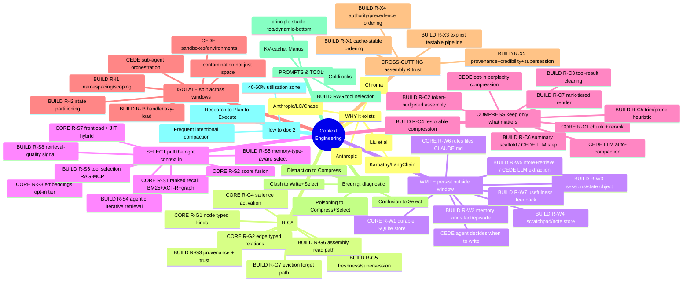

# litectx — Product Requirements Document (PRD)

> A standalone, **lite, local-first context-engineering library** for AI coding agents, shipped as
> one importable **npm package** (Node; pure ESM JS + JSDoc). litectx is two things in one library,
> and this PRD is organized as **two parts** that mirror them:
>
> - **Part 1 — the memory engine.** Indexes a repository (code + docs) and directly-written
>   knowledge (facts/episodes) into a queryable **code+context graph**, and serves two read-views —
>   **recall** (ranked search) and **impact** (blast-radius / risk) — with ACT-R-style activation
>   signals. The aurora-borrowed kernel: index · recall · impact · graph · kinds · storage.
> - **Part 2 — the context-engineering primitives.** The four CE primitives (Write / Select /
>   Compress / Isolate) built **on top of** Part 1's graph — `remember`/`assemble`/`compress`/
>   `stash`/`scope`/… — so litectx is the comprehensive, long-running CE library. Derived from the
>   CE leaders (Appendix CE-T), not guessed.
>
> **Not part of the "bare" suite.** litectx is a real ~3–4k-LOC library, not a ≤150-LOC primitive —
> a standalone library the bare suite *consumes* (Part 1 §10). Its discipline is *lite / local-first
> / no-service / deterministic-core / optional-tiers*. **baresuite consumes litectx, never the
> reverse** (the dependency direction is fixed).
>
> **Governing rules:** `.claude/memory/AGENT_RULES.md` (POC-first, dependency hierarchy
> vanilla → stdlib → external, lightweight-over-complex, open-source-only, surgical changes, the
> Testing Trophy) and `LIBRARY_CONVENTIONS.md` (**pure ESM JS + JSDoc, no build step**; TypeScript is
> dev-only — `tsc` checks JSDoc and *generates* the shipped `.d.ts`, never hand-edited). Any
> "TypeScript source" phrasing is stale and overridden. When CLAUDE.md disagrees with those two,
> they win.
>
> **Single source of truth (DECIDED).** This PRD is the one authority for **all of litectx** — both
> the memory engine (Part 1) and the CE primitives (Part 2). Every decision, scope line, and
> build-order call lives here or is *referenced* from here. The companions are subordinate, never
> competing authorities:
>
> | Doc | Role |
> |---|---|
> | **`litectx-prd.md`** (this) | the authority — both parts: decisions, scope, build order, module map (Part 1 §2.1) |
> | `docs/02-engineering/build-studies.md` | calibration + pattern **appendix** — **Part A** aurora borrow ledger (exact constants + aurora `file:line`), **Part B** copy-pattern studies, **Parts D/E** CE flows; referenced, not duplicated |
> | `docs/01-product/benches-prd.md` | the **validation** companion — the ON-vs-OFF A/B bench suite + findings, and the parked factory spike |
> | `docs/02-engineering/baresuite-litectx-prd.md` | the **integration contract** — the consumer-side RT seam shapes; litectx's own obligations live here (Part 2 §8.2) |
> | `barecontext-prd.md` (archived) | **superseded** — its memory axis folded into Part 1, its primitives into Part 2 |
> | `.claude/stash/*`, `CLAUDE.md` | session history / doctrine — never source of truth |
>
> When this PRD and a companion disagree, **this PRD wins**; fix the companion.
>
> **Reading the two parts.** Each part keeps its own section numbering. **Within a part, a bare
> "§N" means *that part's* section N; cross-part references are written "Part 1 §N" / "Part 2 §N".**
> (The two parts were authored as two PRDs and merged 2026-06-23 into this one authority; the seam is
> the part boundary, not a content cut — every decision and validation from both is preserved.)
>
> Status legend: **DECIDED** (settled, do not relitigate), **POC-GATED** (build only after the named
> POC passes), **DEFERRED** (post-v1; names the exact condition that un-defers it), **NON-GOAL**
> (explicitly out of scope).

---

## 0. TL;DR

- **What:** a lite, local-first library that indexes a codebase + its docs into a
  **code+context graph** and ranks/relates that graph with **ACT-R cognitive activation**.
- **Two user-facing views over one graph:**
  1. **recall** — "given a query (or the current file), return the most relevant
     chunks," ranked by BM25 + ACT-R activation (embeddings optional).
  2. **impact** — "if I change this symbol/file, what's the blast radius?" — called-by /
     calling edges → affected files + a **risk bucket** (low/med/high).
- **The graph is the product.** recall and impact are *views*; the typed node+edge graph
  is public API, so **codegraph** and **contextgraph** (§2) can be built on top later at
  near-zero marginal cost.
- **Node `kind` is first-class from day one** (§3.1): v1 implements `code` and `doc` (md);
  the schema *reserves* `fact`, `episode`, and other doc formats so the engine can grow
  into a general short/long-term ACT-R memory without migration.
- **Name:** `litectx` (npm-free) — "lite context."
- **v1 languages:** TypeScript, JavaScript, Python (routed by file extension).
- **Stack:** Node, pure **ESM JS + JSDoc** (no build step), `better-sqlite3` + FTS5, `web-tree-sitter`, `ripgrep`. **Zero
  external binaries required.** Embeddings are the one opt-in tier.
- **Edges/impact:** tree-sitter + `ripgrep -w` only — **no LSP server, ever** (Part 1 §7).
- **Method:** *borrow, don't port* — reimplement AURORA's validated algorithms in clean ESM JS.
- **The CE primitives ride on the same graph (Part 2).** On top of the memory engine, litectx
  ships the four context-engineering primitives — **Write** (`remember`/`forget`/scratchpad),
  **Select** (recall + tool/quality signals), **Compress** (`assemble`/`compress`/`stash`/`trim`/
  `summaryWindow`), **Isolate** (scope/`peek`) — deterministic core, every LLM step ceded or opt-in.
  This is what makes litectx the comprehensive, long-running CE library rather than just a code index.


---

# Part 1 — The memory engine

> **What Part 1 specifies:** the aurora-borrowed memory kernel — the code+context graph and its two
> read-views (recall · impact), ACT-R activation, node kinds, indexing, edges, tiers, storage, the
> write path, and the access-log tier. Part 2 (the CE primitives) is built *on top of* everything
> here and references it. Within Part 1, a bare "§N" means Part 1 §N.

## 1. Why this exists

AI coding agents re-discover the same codebase every session — grep, read, lose the
thread, forget last turn. They also edit blindly, changing a function without knowing what
calls it. litectx gives an agent a **persistent, ranked, relationship-aware memory of the
code** and a **blast-radius signal before it edits**, both computed locally, with no
service and no required ML.

AURORA (`~/PycharmProjects/aurora`, Python) proved the core works. litectx extracts the
**validated kernel** — ACT-R activation, the edge graph, block-level git signals,
tree-sitter chunking, code-aware BM25 — and leaves behind the LLM orchestration
(`soar`/`reasoning`/`spawner`/`cli`, ~50k LOC) a harness already does. The most valuable
carry-over is not code but **calibration** (§12).

---

## 2. Scope — one substrate, two views (DECIDED)

The core deliverable is a **code+context graph**:

- **Nodes** — typed context units (see §3.1 for `kind`): code chunks
  (function/method/class, with name/signature/docstring/line-range) and doc chunks (md
  sections) in v1.
- **Edges** — typed relationships: `calls`, `imports`, `depends_on` (extensible).
- **Per-node signals** — git (block-level commits/recency), activation (access
  count/recency), AST complexity.

Over that one graph, v1 ships **two views**:

| View | Question it answers | Primary inputs |
|---|---|---|
| **recall** | "what's most relevant to *this*?" | FTS5/BM25 + ACT-R activation (+ optional embeddings) |
| **impact** | "if I change *this*, what breaks and how risky?" | call/import edges → reference count → risk bucket |

**Why this framing is load-bearing:** the graph is exposed as first-class public API, so
`codegraph`/`contextgraph` are *additional views over the same data*, not re-extractions —
**`contextgraph` now ships** (the `observe()`/`trace` CE-pipeline view; `codegraph`'s content
view rides `getNode`/`related`/`impact`). See `docs/03-usage/graphs.md`. Build "a search
function" instead and you pay for the graph twice.

### 2.1 Module architecture (the memory engine) — one substrate, scorers, views

The engine decomposes into small ESM modules with a strict dependency DAG (no cycles). Each maps
to a build slice (§11.2) and to the calibration sections of the borrow ledger. *Slices ≠ modules:*
a slice adds a capability over time; the modules below are the code units it lands in.

| Module | Role | State | Slice / ledger |
|---|---|---|---|
| `store` | SQLite/FTS5, pragmas, all SQL, tables, `getNode`/`related` | ✅ | §9 · ledger §12 |
| `indexer` | pass orchestration: collect + incremental diff + dispatch | ✅ | §6 · slices 0–1 |
| `langdef` | per-language registry (`defTypes`/`importTypes`/`callTypes`/`branchTypes` per ext) | ✅ | slice 2/4/5 · ledger §11 |
| `chunker` | file → tree-sitter (code) / section (md) chunks + line ranges → `nodes` | ✅ | slice 2 |
| `gitsig` | file-level `git log` (one pass) → commit count + last-commit time, attached to hits as **activity metadata** (not scored) | ✅ | slice 4 · ledger §8 |
| `edges` | import specifiers → **`imports`** edges (intra-repo) → **1-hop additive spreading** in recall; `calls` relationships computed on-demand by `impact` (not persisted, §7.1 — `type='call'` row stays reserved) | ✅ (imports) | slice 4 · ledger §11/§4 |
| `tokenize` | code-aware BM25 body (`indexBody`: split + path + symbol names) + query match | ✅ (deps deferred) | slice 3 · ledger §1 |
| `activation` | ACT-R base-level **pure fns** (BLA · decay+churn · boost) — **deferred to access-log tier** (POC: git-only base-level is repo-dependent; the *spreading* ACT-R term ships via `edges`) | deferred | access-log tier · ledger §2–6 |
| `recall` | **kind-scoped** FTS gate → per-kind BM25 **+ additive import-spreading** (+semantic w/ embeddings tier) | ✅ (kind-scoped + spreading) | slice 3–4 · ledger §7 |
| `impact` | `impact(symbol)`: callees (ts walk) + callers (`rg -w`→ts confirm, + renamed barrel/path-alias resolution) → risk bucket `max(confirmed,mentions)` + complexity, on-demand; §7.2 hedges | ✅ (5a + 5b) | slice 5 · ledger §9 |
| `embeddings` | semantic tier (float32 BLOB / ONNX via transformers.js), off by default | ✅ (slice 6) | §8 · ledger §11/§12 |
| `LiteCtx` | facade: config + wiring | ✅ | §3 |

**Seam rules (do not violate):**
1. **`store` persists FTS content, never builds it** — code-aware body text is `tokenize`'s job
   (✅ slice 3: `store.applyChanges` now calls `tokenize.indexBody`).
2. **One `langdef` registry** — `chunker`, `edges`, and complexity all read it; never fork it
   per-slice (`.scm` for chunking + node-type config for edges hang off the same module).
3. **`activation` stays pure** — functions of already-extracted signals, so the bench can ablate
   each term. (Ablation earned its keep: Step-0 showed base-level *still* fails the multi-repo gate
   *with* decay+churn — not a half-formula artifact but a real "needs an access log" finding.)
4. **`recall` is its own module, not the facade** — fusion weights / normalization / the
   tri→dual fallback chain don't belong in `LiteCtx`.

Don't pre-create empty modules — `gitsig`/`edges`/`impact` land with their slices; `activation`
lands with the access-log tier, not v1.

---

## 3. Public API (DRAFT shape)

One importable surface; one config object; safe defaults; everything advanced is opt-in.

```js
import { LiteCtx } from "litectx";

const lc = new LiteCtx({ root: "/path/to/repo" /*, ...LiteCtxConfig */ });

await lc.index();                       // incremental, git-aware (§6)
await lc.index({ paths: ["src/"] });

// view 1 — recall (kind-scoped; kinds never share a ranking — §5)
const code = lc.recall("how does auth work", { kind: "code" });     // flat Hit[], default n=10
const both = lc.recall("how does auth work");                       // grouped { code:[…5], doc:[…5] }
const more = lc.recall("how does auth work", { kind: "code", n: 30 }); // dig deeper
const full = lc.recall("how does auth work", { kind: "code", body: true }); // inline each hit's content (RT-3)
// Hit → { path, kind, format, score, chunk, body?, meta? }  (body only with {body:true}; meta = written-memory opaque dict)

// view 2 — impact
const blast = await lc.impact({ file: "src/auth.ts", line: 42 });
// → { symbol, usedBy:{refs, files}, risk:"low"|"med"|"high", complexity, callers, callees }

// the write path — directly-written memory (slice 7, §3.2): facts/episodes/docs with no file on disk
await lc.remember("fact:auth-uses-jwt", "Auth is JWT, verified in middleware.", { kind: "fact" });
await lc.remember("faq:refunds", "Refunds within 30 days…", { kind: "doc", format: "md" });
await lc.remember("ep:2026-06-09-async", "recall() became async.", { kind: "episode", occurredAt: 1717900000 });
await lc.remember("fact:tagged", "…", { kind: "fact", meta: { sessionId: "s-1", tag: "auth" } }); // RT-3: opaque dict, sealed + verbatim round-trip
await lc.forget("fact:auth-uses-jwt");                              // update / forget by caller key

// the substrate itself (foundation for codegraph/contextgraph)
const node = await lc.getNode(id);
const related = await lc.related(id, { edge: "calls", hops: 1 });

// mount litectx as a host's swappable memory backend (RT-3): the four-method { store, search, get, delete }
import { liteCtxAsStore } from "litectx";
const memory = liteCtxAsStore(lc);                                  // drop-in for a substring-scan store; ranked recall
```

`LiteCtxConfig` — **one object, all optional except `root`. There is no config file** (no
`.litectxrc`, no env): litectx is an *imported library*, not a service, so an operator sets these as
constructor args — or as the equivalent **CLI flags / MCP tool args** — and host-app config
management stays the caller's concern (the "one config, no guardrail/budget layer" doctrine). The
surface is small enough to live here rather than earn its own doc — eight knobs:

| field | default | knob |
|---|---|---|
| `root` | *(required)* | repo root to index |
| `include` | `.ts .js .mjs .cjs .py .md` | which file extensions to index |
| `pathspecs` | — | git pathspecs to scope the index |
| `dbPath` | `<root>/.litectx/index.db` | the single SQLite file (`:memory:` = ephemeral) |
| `embeddings` | `false` (lib) · **on** (CLI + MCP) | the opt-in semantic tier |
| `embedWeight` | `1.0` | semantic fusion weight (higher = more semantic) |
| `embedModel` | `Xenova/all-MiniLM-L6-v2` | transformers.js model id |
| `embedder` | — | inject a custom/stub embedder (advanced / testing) |

(No activation preset/weights knob — base-level activation as a ranking signal was POC-falsified and
dropped; the edit signal lives in `recentActivity`, never in config.) The operator-facing subset is
mirrored as CLI flags and MCP args: see the **CLI / MCP reference**
(`docs/03-usage/mcp-cli-reference.md`) and the optional **Claude Code integration** — the LSP-free
pre-edit `impact()` hook + SessionStart index-warmer (`integrations/claude/README.md`).

### 3.1 Node kinds (memory types) — first-class from day one (DECIDED)

AURORA shipped a fixed `code | kb | doc | reas` set keyed by extension
(`core/.../chunk_types.py`). litectx generalizes this into an **open `kind` discriminator
present in the schema from day one**, because the engine is meant to grow into a general
ACT-R memory (short- and long-term), not just a code index.

| `kind` | v1? | What | Chunker | Source |
|---|---|---|---|---|
| `code` | ✅ v1 | AST chunks (function/method/class) | tree-sitter | file |
| `doc` | ✅ v1 (**md**) | authored prose passages (README, FAQ, KB…) | section-aware md chunker | file **or** direct |
| `fact` | ✅ **slice 7** | semantic memory — a decontextualized, durable assertion | none (stored whole) | direct |
| `episode` | ✅ **slice 7** | episodic memory — a time-stamped event/observation | none (stored whole) | direct |

> The full write-path contract — the `remember`/`forget` API, the `source`/`path`/`occurred_at`
> fields, fact-vs-doc, FAQ-is-a-doc, and the cold/warm-vs-hot split — is **§3.2**.

Design rules (DECIDED):
- **Doc *formats* are a `format` field under `kind=doc`** (`md` in v1; `pdf`/`docx`/`txt`/`log`/`csv`
  shipped since), **not** new top-level kinds — so adding a format never migrates the schema.
- **Unified file ingest** (SHIPPED — `ctx.ingest(buffer, { filename, scope?, expiresAt? })`, the
  chat-upload flow; supersedes the unreleased `ingestDocument`). Routed by extension:
  - **md/pdf/docx → chunkable**: markdown is a trivial local chunker; PDF/DOCX need extraction libs, so
    they ride an **optional, lazy-loaded peer-dep tier** (`pdfjs-dist` + `mammoth`, mirroring embeddings)
    — `npm i litectx` stays lean/offline, nothing imported until the first chunkable ingest. Converted to
    markdown, segmented (DOCX keeps headings → the md chunker; flat PDF → paragraphs reconstructed from
    inter-line vertical gaps, packed whole into <800-char segments), stored as `source='direct'` `doc`
    rows carrying the reserved `format` — no schema migration. Untrusted input bounded
    (`maxSize`/`maxPages`/per-page `parseTimeoutMs`); scanned PDFs not OCR'd.
    - **Refusal (litigated 2026-06-27): no ML-grade PDF converter.** Heavy extractors — `MinerU`,
      `markitdown` — are rejected on two independent grounds. (1) **Wrong language:** both are Python; a
      pure-ESM-JS importable lib can't express them as deps (the peer-dep escape hatch only works because
      `pdfjs-dist`/`mammoth` are npm packages), and shelling to a Python runtime breaks lean/offline/
      single-install/no-lock-in. (2) **Wrong consumer:** the extraction output feeds a BM25/embeddings
      recall index, which keys off *terms*, not layout — MinerU's value (tables, formulas, OCR, column
      reflow) is wasted on a search index. Most JS-native PDF libs are `pdfjs` underneath anyway, so there's
      no JS drop-in that's meaningfully more robust without ML (→ cloud API → online + lock-in, also out).
      The robust-converter need is served by the **existing seam**: a consumer runs their own extractor and
      `ingest()`s the resulting markdown. Heavy extraction lives at the consumer's edge; litectx owns
      chunking + recall, not document fidelity.
  - **txt/text/log/csv → chunkable** (multis M3 plaintext-chunker, v0.19.0): already plaintext, so **no
    parser, no peer dep, no new format-native chunker** — they reuse the same headless packer (blank-line
    paragraphs, else lines, packed whole to <800 chars; a leading `#` is literal, never a heading). CSV is
    chunked as raw text (no columnar parse). Closes a silent no-op: these previously fell to the blob path
    (0 chunks, body unsearchable) for a type adopters advertise.
  - **any other type (xlsx/xml/code/binary, + text formats off the allowlist like `.tsv`) → byte-exact blob** (multis M3 R3): stored verbatim in a
    SQLite `BLOB` (POC-proven byte-identical round-trip), **filename indexed** for recall, body never
    parsed/chunked; `get(id)` returns the original bytes. litectx is the single durable store. A blob is
    never parsed → none of the parser-RCE/XXE surface, only the `maxSize` cap.
  - **Per-upload `scope`** (R2) fences doc/blob rows on **both retrieval paths**: `recall({ scope })` returns
    `scope ∪ null-global` (never another scope), and `get(id, { scope })` applies the same fence to the
    **direct handle** — a by-id fetch with a mismatched scope returns `null` (fencing search alone is
    insufficient: derived ids are guessable). Bare `get(id)` stays unfenced (backward-compatible; the
    customer-tenant path opts into the stricter check via the `scope` arg — a threat-model-justified
    asymmetry, the `owner`/`session` fact model untouched). Distinct axis from `owner`/`session`. **Consumer
    must** pass `scope` to both `recall` and `get` on customer-reachable paths, never expose a bare `get(id)`,
    and namespace ids per scope (defense-in-depth). **Optional `expiresAt`** (R5): once past, excluded from
    recall/get and reclaimed by `ctx.purge()`; the consumer owns the retention schedule, litectx the
    mechanism. Both default null (global/forever; backward-compatible).
  - **Fail-closed scope (v0.18, multis M3 follow-up)** — R2 fences a *set* scope correctly, but the
    *default* (a missing scope = see/write all) is the single-tenant origin leaking through, and a
    per-call `scope` arg is forgettable. The durable fix is three additive pieces: **`strictScope: true`**
    makes a missing doc scope **throw** on read *and* write (an un-scoped `ingest` silently publishing to
    the shared tier is a *persistent* leak, so the write path fails closed too); **`GLOBAL`** is the
    unambiguous shared-tier opt-in (a read/write sentinel, never a stored value → no migration, union
    intact) so "deliberately global" ≠ "forgot"; **`ctx.scoped(scope)`** binds the scope once (the
    doc-axis analogue of instance `owner`/`session`) so "forgot to pass scope" is a non-existent code
    path. Flag off by default → single-tenant byte-identical. Doc/blob axis only at v0.18 — the
    `fact`/`episode` memory axis was left untouched (it was already bind-once-safe on the instance, and
    flipping its default was a non-goal *then*). **Superseded by M4 (v0.21, below):** once multis needed
    per-tenant memory from a *single shared* instance, the memory axis gained the same per-call fence and
    `strictScope` was extended to it.
  - **Recency fallback `recentMemory()` (v0.20, multis M3 fast-follow)** — `recall` returns `[]` for an
    all-stopword query (*"what did I say"*): there is no term to rank on. A consumer that still wants to
    ground the agent needs "the latest uploads for this scope," which is recency, not relevance. This ships
    as a **separate verb**, deliberately *not* a `recall({ recentOnEmpty })` flag: the consumer owns the
    *policy* (whether/when to fall back), litectx the *mechanism*, and folding recency into `recall` would
    mix it into a relevance ranking and pollute the demand signal — so it parallels `recentActivity()` (a
    recency view isolated from recall scoring). `recentMemory({ scope, n, body })` returns direct `doc` rows
    (blobs included) newest-first, **scope-fenced + expiry-aware with the exact `recall` doc predicate** (so
    it can never leak another tenant's upload or surface an expired row; `strictScope` throws on a missing
    scope, the doc axis). Mechanism: `doc_scope` gains a `created_at` column (column-additive), recorded for
    every direct doc; a `scope=NULL, expires_at=NULL` row stays byte-identical to the old "no row" under the
    LEFT JOIN, so the fence is unchanged. Doc axis only — `fact`/`episode` scope on the orthogonal
    owner/session axis and are out of scope (straddling both in one verb was a non-goal).
    - **Known cost, deferred by design (not a bug):** unlike every other doc query, `recentMemory` has no
      FTS `MATCH`, so it cannot use the FTS index — `EXPLAIN QUERY PLAN` shows `SCAN docs VIRTUAL TABLE` +
      a temp-b-tree sort. On a large indexed repo the `docs` table is dominated by `source='file'` code
      rows, so each call scans them to surface a handful of direct docs. This is **availability-only, not
      attacker-amplifiable** (a rare empty-query fallback; results bounded by store size; `LIMIT` always
      set). The obvious fix is **proven ineffective**: an index on `doc_scope.created_at` does *not* change
      the plan, because `docs.path` is an UNINDEXED FTS5 column — resolving `format` for specific paths
      forces the FTS5 scan regardless of which table drives the join. The only effective fix is structural
      (store `format` in `doc_scope`, or a separate physical direct-doc table), which is disproportionate
      for a rare path on a bounded local-first store (a ~5k-row scan is sub-millisecond). **Un-defer
      condition:** a consumer reports measurable `recentMemory` latency on a large store — then build the
      structural index, not before (adding the ineffective index now would be cargo-cult).
  - **Per-tenant memory from one shared instance (v0.21, multis M4)** — multis is multi-tenant on **one
    `LiteCtx` per process** (the doc axis already supported this via per-call `scope`/`scoped()`), but the
    `fact`/`episode` axis fenced **only** by the `owner`/`session` bound at construction — so a single
    instance could not fence per-tenant memory, blocking the migration of multis's memory onto real
    `episode`/`fact` kinds (needed for the promotion ladder). The fix makes the per-call `scope` drive the
    memory axis too: `scope` → the per-call `mem_scope.owner` (a tenant string → that owner ∪ global;
    `GLOBAL` → the shared tier; omitted → the instance owner). It fences `recall({kind:'fact'|'episode'})`
    on **both** the BM25 and KNN paths (cosine can't float another tenant's memory past the gate) **and**
    the ladder (`reviewCandidates`/`promotionCandidates`); `ctx.scoped(tenant)` now binds every fenceable
    kind, so one instance is a complete multi-tenant store. **`strictScope` extends to the memory axis**
    (a missing scope on a `fact`/`episode` read/write or a ladder query throws), revising v0.18's
    doc-axis-only carve-out. **Single-dim by design:** the tenant maps to `owner`; `session` stays
    instance-bound (multis chose one fence per tenant, not customer-owner + chat-session two-level).
    Mechanism is purely additive — the per-call owner falls back to the instance owner when no scope is
    passed, so a non-strict single-tenant store is byte-identical; no schema change (`mem_scope` already
    existed). **`get(id)` is fenced too** (the security boundary, not only recall): a scoped/`GLOBAL`
    `get` of a `fact`/`episode` owned by a *different* tenant returns `null` — `getItem` is kind-routed to
    `mem_scope.owner` exactly as it fences a `doc` on `doc_scope.scope` (the same lesson the doc axis
    learned in v0.18: "fencing recall without get is only half the boundary"). A bare non-strict `get(id)`
    stays unfenced (legacy by-id model); under `strictScope` a bare `get(id)` throws.
  - **Tenant-scoped memory forget (v0.22, multis M4)** — the delete-side mirror of v0.21's read fence.
    Until v0.22 `forget` could drop one row by `id` or bulk-invalidate by `{ kind, by }` **owner-blind**
    (across every tenant), so a shared instance had no way to clear one tenant's memory without reaching
    another's — a security gap, not a nicety (a mis-scoped `/forget` would delete a *different* customer's
    memory). The fix adds `forget({ scope, kind? })`: a tenant string → delete only `mem_scope.owner =
    scope` rows; `GLOBAL` → the shared tier (`owner IS NULL`) **only**. The fence is deliberately the
    **stricter `owner = scope`, NOT the read fence's `owner ∪ global`** — a tenant forget that also
    matched `owner IS NULL` would wipe the shared memory for everyone; a `GLOBAL` forget uses a LEFT JOIN
    because an ownerless row has no `mem_scope` entry at all. **Mem-axis only** (never a tenant's `doc`/
    blob uploads, another tenant's rows, or the stash). `ctx.scoped(tenant).forget()` is the bound-view
    form (no scope to omit); under `strictScope` a scope-less memory forget (`forget({})` or owner-blind
    `forget({ kind })`) throws — a tenant-blind wipe is unexpressible by omission. Purely additive: legacy
    `forget('id')` / `forget({ kind, by })` are byte-identical on a non-strict instance; no schema change.
    v0.22 also surfaced the store's precise by-key selectors on the object form — `forget({ id })` and
    `forget({ idPrefix })` (base id + its `#<n>` segments, the clean-re-ingest handle) — which name an
    exact target and so run even under `strictScope`. A tenant `forget({ scope })` combines **only** with
    `{ kind }`: passing any other narrower (`id`/`idPrefix`/`by`) throws rather than silently dropping it,
    which also closes a scoped-view footgun (an injected `scope` would otherwise widen
    `scoped(A).forget({ by })` into a full tenant-A wipe).
  - **Memory-axis recency + count, KNN-fence lock (v0.23, multis M4 R3/O1/R4)** — the reads that let a
    consumer keep **no** homegrown memory store. **R3:** `recentMemory` gains a `kind` axis selector —
    `kind:'fact'|'episode'` returns that tenant's memory **newest-first by `occurred_at` (episodes) /
    `created_at` (facts)**, fenced on `mem_scope.owner` exactly like `recall`/`get` (doc-axis behavior
    byte-identical when `kind` is omitted). It carries each row's verbatim `body` + opaque `meta` and
    **never parses the stored text** — the consumer carries `role`/turn markers in `meta`, so the
    conversation window reconstructs faithfully (no lossy `User:/Assistant:` string-splitting; litectx
    owns content, never transcript grammar). Mixing `doc` with `fact`/`episode` in one call throws (the
    two scope axes resolve differently). Backed by a new `mem_scope.created_at` column — written
    unconditionally, column-additive ALTER, a legacy undated row sorts last (mirrors v0.20's
    `doc_scope.created_at`). **No per-row TTL on the memory axis** (unlike doc R5): episode staleness is
    the existing 30-day prune, facts are durable. **O1:** `count({ scope, kind })` sizes a tenant's
    memory by kind for `/memory`-style surfaces without pulling rows — same fences, additive across both
    axes (so one call may sum facts ∪ shared + live docs ∪ shared), fail-closed under `strictScope`.
    **R4:** the v0.21 per-tenant fence on the **KNN/semantic** recall path is now regression-locked — a
    semantic nominee a *different* tenant holds is never floated past the gate (`knnCandidates` already
    routed through `mem_scope.owner`; v0.23 adds the failable proof: a fence-bypass mutation makes a
    cross-tenant nominee leak and the test fails). Purely additive; `ScopedView` gains `count` and
    `recentMemory`'s `kind`.
  *(PDF/DOCX was DEFERRED through v0.16; R2/R3/R5 added for the multis M3 migration; v0.18 hardened the R2
  scope default; v0.20 added the `recentMemory` empty-match recency fallback; v0.21 extended per-call
  scope + `strictScope` to the memory axis; v0.22 added tenant-scoped `forget`; v0.23 extended
  `recentMemory` + a new `count` to the memory axis and locked the KNN fence.)*
- **Type-specific decay (§4) is keyed by `kind`** — adding a kind = add a decay rate + a
  chunker; no schema change. ACT-R applies uniformly across kinds, which is precisely how
  long/short-term doc memory lands later.

### 3.2 The write path — facts, episodes, and directly-written docs (DECIDED — slice 7)

v1 indexes content *from files on disk* (`code`, `doc`). A long-running agent memory also needs to
**write content that is not a file** — a fact it learned, an episode it observed, a doc/FAQ handed to
it at runtime. Slice 7 adds that write path. It rests on **one new idea — a `source` discriminator —
and otherwise reuses the existing `kind`/`format`/`path` triad unchanged.**

**Three orthogonal axes (do not conflate — the most-litigated point of the design):**

| Axis | Field | Values | Decides |
|---|---|---|---|
| **memory type** | `kind` | `code` · `doc` · `fact` · `episode` | retrieval semantics + decay rate |
| **content form** | `format` | `ts`·`js`·`py`·`md` (`pdf`/`docx`/`txt` reserved) | chunker; **never** a new top-level kind |
| **origin** | `source` | `file` · `direct` (+ provenance: user/agent/doc) | `index()` reconciliation + trust |

`path` is the **identity / name** on every node and the disambiguator across all of them:
`README.md` and `faqs.md` are *byte-identical* in `kind` (`doc`) and `format` (`md`) — they differ
only by `path`. "Give me only the FAQs" is a `path` filter, **not** a new kind. For directly-written
content `path` holds the **caller-supplied key** (`"fact:auth-uses-jwt"`, `"faq:refunds"`), which is
also the update/forget handle.

**Two entry paths, and the entry path decides the available kinds.** Files enter via `index()` →
`code`/`doc` (kind by file extension; you **cannot** index a file *as* a fact — distilling a doc into
facts is consumer extraction, then `remember`). Knowledge enters via `remember()` →
`fact`/`episode`/`doc`. `doc` is the only kind both paths produce. **`index()` is never mandatory:** a
litectx with only `remember()`/`recall()` and no repo is a supported **pure-memory** store; indexing
is also scopable (`index({ paths: ["docs/"] })`).

**The API (mechanism, not policy):**

```js
await lc.remember(id, text, { kind, format?, by?, occurredAt? });  // upsert by `id` (→ path)
await lc.forget(id);                                               // delete by `id`
await lc.forget({ idPrefix });                                     // base id + all its `#<n>` segments (v0.22)
await lc.forget({ kind: "fact", by: "agent" });                   // forget-by-query (human invalidation)
await lc.scoped(tenant).forget();                                  // tenant-scoped wipe (v0.22, multis M4)
```

- `kind ∈ {fact, episode, doc}` — directly-written **docs are first-class**, not only facts (an FAQ
  with no file is `remember("faq:x", …, { kind: "doc" })`).
- **`by` = provenance** (`"human"` | `"agent"`, default `"agent"`) — *who asserted it*, for trust.
  The caller never passes `source`: calling `remember()` already means `source="direct"` (set
  internally). Two different "who/how" axes — **source = HOW it entered** (file vs direct; the
  engine's reconciliation key) and **`by`/provenance = WHO said it** (human vs agent; the trust key).
- `occurredAt` is the **episode timestamp** (epoch ms; defaults to write-time). Facts ignore it.
- Stored **whole** — one node, no tree-sitter/section chunking (`symbol`/`node_type` → null/`"whole"`).
  The caller controls granularity by how it splits before writing.
- `source="direct"` (internal) lets files and written memory **coexist in one store**: `index()`
  reconciles only `source="file"` rows against disk, so a written fact is never deleted as a
  "vanished file."

**fact vs episode (a *type* split, NOT a source split):**

- **fact** — a *decontextualized, durable assertion*, true regardless of when learned ("auth uses
  JWT"). No constitutive timestamp. **Slow decay.** Source is orthogonal: user-asserted, agent-
  derived, and doc-extracted are *all* facts — origin is recorded as provenance, it does not change
  the kind. ("User instructions that don't change" are just the `source=user` cell — one corner, not
  the definition.)
- **episode** — a *time-stamped event* ("on 2026-06-09 `recall()` became async"). `occurred_at` is
  **constitutive** (cheap now, expensive to retrofit). **Fast decay** (recency-dominated).

**fact vs doc (both prose — keep the line clean):** a **doc** is retrieved as a *passage* (classic
RAG — read the FAQ answer whole); a **fact** is a *distilled assertion*. An FAQ is a `doc`; if you
later extract its policy line, *that* derived assertion is a `fact` (`provenance=doc`). Most
chatbot-KB use is doc-retrieval; facts are the distilled layer on top.

**History + trust — recorded in slice 7, scored later.** Two "memory" layers beyond search land now
as *recorded data*, not yet as ranking:
- **History** — every `recall()` hit is logged (an audit row: which item, when). This shows *what
  agents lean on*, catches over-use, and traces *where a wrong belief came from*. It is the genuine
  **access log** the base-level tier (§4) will later score — and unlike code's git proxy, written
  memory produces *real* access events, so this log is signal, not proxy. v1 records it, does not rank.
- **Trust** — each written item carries `by` (human/agent). Human-asserted should outrank
  agent-asserted — *later*, in the activation tier; v1 just stores it.

**Human-in-the-loop promotion — review earned by use (consumer policy; litectx supplies the trigger +
the two actions).** To avoid a human reviewing *every* agent fact, review is **earned by use**: when
an agent-asserted fact crosses a recall-hit threshold (**default 5**), it becomes a **review
candidate**. The consumer's loop shows candidates to a human, who either **validates** →
`remember(id, text, { by: "human" })` (provenance flips to human; now durable/high-trust) or
**invalidates** → `forget(id)`. litectx's role is *only*: store `by` + recall counts, expose the
candidate set via **`reviewCandidates(threshold=5)`** (`by="agent" ∧ hits ≥ threshold`, read off the
recall log; acting on a candidate removes it from the set — promotion flips provenance off `'agent'`,
forget deletes — so no separate "reviewed" flag is needed), and the promote (`remember`) / `forget`
actions. The *threshold value* and the *review flow* are the consumer's. **Safety:** this count gates
**review, not ranking**, so it is **not** the rich-get-richer feedback loop §4 forbids — over-triggering
a review is harmless (a human just confirms).

**Ranking of facts/episodes in v1 — honest scope.** The recall engine is kind-agnostic, so
BM25 (+ embeddings if the tier is on) ranks them today *for free*. But they have **no import/call
edges, so spreading does not apply** — their v1 ranking is BM25(+semantic), not the graph-spreading
that powers code recall. The behavior that makes fact/episode memory *cognitively* work — **slow
decay + reinforcement-on-retrieval for facts, recency-fade for episodes** — is exactly the
**access-log / base-level tier** (§4, §14 #4), which is **deferred**. Slice 7 makes that tier's
*need* concrete (it resolves §14 #6); it does not build it. Decay is one line per kind in the
existing kind-keyed map (`fact` very slow; `episode` fast) — no schema change.

**litectx is the cold/warm store, not hot memory (mechanism vs policy).** Because a written fact only
surfaces *when a query is relevant to it*, litectx's **bar for writing is low** — storing 10k facts
costs nothing if only the relevant few ever surface. This is the opposite regime from an
always-injected hot `MEMORY.md`, whose bar must be high (one bad fact poisons every session). They
compose: litectx holds the long tail (retrieved on relevance); a consumer curates the few that get
promoted hot. So litectx deliberately ships **no extraction LLM, no trust funnel, no consolidation** —
*what* becomes a fact and *which* facts go hot is consumer policy (non-goals §13: ML opt-in, no LLM
orchestration). litectx provides `remember`/`forget` + kind-scoped recall; nothing more. (The
liteagents `/stash → /friction → /remember` pipeline is the *reference* for such a consumer — borrowed
as a model, **not** built into litectx.)

**Corpus separation (a codebase *and* a product KB in one process).** Both are `kind=doc`, so kind
won't split them — but that is a **namespace** concern, orthogonal to kind. v1 answer: **separate
stores** (two `LiteCtx` instances / db files — zero new schema, works today). A `namespace` field is
added only if a consumer needs cross-corpus recall *in a single query* — DEFERRED until then.

**Schema delta (no migration):** a `source` column (`file|direct`), a `provenance` column
(`human|agent`, exposed as `by`), an `occurred_at` column (episodes), a **recall-log** table (one row
per hit — the access log §4 will later score), `fact`+`episode` added to `KINDS`, and two decay rates
(`fact` slow, `episode` fast — stored, not yet scored). Everything else in the node row
(`path`/`kind`/`format`/`symbol`/`node_type`/line-range/`body`) is unchanged.

---

### 3.3 The memory model at a glance — kinds × operations (2026-06-10)

> The whole machine is **four kinds × seven operations with two frozen weights**. Everything else in
> this PRD is either a *weight* inside the rank step or a *future event type* feeding heat — the
> skeleton below doesn't change.

**Table 1 — the four kinds (what lives in memory)**

| | **code** | **doc** | **fact** | **episode** |
|---|---|---|---|---|
| Enters via | `index()` | `index()` (.md) or `remember()` | `remember()` | `remember()` |
| The unit | function/class (tree-sitter chunk) | heading section | the row itself | the row itself |
| Word matching | exact tokens | exact tokens | stemmed (deploys=deploy) | stemmed |
| Graph boost | yes (imports) | no | no | no |
| Survives re-index | re-built from file | re-built / survives if direct | always survives | always survives |
| Future heat source | edit-after-recall | edit-after-recall | corrective re-remember | recency (occurred_at) |

One sentence to hold it all: **files are indexed and chunked; knowledge is written whole; each
kind ranks only against its own kind.**

**Table 2 — the seven operations (what you can do)**

| Operation | What it does |
|---|---|
| `index()` | Read repo from disk. Skip unchanged files (mtime+size→hash). Changed files: re-chunk, re-FTS, re-edge. |
| `remember(id, text, {kind, by})` | Write/overwrite one fact/episode/doc by id (raw text kept verbatim). `by` = human or agent. |
| `forget(id)` | Hard delete: row + raw text + embedding + its log rows. Gone is gone. Can't touch indexed files. |
| `recall(query, {log?})` | **Gate** (lexical match, per kind) → **rank** (BM25 + 0.3·neighbor + optional semantics) → attach each hit's best **chunk** pointer → return grouped by kind → **log** one impression per hit (skipped with `log: false` — non-demand consumers must not pollute the signal). |
| `get(id, {log?})` | Fetch one item's body by id — written memory verbatim, files fresh from disk. Logs `action:'fetch'`, a **tagged weak signal** demand readers exclude (the fetch-toll: you fetch what recall returned; counting it doubles demand). |
| `reviewCandidates(5)` | List agent facts recalled ≥5× (recalls only — fetches don't count) → a human promotes (re-remember `by:"human"`) or kills (forget). |

**The story, once through**

```
Day 1   index() reads the repo. auth/refresh.js → 3 chunks. README.md → 5 sections.
        remember("deploy-oidc", "npm publish uses GitHub OIDC — no tokens", {kind:"fact"})

Day 2   recall("token refresh")
        ├─ harvest: stat the few recently-recalled files — nothing changed, move on
        ├─ gate:    FTS5 finds 40 code candidates containing "token"/"refresh"
        ├─ rank:    refresh.js scores 0.9, +0.3×0.8 from its neighbor session.js → #1
        ├─ return:  {code: [...], doc: [...], fact: [...], episode: [...]}
        └─ log:     one impression row per hit

        Agent edits the refresh function.

Day 3   recall("session expiry")
        └─ harvest: refresh.js mtime moved → re-hash → re-parse → diff chunks
                    → only the refresh function changed → edit event for THAT chunk
                    (access-log tier: heat is CAPTURED, decaying over weeks — but it does NOT
                     re-rank code recall: that use was falsified as topic-blind, §14 #4 2026-06-11;
                     the captured signal feeds next-use prediction, not recall ranking)

Day 30  "deploy-oidc" has been recalled 6 times → shows up in reviewCandidates(5)
        → human re-remembers it by:"human" → durable trust. (Or forget() → gone.)
```

(The harvest step is the access-log tier's capture — designed, not yet built; see §14 #4
"SETTLED — capture mechanics." Impressions get a *slight, bounded* boost only over tens of
retrievals, and only if the bench admits it — an item earns its place, it is never gifted it.)

**Open items behind this picture** (full text in §14): build order = ~~chunk-granular recall~~
(✅ slice 8 — hits carry `chunk` pointers, the log records the symbol) → ~~`get(id)`~~ (✅ slice 9 —
body access + tagged fetch logging) → ~~MCP/CLI~~ (✅ slice 10 — `litectx-mcp` second bin + CLI
write parity) → access-log tier; activation calibration is all "run the bench" and that bench
doesn't exist yet (the biggest IOU).

**Closed 2026-06-10 (discussion w/ user):**
- **No facts-only embedding default.** "Facts embedded by default" would mean the embedder runs by
  default, which is blocked by the embedder being an **optional peer dep**
  (`@xenova/transformers` — defaults can't depend on it; requiring it doubles prod deps for a
  corpus of dozens). *(The latency objection does NOT apply: the ONNX model load is ~0.7s cached /
  ~2s first-download, warm ~6ms — not the 15–19s of aurora's torch stack, a mis-borrow corrected
  2026-06-11. The real opt-in cost is the dependency + index-time embedding, not first-recall lag.)*
  **Facts ride the single existing tier switch** — already the
  implemented behavior (`writeMemory` embeds when the tier is on). No second knob (one-config
  doctrine). The paraphrase hole in the default config is an **accepted, documented gotcha**:
  write facts in the words you'll query (the id is indexed too — "deploy-oidc" hits a "deploy"
  query); stemming covers word-forms. The memory bench's labeled para queries measure the
  embeddings lift for free whenever the tier is on. **Grounded (slice-10 release E2E, real
  model):** the hole was *narrower but deeper* than "embeddings fix it" — the semantic pool is
  BM25-gated (`_rankKind`: cosine re-ranks the FTS-matched pool, it never admits to it), so a
  **zero-shared-term** paraphrase missed even with the tier ON; the tier lifted deep-pool answers
  (the POC-validated claim), it did not retrieve what the lexical gate never saw. ~~True
  gate-bypassing semantic recall would be a separate candidate source (vector KNN union) — not
  built, not promised.~~ → **BUILT (slice 11, 2026-06-11, user-ordered):** the KNN union closes
  the hole for **written kinds only** — see §11.2. With the tier on, fact/episode recall unions
  up to 8 cosine-nearest stored vectors into the pool as nominees (pool-floor score, rank on
  semantics; strictly-positive cosine only). Bench: para 0.000 → 0.574 with exact/morph held;
  the `--embeddings` bench pass is now gated when it runs. The DEFAULT config keeps the hole —
  "write facts in the words you'll query" stands wherever the tier is off.
- **`log: false` on `recall()` — approved.** The recall log is a **demand signal**; anything that
  isn't real demand must not write to it. Agent/human queries log (default `true`); dashboards,
  CI checks, batch tooling, and read-only-db consumers pass `{ log: false }`. One boolean, nothing
  else. Ships with the next code slice.

---

## 4. Activation — the differentiator (DECIDED algorithm; params tunable)

> **What we expect from litectx's memory (recalibrated 2026-06-05, POC-corrected).** The "memory"
> is an **ACT-R activation layer over the graph** with two terms: **spreading** (activation flows
> along call/import edges) and **base-level** (frequency/recency of access, with type-decay + churn
> by `kind`). **The Slice-4 Step-0 POC split them cleanly:**
>
> - **Spreading is the v1 ranking win — BUILT (slice 4).** `recall = BM25 + 1-hop import-spreading`,
>   over **import** edges only (calls don't help recall). Shipped as an **additive boost**
>   `own + w·spread` at **w=0.3** — not the convex `(1−w)·own + w·spread` form, which *taxed*
>   well-ranked files with weak neighbours (two diagnosed regression modes: *collateral dilution* and
>   *weak-neighbour demotion*). **Validated on four repos** (aurora +0.027 / gitdone +0.010 /
>   aurora-mixed +0.008 / multis +0.014): additive@0.3 is the only setting positive on all four.
>   In v1, "ACT-R in recall" effectively *means spreading*.
> - **Limit — 1-hop import-spreading is at its robust optimum; graph-only recall has hit diminishing
>   returns.** The four-repo weight sweep is the ceiling evidence: above additive@0.3 every knob is a
>   *seesaw* (additive@0.7 = +0.044 aurora but **−0.024 multis**, below baseline — the two non-tuning
>   repos peak low and punish high weight), and one regression mode is **irreducible** — a genuinely
>   poorly-connected true answer is demoted by *any* graph prior under *every* fusion/weight (the
>   intrinsic cost of trusting the graph, not a tunable). Further recall gains therefore do **not**
>   come from graph tuning (more hops dilute; call edges don't help recall) — they come from the
>   **deferred tiers** (embeddings/semantic; access-log base-level), which are separate tiers.
> - **Base-level activation does NOT earn v1 ranking weight.** It needs a real **access log**, and
>   v1 has none. Seeding it from git history (commits as pseudo-accesses, §4.1) — even with the
>   full **type-decay + churn** formula — is **repo-dependent**: net-positive on aurora,
>   net-negative on gitdone at *every* weight (POC: `RESULTS.md` "Slice-4 Step-0"). decay+churn did
>   not rescue it (it bites *stale* high-churn files; gitdone's failure is *recently*-churned ones).
>   A repo-dependent prior is the one thing recall must not ship. **So base-level activation is
>   deferred to the access-log future** — litectx's long-running-memory differentiator — and
>   validated *then*, on real usage. The `activations` table is schema-reserved for it.
>   - **An access is a *retrieval that was used*, NOT a mere appearance in results.** The access-log
>     boost (a "this surfaced before, lift it" term) records when a hit is actually retrieved/acted
>     on — that is the genuine relevance signal base-level activation rewards. Boosting *appearance*
>     alone would be a degenerate feedback loop (rich-get-richer: it amplifies the current ranking,
>     not relevance) and is explicitly **not** the design. This is also why git ≠ access: git is
>     *edit* frequency (commits), the access log is *use* frequency — aurora's card shows them as two
>     separate counts ("accessed 7x, 7 commits").
> - **Git is not a scored signal; it is passive activity metadata** (commit count + last-modified,
>   shown alongside hits as grounding). This re-derives aurora's own design: aurora never scored git
>   directly — git *seeded* activation and was *displayed raw*; its scored activation rode a real
>   access log ("accessed 7x").
>
> **v1 default ranking = BM25 + spreading** (two zero-ML signals). **Embeddings stay an optional
> tier** (semantic; dual ≈85% vs tri ≈95% — not worth the cold-start + ML dep by default). The
> activation engine remains **kind-agnostic** — the same math ratchets `fact`/`episode` memory once
> the access log exists; code is just v1's content.

ACT-R total activation, reimplemented in JS (grounding: aurora `activation/*`,
`docs/02-engineering/build-studies.md` Part A):

```
A = BLA + Σ_j (W_j · F^hop_ij) + ContextBoost − Decay
```

- **BLA (base-level)** — `ln(Σ_j t_j^-d)` over access history, `d=0.5` default.
- **Spreading** — BFS over edges, `F=0.7`/hop, max 3 hops.
- **Context boost** — query↔chunk keyword overlap, `boost=0.5`.
- **Decay** — `−d_kind · log10(days_since_access)`, **1-hour grace**, capped at **90d**,
  floored at `−2.0` (aurora-verified; see borrow ledger).
- **Type-specific decay** (keyed by **`(kind, format)`**) — markdown (`kind=doc, format=md`)
  `0.05`, class `0.20`, function/method/`code` `0.40`, toc-entry `0.01`; pdf/docx `0.02`
  (reserved). Markdown decays ~8× slower than functions. ⚠️ **aurora tuned _markdown_ at `0.05`**
  — its `0.02` rate was for paginated pdf/docx; do **not** apply `0.02` to md (ledger §3/§10).
  - **Written-memory rates (slice 7, §3.2) — `fact` `0.02`** (durable semantic memory, ~never
    fades) and **`episode` `0.40`** (recency-dominated, fades like volatile code). **Provisional** —
    these are *calibration only*, not yet code: nothing scores decay in v1 (no access log), so a
    decay-map constant would be dead code. They are validated when the **access-log tier** scores
    base-level on real recall history (§11.2 — the log slice 7 starts recording). The split itself
    is load-bearing (it *is* the semantic-vs-episodic distinction); the exact constants are a
    starting point to re-validate, per "carry the calibration, re-validate any change."
- **Churn factor** — `0.1 · log10(commits+1)` added to decay (volatile code decays faster).
- **MMR diversity rerank** (optional) — needs embeddings; off by default.

Ship AURORA's 5 presets as config presets. All formulas are pure functions → near-verbatim
JS port, unit-testable. **Every constant above is source-verified in
`docs/02-engineering/build-studies.md` Part A (aurora `@ 750a39d`)** — that ledger, not this
summary, is the calibration source of truth; start at aurora's tested defaults, re-validate any
change on both repos before it earns weight. **Scope note (POC-corrected):** of these, only
**spreading** ships as a v1 *ranking* term (slice 4, over edges). The base-level terms (BLA,
type-decay, churn, context-boost) are the **access-log tier** — built and validated when real
accesses exist, not at cold-start (see §4.1 and §14 #1/#4).

### 4.1 Cold-start ranking — git is activity metadata, not a ranking prior (POC-corrected 2026-06-05)

> **Original design (retired for v1 ranking).** The plan below seeded base-level activation from
> git commit timestamps so cold-start recall wouldn't collapse to keyword-only. The **Slice-4
> Step-0 POC falsified it as a ranking signal**: git-seeded base-level — *even with* the full
> type-decay + churn formula — is **repo-dependent** (net-positive aurora, net-negative gitdone at
> every weight; `RESULTS.md` "Slice-4 Step-0"). So in v1: **git is passive activity metadata**
> (commit count + last-modified, displayed alongside hits, not scored), cold-start ranking is
> **BM25 + spreading**, and the unified BLA model below is **kept for the access-log future** —
> where it is validated on real usage, the only place it has signal. The reasoning below stands as
> the *future* design; it is no longer the v1 cold-start path.

At first index there is no access history, so a naive BLA would zero out everything and
recall would collapse to keyword-only. **AURORA already solved this the way we want** —
`git.py:calculate_bla(commit_times, decay=0.5)` applies the *same* `ln(Σ t_j^-d)` to a chunk's
git commit timestamps (fallback `0.5` when untracked); commit recency → recency, commit count →
frequency. So this is **borrowed, not invented**: litectx carries that unified single-formula
approach with **safe defaults**:

1. **Never-accessed is neutral, not punished** — empty access history ⇒ BLA `= 0` (not
   `−∞`); decay `= 0` when `last_access` is null or within grace. No chunk is penalized for
   being freshly indexed.
2. **Git provides the positive prior** — recently/often-committed chunks should outrank
   stale ones on day one. **Recommended unification (validate in POC):** *seed the BLA
   access-history with the chunk's git commit timestamps as pseudo-accesses.* Then the same
   `ln(Σ t_j^-d)` naturally bootstraps cold-start — commit **recency → recency term**,
   commit **count → frequency** — and real accesses simply append more terms over time. One
   formula instead of two BLAs; "git was good for first index" falls out for free.
3. **First-index ranking is therefore** git-prior + context-boost (query match) + spreading
   (edges) − (neutralized) decay → code and docs surface immediately on relevance + recency.

---

## 5. Retrieval pipeline + the code-over-md fix (DECIDED — reshaped in slice 3)

Two-stage (grounding: `hybrid_retriever.py`, `MEM_INDEXING.md §Hybrid`):

1. **FTS5 keyword gate** — SQLite FTS5 BM25 → top ~N candidates **per kind**.
2. **Kind-scoped ranking** → BM25 now; **spreading** (slice 4, over edges) and **semantic**
   (embeddings tier) layer in **within a kind**, never across. Base-level activation is the
   access-log tier (§4), not a v1 ranking term:
   - **code**: BM25 → +spreading (graph) → +semantic (embeddings tier).
   - **doc/kb**: BM25 → +semantic (prose benefits most from embeddings; few code edges).
   - *(grounding shown, not scored:* git activity per chunk; impact/refs via the impact view.)

**Code-over-md — solved structurally by kind-scoping, NOT by weights (slice 3 decision).**
The bug: prose-heavy md out-surfaced code because a query term is *mentioned* more in prose.
AURORA's fix was per-kind hybrid **weights** (`hybrid_retriever.py`) — but that only works
once ≥2 signals exist (in dual-hybrid, code leans BM25 0.625 / doc balances BM25 0.5 with
activation); **with BM25 as the only signal it degenerates to a tuned md-penalty constant**,
which the doctrine forbids. Worse, any *shared* ranking is hostage to the doc/code volume
ratio (AURORA had ~26k lines of md that overpowered code) — a calibration that can't
generalize across repos.

litectx's fix removes the shared ranking entirely:

> **Invariant: kinds never share a ranking.** `recall` is kind-scoped — one FTS query per
> kind, each BM25-ranked only against its own kind. A `kind:"code"` result can never contain
> a doc, no matter how prose-heavy the index. No weights, no md penalty, no calibration.

This matches how a long-running agent queries memory — it knows its intent (`code` /
`fact` / `episode`), so a required `kind` makes that intent explicit. Three modes: single
kind → flat list (default `n=10`); multiple, or omitted → grouped per kind (default `n=5`
each, the safe CLI/agent default); `n` caps per kind, raise to dig deeper.

**Validated (slice 3, `poc/datasets/aurora-mixed.mjs`):** indexing aurora's 497 `.py` *with*
its 196 `.md` design docs and recalling `kind:"code"` **holds — and slightly beats — the
py-only baseline** (MRR 0.525 → 0.545 — md in the corpus even sharpens code IDF) where a shared ranking dropped
it to 0.480 with **12/22 queries** prose-buried. The two surviving structural mechanisms:
1. **FTS5 gate per kind** so rare-but-relevant code isn't starved.
2. **Code-aware FTS body** (slice 3, `tokenize.indexBody`): identifier-split supplement
   (`getUserData → get user data`) + symbol names folded in, so a descriptive query matches
   identifier-dense code. (AURORA lesson: sparse content → descriptive queries return 0.)
   *Deps + `k1/b` tuning deferred — neutral on the bench, and deps ride slice-4 edge extraction.*

### 5.1 Written-memory stemming — the gate fix for short prose (DECIDED 2026-06-10)

The `bench:memory` gate (§11.3) measured the dominant written-memory failure: FTS5 has no stemming,
so a fact stored as *"refunds…"* is **never** retrieved by *"refund policy"* — morph MRR **0.000**,
total, because the FTS **gate** is lexical and a zero-match item never reaches ranking (activation
can't fix this — it re-ranks, never gates). Short fact texts have no redundancy to absorb it; code
does (identifiers repeat, the tokenizer splits them).

**Measured before decided (both options, real pipeline):**
- **Porter on everything — REJECTED by the every-repo rule.** Flipping the one `docs` table to
  `porter unicode61`: memory morph 0.000→**0.722**, but aurora **0.552→0.530 (breaks its committed
  floor)**, multis 0.457→0.431, gitdone P@1 **25%→15%**. Mechanism: in code, word-forms are distinct
  *symbols* (`token`/`tokens`/`tokenize`/`tokenizer`) — stemming merges them and dilutes identifier
  precision. In prose, forms are one meaning — full win, no loss (exact held 1.000).
- **Aurora grounding (MEM_INDEXING.md):** aurora ships `tokenize='porter ascii'` on everything — but
  its stemmed FTS is **stage-1 gate only**, re-scored by a separate code-aware ranker; porter widens
  *who gets in*, never *who ranks first*. litectx's FTS table is gate **and** ranker, which is
  exactly why porter-everywhere moved our rankings. The faithful borrow for code — **"stem the gate,
  rank exact"** (a stemmed candidate gate + the existing exact-token BM25 as ranker) — is the
  DOCUMENTED FUTURE OPTION if a code-morph case ever shows on the bench; not built now.

**The decision — porter for `fact`/`episode` only, routed by kind (one table per ranking domain):**
written facts/episodes live in their own FTS table with `tokenize='porter unicode61'`; `code`/`doc`
stay on the unstemmed `docs` table. Because **kinds never share a ranking** (§5), no query ever
merges BM25 scores across the two tables — the kind routes to exactly one. `doc` stays unstemmed
*even for direct writes* (an FAQ written via `remember`): `doc` is the one kind both entry paths
produce, and stemming only the direct half would fork one kind into two incomparable ranking
domains. Doc passages are long enough that morphology rarely zero-matches; the residual is the
embeddings tier's job (para stays 0 under porter — stemming is not semantics).

---

## 6. Indexing (DECIDED)

Grounding: `MEM_INDEXING.md`.

- **Route by file extension, everywhere** (DECIDED): extension → `kind` → parser → edge
  config. **Never** sniff language by content/shebang.
- **Index code + markdown**, incremental re-index.
- **Change detection** (fast→slow): `(mtime, size)` → content-hash (sha256); skips ~95% of
  files on re-index. Track in `file_index(path, content_hash, mtime, size, indexed_at)`. (A
  git-status pre-filter tier is deferred — `(mtime, size)` already meets the skip goal; §11.2.)
- **Block-level git signals** (DIFFERENTIATOR): `git blame --line-porcelain` → commit
  count + recency **per chunk line-range**, not per file — feeds churn, cold-start BLA
  (§4.1), and the output schema.
- **Symbol-chunk composition — a chunk carries its own leading doc** (DECIDED, shipped 2026-06-12):
  a code chunk's line-range extends *upward* over an immediately-adjacent doc-comment block (JSDoc
  `/** … */`, contiguous `//`, or Python `#`); a blank line breaks the association. **Why:** a JS/TS
  JSDoc is a tree-sitter *sibling node above* the `function`/`class`, so without this it orphaned into
  the file `preamble` chunk — indexed but **dissociated from the symbol it documents** (Python
  docstrings, being *inside* the body, were never affected). **The sole justification is the R-C7
  `compress()` render tier — it does NOT improve recall.** This is **chunk-granular only**: file-level
  FTS + embeddings index the raw whole file, so ranking is byte-identical (proven: aurora 0.552 /
  gitdone 0.425 unchanged). And even at chunk grain it doesn't help retrieval — *lexical* localization
  changed in **0/3** real OpenSpec TS cases (an earlier crafted "0/2→2/2" used doc-exclusive sentinel
  queries; real queries share the code's vocabulary and the named-chunk-over-preamble tie-break already
  localizes); *semantic* is a wash too, **−0.003 MRR** for doc-in-symbol on fair name-derived queries
  (`poc/rc7-doc-embed-poc.mjs`, 229 symbols; the +0.248 upper bound is an artifact of doc-derived
  queries). Over-capture is acceptable (a mis-attached comment widens a chunk,
  never drops a symbol). This is the indexing half of Part 2's R-C7 `compress()` render tier — the
  signature/docstring unit is *derived from the chunk body*, not a stored column (correcting the
  borrow-ledger's "render unit is free"; signature 100% from body, docstring now rides in the body).
- **Ignore**: `.git`, `node_modules`, `__pycache__`, `.venv`, `dist`, `build`, plus a
  `.litectxignore` (gitignore syntax).

---

## 7. Edges & the impact view — ripgrep only, no LSP (DECIDED)

> **Status (slice 5a, shipped):** `impact(symbol)` is built and tested — callees via a tree-sitter
> walk of the symbol body, callers via `rg -w` confirmed with tree-sitter, risk = `max(confirmed,
> mentions)` bucketed at the aurora thresholds (≤2/3–10/11+), plus complexity and the §7.2 hedges.
> **Computed on demand, not persisted** (§7.1's mechanisms are query-time; the `type='call'` edge
> row stays reserved for a future persist-if-slow optimization — externally confirmed viable and
> now specified with its trigger in the §15 borrows block). Validated on aurora: hubs bucket
> `high` with correct fan-in (`SQLiteStore` 235 refs/109 callers, `BaseLevelActivation` 47/36),
> ~0.1–0.9s/symbol.
>
> **Status (slice 5b, shipped 2026-06-09):** the §7.2 **alias / barrel** anti-false-isolation
> mitigations now ship. A symbol reached only under a *renamed* re-export (e.g. `export { default as
> Panel } from "./impl"`, imported via a tsconfig path alias) is invisible to a name-only `rg -w`
> sweep — the canonical false-isolation. `impact()` now resolves it on demand (still no LSP): barrel
> re-export extraction (`chunker.reExportsOf`/`importBindingsOf`) + tsconfig `paths` resolution
> (`tsalias.js`, deliberately separate from `edges.js` so recall stays frozen) chain def → barrel
> alias → consumers that actually import that alias *from the barrel* (path-alias-scoped, so an
> unrelated same-named symbol is never miscredited) → confirmed call sites, tagged with the alias.
> Gated by a committed TS fixture (`poc/fixtures/ts-barrel`) + `impact-ts` dataset (§11.3).

The decision is final: **there is no language-server tier.** The one and only edge resolver =
**tree-sitter queries + `ripgrep -w`** (word-boundary). Zero external binaries; ~2ms/symbol;
deterministic. (AURORA measured LSP ~300ms/symbol and itself fell back to `rg -w`; in Node there is
no multilspy and hand-driving servers over `vscode-jsonrpc` is fragile — rejected.) Grounding:
`LSP.md`, ledger §11. Accuracy comes from the **language definition** (`function_def_types`,
`call_node_type`, `skip_names`, entry/callback lists), not a server — that is the knowledge that
makes ripgrep edges accurate. Per-language config is the bulk of "adding a language" (~1–2 days/lang).

**External corroboration (2026-06-11 competitor survey).** The 2026 wave of "code-graph MCP" tools
re-derives this decision. Of the three closest claimants (DeusData `codebase-memory-mcp`, suatkocar
`codegraph`, Jakedismo `codegraph-rust`), two refuse to run language servers at all — the "Hybrid
LSP" in codebase-memory-mcp is a clean-room *reimplementation* of type resolution (for 8 of its 159
languages; "no language server process, no per-project setup"), and the one true-LSP tool gates it
behind optional tiers requiring pre-installed servers — the exact fragility documented above. More
important, codebase-memory-mcp's own published evaluation (**arXiv:2603.27277**) measures the
ceiling: its graph-backed agent scores **0.83 answer quality vs 0.92 for a plain grep+read
file-exploration agent** (0.58 on macro-heavy C), winning only on tokens (10×) and tool calls
(2.1×); the authors' own conclusion is a hybrid — graph for structural queries, file exploration
for source-level tasks. That is §7.1's carve-out measured independently: precision-grade resolution
(real LSP or reimplemented type inference) bought **no agent-level quality** over approximate
structure + reading code. Cite this instead of re-arguing §7 from first principles. Their "159
languages" is the same lesson inverted — vendored grammars + a generic walk, with real import
parsing/type resolution for only 8; breadth without the per-language calibration this section makes
load-bearing.

### 7.1 The carve-out — what litectx answers vs. what only an LSP can (DECIDED)

litectx replaces the *questions you'd ask* an LSP, not the LSP. It is near-perfect at **detecting**
syntax (tree-sitter) and deliberately **imprecise at resolving bindings** (over-count by design).

| Capability | In/Out | How | **Detect** | **Resolve** | Failure bias |
|---|---|---|---|---|---|
| **calling** (callees) | ✅ in | tree-sitter walk of def body (no rg) | ~99% | ~95% by-name | over (local; nothing to resolve) |
| **called-by** (callers) | ✅ in | `rg -F -w --json` sweep → ts confirm call site | ~90% | ~80% | **over-count** (superset) |
| **imports / connected files** | ✅ in | ts import nodes → module→file heuristics | ~98% | ~75–90% | under/mis-attrib (see 7.2) |
| **refs → risk bucket** | ✅ in | confirmed candidates → counts → risk thresholds (ledger §9) | — | inherits | over → higher risk |
| **complexity** | ✅ in | ts branch-node count in the chunk | ~99% | n/a | none |
| **dead-code** | ✅* candidate | inverse impact (0 callers ∧ 0 importers) | — | inherits | false-neg (safe) — *never a verdict* |
| `get_definition` / `hover` | ⛔ out | editor nav, not litectx | | | |
| `lint` / diagnostics | ⛔ out | linters exist | | | |
| precise import-vs-usage binding | ⛔ **non-goal** | over-count by design (§13) | | | |

*The one measured anchor is aurora's ripgrep dead-code mode at ~85% ("daily dev / CI, NOT before
deleting"). The rest are mechanism estimates anchored to it; litectx's own numbers get measured on
the bench when slices 4–5 land. **Detection is near-perfect everywhere; the gap is resolution, and
it is biased to over-count.***

### 7.2 The safety contract — over-count is safe, under-count is dangerous (DECIDED, GOVERNING)

The two error directions are **not** equally bad, and the whole impact view is built around the
asymmetry:

- **Over-count** (looks *more* connected / *higher* risk) → AI is over-cautious → wasteful, never
  harmful. **75%-accurate counts are fine.**
- **Under-count** (looks *more isolated* / *lower* risk) → AI concludes "siloed, safe to change" →
  **breaks hidden consumers. This is the damaging error.**

**Invariant: litectx may overstate connectivity freely, but must never understate it silently.**
"It's connected / risky" is a normal claim; **"it's isolated / unused / low-risk" is a load-bearing
safety claim** and only ships hedged, after the anti-false-isolation mitigations below.

Every dangerous failure mode is an under-count. Sorted by *danger × incidence × testability* (the
gate repos — aurora Py / gitdone JS — exercise only reflection: 23/497 `getattr`, 7/103 dynamic
`require`; **zero** aliases/barrels/TS):

| Under-count mode | Mitigation | v1 status |
|---|---|---|
| Framework callbacks / entry points | carry aurora's `entry_*`/`callback` lists as **roots** | ✅ build (exercised; lists borrowed) |
| Public exports look unused | every export is a **usage root** | ✅ build (trivial, falls out of export nodes) |
| Reflection / string-keyed (`getattr`, `require(var)`) | flag dynamic-feature files + **string-literal mention check** (rg already running) before any dead/isolated claim | ✅ build (the mode actually in our data; cheap 80/20) |
| Barrel / `export…from` re-exports | resolve renamed re-exports on demand (`reExportsOf` → alias → confirmed call sites) | ✅ build (5b; single-hop — transitive-through-barrel deferred, 0 incidence/now testable via #1) |
| Path aliases (`tsconfig paths`) | parse tsconfig `paths`+`baseUrl` (`tsalias.js`) to scope alias attribution to true barrel importers | ✅ build (5b; gated by the committed `ts-barrel` fixture, POC-first as required) |

**The universal safety net (cheap, covers the residual):** the only dangerous act is *silently
dropping a reference*. So any reference we can't resolve — unfollowable alias, dynamic call,
unresolvable import — is recorded as **`unresolved`, never `absent`**. That single rule keeps every
"isolated / low-risk" verdict honest even for modes we haven't fully solved: such a symbol reads as
"couldn't fully resolve," not "siloed." Truly unresolvable reflection then gets the explicit caveat
*"dynamic usage not statically visible — review candidate,"* never a clean isolation verdict.

**Planned refinement — graded resolution confidence (borrowed 2026-06-11; field-level, no new
mechanism).** codebase-memory-mcp resolves every call through a confidence cascade (exact
import-map match 0.95 → same-module 0.90 → unique-name-project-wide 0.75 → suffix 0.55 → fuzzy
0.3–0.4). The borrowable idea is **not** the cascade — it exists to *reduce* over-count, i.e.
precision, our §7.1 non-goal — but the **graded edge**: "unresolved, never absent" becomes a
per-reference confidence instead of a binary. What it buys: `impact()` reports "N confirmed + M
low-confidence callers" instead of one merged count, and the isolation/dead-code hedge can demand
*high-confidence absence* before making even the hedged claim. v1 already computes the grain
implicitly (tree-sitter-confirmed > rg-mention > unresolved); this names it as an explicit field on
impact output — and on the reserved `type='call'` edge row if it is ever persisted. No migration,
no ranking change: record the grade we already compute, never drop it. Rides along with the next
schema-touching slice (§15 borrows block); never a blocker.

### 7.3 Edge types & the two non-conflatable signals

- **Two edge types, both required (ledger §11):** `calls` (symbol→symbol) powers called-by/calling
  + symbol blast radius; `imports` (file→file, tree-sitter import nodes) powers file connectivity
  (aurora's `get_imported_by`). **Recall spreading rides `imports` only** (Step-0 POC: calls were
  repo-dependent for recall); **`calls` feed impact**, not recall.
- **complexity** = cyclomatic-ish AST branch count *inside* a chunk (local property);
  **risk/impact** = *reference count* from the call graph (blast radius). Separate fields, by design.

---

## 8. Tiers & defaults (DECIDED)

| Capability | Default | Tier (opt-in) | Rationale |
|---|---|---|---|
| BM25 + ACT-R recall | **on** | — | the lite core; zero ML |
| Block-level git signals | **on** | — | cheap, high-value |
| tree-sitter + ripgrep edges | **on** | — | zero external binaries; sole edge resolver |
| Embeddings (semantic) + MMR | **off** | `@xenova/transformers` (ONNX); vectors = float32 BLOB in the one file (§9 — `sqlite-vec` rejected, slice 6) | +10% quality; cost is +ML dep + index-time embedding (model load ~0.7s cached / ~2s first-download / ~6ms warm — *not* aurora's 15–19s torch figure) |

Embeddings are the **only** tier. There is no LSP tier (§7).

**Model:** default `Xenova/all-MiniLM-L6-v2` (384-dim, ~90 MB; aurora's choice, POC-proven),
swappable via `embedModel`. **Bench candidate (2026-06-11):** `jina-embeddings-v2-base-code`
(768-dim ONNX, code-specific — the model an independent same-stack tool, suatkocar `codegraph`
[Rust + SQLite/FTS5 + hybrid fusion], shipped for code search). It is a pure config swap, so it
earns the default the only way anything does here: beat MiniLM on the §11.3 recall bench (incl.
the paraphrase set) by enough to justify the several-× larger model download. No code change
either way.

---

## 9. Storage (DECIDED — closed question)

- **`better-sqlite3` + FTS5.** Single file, synchronous (no connection-pool tax — deletes
  ~330 LOC of AURORA's Python), FTS5 gives BM25 natively in SQL. Correct and final for a
  local-first lib; **"change if something better" is resolved: no.**
- **Vectors (embeddings tier only):** a `float32` BLOB column inside the one SQLite file
  (slice 6 — **`sqlite-vec` rejected**: recall is BM25-gated, so cosine runs only over the
  candidate pool, never the corpus → brute-force is O(pool) and sub-ms at any repo size,
  and a native extension would cut against the lite/one-dep doctrine). No second datastore.
- Tables (from AURORA, slimmed): `chunks`/`nodes` (incl. `kind`, `format`, `path`, and — slice 7,
  §3.2 — `source` `file|direct`, `provenance` `human|agent`, `occurred_at` for episodes),
  `relationships` (edges, indexed both ends), `activations` (reserved — v1 has no *scored* access
  log; git seeds BLA, §4.1), `file_index`.
- **`source` is the file-vs-direct discriminator (slice 7):** `index()` reconciles only
  `source="file"` rows against disk; `source="direct"` rows (written via `remember`) are never
  swept as vanished files. This is the single column that lets indexed and written memory share one
  store.
- **Recall log (slice 7):** every `recall()` hit appends an audit row (item + time). This is the
  genuine **access log** the `activations`/base-level tier (§4) will later score — v1 records it but
  does not rank on it. (Unlike code's git proxy, written memory generates *real* access events, so
  this log is signal once scored.) It also feeds HITL promotion (§3.2): an agent fact past the
  recall threshold becomes a human-review candidate.

---

## 10. Relationship to the bare suite

```
   bareagent  ── agent loop runner ──┐
        │                            ├─ may use → litectx  (code-aware memory; THIS doc)
        ▼                            │
   bareguard  ── policy + audit (the governance floor)
```

litectx is **orthogonal to bareguard**: it never touches token budgets, allowlists, or
content-judgment (bareguard/harness concerns — §13). It is a leaf-ish local library a
runner *uses*. The `barecontext-prd.md` boundary table now reads bareguard ↔ litectx; that
single reference is what bareguard's repo keeps after this doc relocates (banner, §0).

---

## 11. Build order & the POC gate (per AGENT_RULES — POC-first)

**POC (do first, stupidly simple, no tests):** `better-sqlite3` + FTS5 (BM25) + a hand-coded
ACT-R base-level decay + git-seeded cold-start (§4.1) + a few hardcoded edges + one-hop
spreading, over one sample repo. **The one hypothesis to kill or confirm:** *does
activation-weighted, graph-aware recall measurably beat plain FTS5/BM25?*

- **POC passes** → build v1 properly (below), with tests.
- **POC fails** (BM25-alone ≈ as good) → stop; re-scope to a thin BM25 index.

> **POC RESULT (2026-06-04 — PASS for graph-aware recall).** Ran on **two repos** — aurora
> (Python, 497 files, 22 queries) and gitdone (JS/CJS, 100 files, 20 queries). Harness + full
> writeup in `poc/` (`RESULTS.md`). The ablation separates the signals cleanly:
> - **Graph spreading generalizes and is the real win** — positive on *both* repos and every
>   breakdown, never hurts an aggregate (aurora HARD ΔMRR +0.050; gitdone HARD P@3 50% → 70%).
> - **Git-seeded BLA at a flat 0.3 weight does NOT generalize** — looked like a win on aurora
>   (driven by hot-file/easy queries) but is **net-negative on gitdone** (ALL −0.030), and the
>   combined preset **loses to plain BM25 on gitdone** (−0.067). Cause: recency half of ACT-R
>   shipped without the churn/decay half, so "recently changed" reads as "relevant" — and how
>   well that holds is repo-dependent.
>
> → **Build v1: ship the graph substrate + spreading. Rework the activation/cold-start term
> before it gets real weight** — implement decay+churn, demote BLA to a small term/tiebreaker,
> and re-validate on *both* repos (adopt only weights ≥ baseline on every repo). The dataset-driven
> `poc/` harness is kept as the multi-repo calibration gate (§4.1, §14 #1).

### 11.1 Build methodology — walking skeleton + vertical slices (DECIDED)

How we build matters as much as what. Hard-won constraint: a prior project was built as ~5500
heavy-TDD **unit** tests across modules that were never wired together — green coverage, nothing
ran, huge cleanup. That is the failure mode we engineer against. Rules:

- **Walking skeleton first.** Slice 0 is the thinnest end-to-end pipeline that *actually runs*
  (index → store → `recall` returns hits). The system is connected from the first commit.
- **Vertical slices, one capability at a time.** Each slice adds one capability to the
  already-running pipeline and is integrated **as it lands** — never build modules in isolation
  and wire them up at the end (that re-creates the failure above; "microservices built apart" is
  the same trap with bigger boundaries — litectx is one library with clean seams, not services).
- **"Works by itself" = observable end-to-end behavior, not isolated unit tests.** A slice is done
  when it runs through the whole pipeline, holds-or-beats the benchmark, and has its tests.
- **The `poc/` multi-repo labeled-query harness is the always-green integration gate.** Every
  slice must hold-or-beat its MRR/P@k on **both** repos before the next slice starts. The harness —
  not unit-test count — defines "done." It is also the calibration gate for any weight/signal change.
- **Tests per slice, after its design stabilizes** (per AGENT_RULES testing trophy): integration-
  first against `:memory:` SQLite + a tmp repo, <60% mocking, behavior not implementation; every
  bug fix adds a regression test. Do **not** front-load unit tests against an unstable design.
- **Aurora is a second opinion, not an oracle.** We borrow the *concept*, not the *output*; aurora
  may be bloated/wrong on a given approach (that's *why* we reimplement and simplify). A litectx↔
  aurora divergence is a **question to investigate, not a bug to fix toward aurora.** Cross-check is
  **manual and as-needed** (e.g. a signal misbehaving) — never a CI dependency (heavy Python env).

**Definition of done — one slice = one module (§2.1), three gates, then the next.** A slice adds
exactly one module from the module DAG and is not "done" (and the next slice may not start) until
**all three pass**:

1. **Behavior** — `npm run bench` **holds-or-beats** the baseline MRR/P@k on **both** repos
   (aurora + gitdone). Any new weight/signal is adopted only if it is ≥ baseline on *every* repo.
2. **Types** — `tsc --noEmit` (`checkJs` + `strictNullChecks`) is clean; the generated `.d.ts`
   stays in sync (no `!`, `as any`, or `@ts-ignore`).
3. **Tests** — integration-first against `:memory:` SQLite + a tmp repo (<60% mocking, behavior
   not implementation); every bug fix ships a regression test.

This is the guard against the 5500-dead-unit-tests failure mode: a module proves itself
end-to-end before the next one exists, so nothing is built apart and wired up later.

### 11.2 v1 build slices (after POC graduates)

- **Slice 0 — walking skeleton ✅ SHIPPED** (2026-06-04): index files → SQLite (FTS5) →
  `litectx recall "query"` returns ranked hits. **Plain BM25, file-granularity.** Real `src/`
  (LiteCtx/Store/indexer/tokenizer) + thin CLI `bin/litectx.js`; pure ESM + JSDoc→`.d.ts`
  (typecheck clean); one prod dep (`better-sqlite3`); 6 `node --test` integration tests.
  Integration gate = `npm run bench` (`poc/bench-lib.mjs`, runs the **real library** so it can't
  drift from the harness). **Baseline to beat, both repos:** aurora ALL MRR 0.523 / P@3 64%;
  gitdone ALL MRR 0.416 / P@3 45%.
1. **✅ SHIPPED** (2026-06-04): Harden SQLite store + schema (`kind`/`format` first-class) +
   incremental git-aware indexing (§6). `index()` re-reads only changed files (fast skip on
   `(mtime, size)`, `content_hash` as arbiter via a `file_index` table) and drops deleted files;
   returns `{ files, added, updated, removed, unchanged }`; `force`/`paths` opts. Recall path
   untouched → bench holds the slice-0 baseline exactly on both repos. 14 `node --test` tests.
   (Git-status as an explicit pre-filter tier deferred — `(mtime, size)`+hash already meets the
   "skip ~95% on re-index" goal; the same-mtime/same-size content swap is the documented `--force`
   corner.)
2. **✅ SHIPPED** (2026-06-05): tree-sitter **symbol-level** chunking for **TS, JS, Python** +
   md section chunker → a `nodes` table (§3.1, §6). **DUAL-GRAIN, not a replacement** —
   corrected from the POC: pure chunk-BM25 *regressed* the file-target gate on both repos
   (aurora MRR 0.523→0.434; max/sum/top3 pooling all lost), because for *file*-finding whole-file
   BM25 is a strong baseline that sub-file chunks fragment. So the file-level FTS doc stays the
   recall gate (bench holds **exactly** — aurora 0.523/64%, gitdone 0.416/45%) and the line-ranged
   symbol chunks land *alongside* as the structural substrate that edges + spreading (slice 4) ride
   on. The recall jump the chunks enable arrives in slices 3–4, not here
   (POC: `poc/RESULTS.md` "Slice-2"). Binding: **web-tree-sitter (WASM)** pinned to `0.22.6`,
   grammars **vendored** under `src/grammars/` (py/js/ts, Unlicense) — native tree-sitter was ~3×
   *slower* for this walk-heavy workload with identical output (POC: `binding-bench`). **+1 prod
   dep** (`web-tree-sitter`, 292 KB runtime; grammars vendored, not depended) — justified: symbol
   chunking/edges are doctrine-mandated (ripgrep + tree-sitter only) and not doable in stdlib;
   `tree-sitter-wasms` (50 MB, all langs) was rejected for the 3 vendored grammars (~3.4 MB).
   `index()` is now **async** (the PRD §3 `await lc.index()` shape). 6 new tests.
3. ✅ **SHIPPED** — Kind-scoped recall = the code-over-md fix (§5). `recall` scoped by `kind`;
   **kinds never share a ranking** (one FTS query per kind, BM25 within-kind) → prose can't bury
   code, no weights/calibration. Three modes (single→flat n=10; multi/omitted→grouped n=5 each);
   `KINDS` export; code-aware `indexBody` (camelCase split + symbol names; seam rule 1). Replaces
   AURORA's per-kind hybrid *weights* — those need ≥2 signals and degenerate to a forbidden
   md-penalty under BM25-only. Gate `aurora-mixed` (py+md): `kind:"code"` holds 0.525→**0.545** vs
   0.480 shared-ranking (12/22 prose-buried). 6 new tests pin the invariant. (deps/`k1·b` deferred:
   neutral on bench; deps ride slice-4 edges.)
4. **Edges + spreading (the next ranking win) + git activity metadata** — RESHAPED 2026-06-05
   after the Slice-4 Step-0 POC (`RESULTS.md`; old slice 4 = "ACT-R activation in recall" is
   **dissolved** — base-level activation does not earn v1 ranking weight, see §4/§14 #1).
   **✅ SHIPPED (2026-06-05) — imports + spreading + `gitsig`. Slice 4 complete.**
   - **Edges (`imports`) — ✅ SHIPPED.** Import specifiers extracted in the **same tree-sitter parse**
     as the slice-2 chunks (Python `import`/`from` abs+rel, ES `import`, CJS `require()`), resolved
     to **intra-repo** target files only → directed `edges(type, src, dst)` table. The `calls` edge
     type (symbol blast radius, ripgrep `-w` + tree-sitter call-queries) is **reserved for the impact
     view (slice 5)** — calls don't help recall (Step-0 POC), so they're not built here.
   - **Spreading — ✅ SHIPPED.** 1-hop over **import** edges, fused into recall **within a kind** (the
     slice-3 invariant holds). Shipped as an **additive boost** `own + w·spread` at **w=0.3** — the
     convex `(1−w)·own + w·spread` form (POC default ≈0.4) was corrected at build time: it *taxed*
     well-ranked files with weak neighbours (two diagnosed regression modes). **Re-validated on four
     repos** (added `multis`, a 3rd CJS repo): additive@0.3 is the only setting **≥ baseline on every
     repo** (aurora +0.027 / gitdone +0.010 / aurora-mixed +0.008 / multis +0.014). **Default ranking
     is now BM25 + additive import-spreading.** *Limit: this signal is at its robust optimum — higher
     weight overfits aurora and sinks multis below baseline; further recall gain is the deferred tiers,
     not graph tuning (see §4).*
   - **Git activity metadata (`gitsig`) — ✅ SHIPPED.** One `git log` pass → per-file commit count +
     last-commit time on each hit (`git: { commits, lastCommit } | null`), stored in `git_sig`.
     **Not a scored term** — bench byte-identical. `git: null` honestly marks *no commit history*
     (non-git tree, or tracked-but-uncommitted). No per-block blame (file granularity; blame +
     base-level activation are the access-log tier).
5. **impact view** (reference count → risk bucket; complexity from AST).
   - **Slice 5a — ✅ SHIPPED (2026-06-05).** `impact(symbol)` on demand: callees (ts walk of the
     body) + callers (`rg -w` → ts-confirm, with enclosing symbol) → `risk = bucket(max(confirmed,
     mentions))` at aurora thresholds ≤2/3–10/11+, plus complexity and the §7.2 hedges. Calls
     computed on-demand, not persisted (§7.1). `langdef` gains `callTypes`/`branchTypes`. 9 tests +
     a mutation check (under-count kills the §7.2 tests). Recall bench byte-identical.
   - **Slice 5b — ✅ SHIPPED (2026-06-09).** The §7.2 **alias / barrel** false-isolation mitigations,
     on demand (`chunker.reExportsOf`/`importBindingsOf` + `tsalias.js` tsconfig-`paths` resolution,
     impact-only so recall stays frozen). Gated by the committed TS fixture (#1, `poc/fixtures/
     ts-barrel`) + `impact-ts` dataset: the default-rename label was red (false isolation) pre-5b and
     green after; decoy-exclusion mutation-checked. 6 tests; recall bench byte-identical.

**Next + post-v1 tiers:**
- **Slice 5b (access-log tier) — `promotionCandidates()`: episode promotion ladder — ✅ SHIPPED
  (2026-06-11).** Episodes (the agent's ephemeral scratchpad / synthesized gotchas) graduate by USE
  into durable facts. `promotionCandidates(threshold=10)` = agent episodes recalled ≥ threshold within
  a 30-day rolling window → the agent distils a fact → existing `reviewCandidates(5)` → human. Mirrors
  `reviewCandidates` (kind='episode' + `occurred_at` window gate); flags, never summarizes; gates
  distillation, never rank. Option A ephemerality (user-chosen): soft-decay at 30d + auto-prune on
  episode write (hard-delete cascade, pruned before the write so explicit/backdated episodes are
  honored), one knob, no count cap. All 3 surfaces. Key reframe: no ranking touch → no falsification
  gate (a synthetic promotion oracle = the circularity trap), so the "scenario bench" is a scenario
  integration test scripting the ladder, not a floored MRR bench; POC-first
  (`poc/promotion-ladder-poc.mjs`) proved composition. 5 tests (126 total); tsc clean; gates untouched.
- **Slice 5a (access-log tier) — `recentActivity()`: "what was I working on" — ✅ SHIPPED
  (2026-06-11).** The first access-log-tier slice, and the legitimate home of the witnessed-edit
  signal the bench POCs validated for *next-use* (AUC 0.79–0.97) but falsified for *recall re-ranking*
  (repo-dependent, ships at zero — §14 #4). A new isolated read over a new `chunk_edits` table
  (incremental `index()` diffs new chunk bodies vs the stored `nodes`; cold/`force` records nothing):
  returns the recently-witnessed-edited chunks, newest first, windowed (`days=7` default), one row per
  chunk with `edits` = distinct sessions that touched it. **Cannot regress search** — it never reads
  the ranking path and writes nothing to the recall log. Scoped to the **code+md chunk-edit spine**
  (episodes deferred to 5b, where they're explicitly written, not derived). All three surfaces
  (`recentActivity()` / `litectx recent` / MCP `recent`). Eyeballed on three real repos
  (`poc/recent-activity-eyeball.mjs`); 9 tests (121 total); `tsc` clean; recall/impact gates
  untouched. One contract refinement the eyeball forced: `edits` counts distinct index passes, not
  chunk rows, so a file's anonymous (null-symbol) chunks collapse to one honest per-file count.
- **Slice 11 — KNN union: written-kind paraphrase recall — ✅ SHIPPED (2026-06-11,
  user-ordered ahead of the access-log tier).** Closes the hole the 0.2.0 release E2E grounded
  (§14 above): with the embeddings tier on, cosine **nominates** for `fact`/`episode` instead of
  only re-ranking — `Store.knnCandidates` unions up to `KNN_K = 8` cosine-nearest stored vectors
  into the BM25 pool before fusion; nominees enter at the pool's score floor and rank on
  semantics alone, so lexical hits keep their head start. **POC-first:** `poc/knn-union-poc.mjs`
  swept K × admission-threshold on the memory bench with the real model — K=8/T=0 is the data's
  pick (any threshold kills true paraphrases: their cosines run low; T=0.25 already halves para
  MRR), with one boundary kept: zero/negative cosine never nominates (no measured similarity is
  no evidence — live-probed: off-topic queries score negative vs unrelated facts → empty result,
  not noise). **Bench: para 0.000 → 0.574 (P@3 83%) · morph 0.722 → 0.889 (stemmer-resistant
  morphs nominate semantically) · exact holds 1.000**; the bench's `--embeddings` pass graduated
  informative → **gated when it runs** (`embFloors` 0.8/0.85/0.55, mutation-checked, skipped
  when the model dep is absent — corpora discipline). Scope guard: `code`/`doc` stay strictly
  gate-then-rerank (their queries share identifiers with their answers; their corpora are where
  a full scan would cost) — all three code gates byte-identical; the scan is linear over written
  memory by design (`sqlite-vec` = named escalation). Honest limits, documented: vectors must
  exist (tier-off writes never nominate until re-remembered) and weakly-positive off-topic
  nominees can surface, ranked low. 8 stub-embedder integration tests (113 total); `tsc` clean.
- **Slice 10 — MCP surface + CLI write parity — ✅ SHIPPED (2026-06-10).** The consumption
  surfaces (§14 #5), with one **decision amendment recorded there**: `litectx-mcp` ships as a
  **second bin in this package**, not a separate package — the POC removed the premise behind the
  separate-package call (an SDK dep that turned out unnecessary). **POC-first, evidence in hand:**
  a 101-line hand-rolled stdio server (newline-delimited JSON-RPC 2.0; no
  `@modelcontextprotocol/sdk`, **zero new deps**) was validated against a *real* client (headless
  Claude Code via `--mcp-config`) before the build; the shipped bin (190 lines incl. tool
  schemas; the protocol loop itself ~50) re-verified the same way (full
  remember→recall→get-verbatim→forget loop, and again from a packed tarball installed in a clean
  project — both bins ship and run as installed commands). Architecture: the lib is the core and
  both surfaces are **thin adapters over the public API** — they import `litectx` exactly as an
  external consumer would; nothing in `src/` knows they exist, and `import { LiteCtx }` loads
  zero surface code. The six MCP tools are the six public operations
  (index/recall/impact/get/remember/forget), each exposing the **core options only** — advanced
  lib options (pathspec-scoped index, kind arrays, `format`/`occurredAt` on remember) stay
  lib-only by design (a surface writes an episode as *now*; backdating is ingestion, the lib's
  job); tool failures are in-band `isError` results (agents
  read and self-correct), protocol errors only for malformed JSON-RPC; stdout protocol-pure;
  responses legally out-of-order (matched by id — a sync `get` beats an in-flight `recall`).
  **Audit-log defaults hold over MCP with no opt-out exposed:** an MCP client is a live agent —
  exactly the demand the log captures; dashboards/batch belong on the lib/CLI. CLI gains the
  write path: `remember` (args or piped stdin), `forget` (id or bulk `--kind`/`--by`, exit 1 on
  no-match), `--embeddings` (index/recall/remember), `--no-log` (recall/get — closes slice 9's
  known item 2). *(Post-v0.4.0 CLI refinement: `help`/`--help`/`-h`/no command print usage — now
  with an output-column legend — to stdout and exit 0; bad invocations still print to stderr, exit
  1.)* 7 integration tests spawn the real server binary and speak JSON-RPC over stdio
  (105 total); `tsc` clean; all three bench gates pass unchanged (no `src/` change this slice).
- **Slice 9 — `get(id)` body access + tagged fetch logging — ✅ SHIPPED (2026-06-10).** The read
  counterpart to recall (pointers → the thing itself) and the MCP prerequisite (§15: a recall tool
  returning fact ids with no way to read their text is useless). **Any id:** a written-memory id
  returns the text **verbatim** — a new `mem_text` table stores it raw at `remember()` time, because
  the FTS body is the processed *searchable surface* (`indexBody` folds path tokens + camel parts)
  and a written row has no file to re-read; a file path returns the file **fresh from disk** (the
  index is not a file cache; `text: null` only when the file vanished since the last `index()`).
  Sync, `null` for unknown ids; on a written-id/file-path collision the written row wins (ids are
  namespaced by convention). **The fetch-toll lands as designed (§14 #4):** `recall_log` gains an
  `action` column (`'recall'`|`'fetch'`); `get` logs `'fetch'`, and the demand readers
  (`recallCount`, `reviewCandidates`) filter to `'recall'` — a fetch is mechanically coupled to the
  recall that produced the id, so counting it would double-count demand. Tagged weak signal only;
  earns weight (if any) at the action-signal bench. `{ log: false }` opt-out, same contract as
  recall. Self-heal extended additively (`ALTER` adds `action`; pre-existing rows are all real
  recalls so the default is true; a pre-slice-9 written row without `mem_text` degrades to its
  stored FTS body, never dropped). CLI `litectx get <id>` (metadata → stderr, body → stdout).
  **Validation round caught a real pre-existing contract violation** (the slice-8 lesson, applied:
  live-probe the real surface before claiming shipped): `index({ force: true })` called `reset()`
  and silently destroyed every fact/episode/direct doc + the recall log — violating §3.2's
  "survives every index() pass" and the store's own "only drop re-indexable data" rule. Fixed:
  force now calls `clearIndexed()` (drops file-sourced data only; written memory, raw text,
  written embeddings, and the append-only demand history all survive — regression-tested);
  `reset()` remains for the ≤0.1.0 self-heal where nothing unrecoverable can exist. All gates
  **byte-identical**; +11 tests (98 total); `tsc` clean.
- **Slice 8 — chunk-granular recall + `log: false` — ✅ SHIPPED (2026-06-10).** Every hit carries
  `chunk: { symbol, nodeType, startLine, endLine } | null` — the best-matching chunk *inside* the
  already-ranked file (function pointer > file pointer; §14 #4 quality motivation, NOT capture).
  Attached **after** ranking to the final hits only (never the pool): localizes, never reorders —
  all gates **byte-identical** (aurora 0.552 / gitdone 0.425 / memory / impact). Localization =
  `splitIdent` both sides (the indexing convention), distinct-terms-present score, plus the
  containment rule a live probe on litectx itself forced: chunks nest, a container's term set is a
  superset of its children's, so naive max-count always returned the whole class — shipped rule is
  **the winner may not strictly contain another scoring chunk** (ties: named > anonymous > smaller
  span; anonymous winners labeled by nearest named container). `null` for written memory (the row
  IS the unit) and filename-only matches (honest). `recall_log` gains the hit's chunk `symbol` →
  recalled-and-edited now join at the **same grain** when the access-log tier's edit-bind capture
  lands — for next-use prediction / the action-signal bench, **not** code-recall re-ranking (§14 #4).
  `recall(q, { log: false })` ships the demand-signal opt-out (dashboards/CI/read-only opens must
  not pollute the log). CLI prints the pointer (`→ symbol:start-end`). Bonus hardening from
  validation: the Store **self-heals pre-release schemas on open** (≤0.1.0 docs table → rebuild,
  it can only hold re-indexable files; missing log column → ALTER, data preserved) — the upgrade
  crash every 0.1.0 adopter would have hit. +8 tests (87 total); `tsc` clean.
- **Slice 7b — written-memory stemming (§5.1) — ✅ SHIPPED (2026-06-10).** A second FTS table
  (`mem`, `porter unicode61`) for `fact`/`episode` rows, routed by kind in `search()`/`writeMemory()`;
  `code`/`doc` (incl. direct docs) stay on the unstemmed `docs` table — no query ever merges the two
  (kinds never share a ranking). `forgetMemory` covers both homes; `reviewCandidates` reads `mem`.
  **Gates all landed as specced:** `bench:memory` morph **0.000 → 0.722** (the `expected` pin
  tripped on the move as designed, then morph **graduated to a floor ≥0.7**); exact held 1.000;
  **code/doc gates byte-identical** (aurora 0.552 / gitdone 0.425; impact 0/0); +2 tests pin
  "fact/episode found across inflection" and the deliberate "doc stays keyword-exact" boundary
  (79 total); `tsc` clean.
- **Slice 7 — Write path (facts · episodes · direct docs) — ✅ SHIPPED (2026-06-09, §3.2).**
  `remember(id, text, { kind, by?, occurredAt? })` / `forget(id)` / `forget({ kind, by })`;
  `fact`+`episode` activated in `KINDS`; `docs` FTS gained `source`/`provenance`/`occurred_at`; a
  `recall_log` table records every hit. **The reconcile seam is structural** — written rows are
  `source='direct'` and never enter `file_index`, and `index()` computes `deletes` solely from
  `file_index` keys, so written memory is provably immune to the sweep (no per-row guard needed; the
  `source` column makes it explicit + powers `forget`-scoping and forget-by-query). Recall is free
  (kind-agnostic engine). HITL review is a built query — **`reviewCandidates(threshold=5)`** returns
  agent facts past the recall threshold (`recallCount` feeds it); the consumer validates
  (re-`remember({ by:"human" })`) or invalidates (`forget`). **13 integration tests**
  (`test/memory.test.js`) pin the round-trip, forget-by-id/query, indexed-files-untouched, the seam
  (survives scoped + full + real-sweep `index()`), upsert, the audit log, the **embeddings-on write
  path** (vector stored + tri-hybrid recall), **`occurred_at`** defaulting (episode→now, fact→null),
  **forget side-table cleanup** (embedding + log), and **`reviewCandidates`**; recall bench
  **byte-identical** (logging doesn't move ranking); `tsc` clean. Base-level **decay/scoring stays the
  deferred access-log tier** — the rates are §4 calibration, not code (no dead constant). Original NEXT-slice spec retained below for the
  record. `remember(id, text,
  { kind })` / `forget(id)`; activate `fact`+`episode` in `KINDS`; add `source` (`file|direct`) so
  `index()` reconciles only file-sourced rows, and `occurred_at` for episodes. Directly-written
  `doc` is first-class (FAQ/KB with no file on disk). Stored **whole** (no chunking). Each item also
  stores **`by`** (human/agent) for trust, **every `recall()` hit is logged** (audit + the future
  access log), and **HITL promotion** is supported as *consumer policy* — an agent fact past a
  recall threshold (default 5) is a review candidate → re-`remember({ by: "human" })` to validate or
  `forget` to invalidate (litectx supplies the candidate query + the two actions, not the loop).
  Recall comes free (the engine is kind-agnostic: BM25 +embeddings) — but **no spreading**
  (facts/episodes have no edges) and **no base-level decay yet** (that is the access-log tier below,
  whose need this slice makes concrete — resolves §14 #6). **POC-light:** the recall path already
  exists; the work is the write/reconcile seam. Gates: a labeled **write→recall round-trip** bench
  (§11.3 — a written fact/episode/doc surfaces for its query and survives a re-`index()`); `tsc`
  clean; integration tests on `:memory:` + a tmp repo.
- **Slice 6 — Embeddings / semantic tier (§8) — ✅ SHIPPED (2026-06-09).** Opt-in third ranking
  signal (tri-hybrid), off by default. POC-validated lift (gitdone dual 0.425 → tri 0.647 @ w=1.0,
  reproduced through the shipped `LiteCtx`; held-out repo confirmed no overfitting cliff). Decisions
  locked by the POC: **file-level** vectors (head-truncated text — a distilled signal was a *wash*,
  so the simpler head shipped); **`float32` BLOB in the same db, no sqlite-vec** (recall is BM25-gated
  → cosine is O(pool), sub-ms at any repo size); **weight 1.0** default; `Xenova/all-MiniLM-L6-v2` via
  transformers.js as an **optional peer dep**, lazy-loaded; incremental re-embed + query LRU cache.
  `recall()` became **async** as a consequence (uniform with index/impact). 9 hermetic tests (stub
  embedder); recall/impact gates byte-identical (embeddings off ⇒ core untouched).
- **Access log + base-level activation** (§4, §14 #4) — litectx's long-running-memory
  differentiator. **Re-scoped by the 2026-06-11 POC (§14 #4 POC-VALIDATED block):** BLA scored into
  **code recall** is falsified — it is **topic-blind** and repo-dependent (both flat and
  query-conditioned forms fail the every-corpus rule), so **edit→recall re-ranking ships at zero**.
  What the differentiator actually is, then: (a) the **non-topic-blind written-memory action signals**
  (corrective re-`remember`, episode→fact-distil HITL), and (b) optionally a **next-use surface** that
  exposes the (robust) edit-*prediction* signal as its own answer — never as a recall prior. Git
  activity metadata (slice 4) remains the displayed grounding; it was never a scored term.

**Impact-view timing:** sequenced *after* recall because it depends on accurate edges
(slice 4). If edges slip, recall ships as v1 and impact lands v1.1 — the graph substrate
makes that a clean cut, not a rework.

### 11.3 End-to-end validation — one labeled bench per view (DECIDED)

The "Behavior" gate (§11.1) is the system's **end-to-end test**: index a *real, stable repo* (a
frozen external checkout, never a toy fixture) through the real `LiteCtx`, run labeled inputs
through the real public API, and score the user-facing output against hand-authored ground truth.
`poc/bench-lib.mjs` is the working template — for **recall** it indexes aurora/gitdone, runs each
labeled `{ q, target }` query through `recall()`, and reports **MRR / P@k** (where the truth file
ranked). The hold-or-beat rule makes it a regression gate.

As litectx grows past recall (impact now; write/select/compress/isolate, activation, embeddings
later — the views are all over **one** graph), **each view gets its own labeled bench gate with a
view-appropriate metric.** Same machine, different labels:

| View | Corpus (stable repos) | Labels | Metric | Status |
|---|---|---|---|---|
| **recall** | aurora (Py), gitdone (JS) | `{ q → target file }` | **MRR / P@k**, hold-or-beat | ✅ shipped |
| **impact** | **aurora (Py) + mcprune (JS)** | `{ symbol → known callers; isolated? }` | **caller-recall (miss-rate)** — must be ~100%; over-count tolerated (§7.2) | ✅ shipped (`npm run bench:impact`) — 100% confirmed-caller recall, **0 false-isolations** on both repos |
| **impact (TS false-isolation)** | committed `poc/fixtures/ts-barrel` (#1) | symbol reached *only* via renamed barrel + path alias → `isolated:false` | **ISOLATION-accuracy** `(refCount===0)===isolated` + caller-recall | ✅ shipped 5b (`npm run bench:impact impact-ts`) — default-rename red→green, decoy excluded |
| **write (memory)** | `:memory:` + tmp keys | `remember(id,…)` for `fact`/`episode`/direct-`doc` → `recall` | **round-trip recall** — written item surfaces for its query *and* survives a re-`index()` (not swept as a vanished file) | ✅ shipped (`test/memory.test.js`) — integration, not an MRR bench: the metric is round-trip *survival* (boolean), not ranking quality |
| **written-memory recall quality** | committed corpus **in the dataset** (24 facts + 5 episodes, `memory-facts.mjs` — no local checkout; pure-memory mode, no `index()`) | `{ q → target id }`, every query labeled **exact / morph / para** + a mechanical **label audit** (exact must share ≥1 keyword with the target's indexed text; morph/para must share 0 — mislabels fail the run) | **per-category MRR**: `exact` floored ≥0.8 (shipped 1.000); `morph` floored ≥0.7 (graduated with 7b: 0.000→**0.722**; its pre-7b `expected` pin tripped on the move exactly as designed); `para` **pinned at 0.000** (the embeddings-tier case — moves fail until consciously updated) | ✅ shipped (`npm run bench:memory`) — exact **1.000** / morph **0.722** / para **0.000**; mutation-checked (mislabel → audit fails; floor above 1.0 → fails; stale `expected` → fails) |
| **action-signal (access-log tier)** | aurora (Py) + gitdone (JS) + litectx self-set; **git-replay** = the temporal oracle | `{ q → target chunk }` (committed recall labels) + per-file real **edit history** | **relevance-lift** — does edit-activation, folded into recall, raise the known-correct chunk vs the BM25+spreading baseline, **holding the recall floor on every corpus** (pollution = MRR falls; the §7.2-style asymmetry — repo-dependent lift must not ship) | 🔬 POC done (`poc/edit-bind-poc.mjs` next-edit AUC 0.79–0.97, full BLA > half-formula; `poc/access-bench.mjs` relevance-lift) — **flat global weight is repo-dependent → ships at zero**; a query-conditioned/bounded form must pass this gate before it earns weight |
| **assemble (COMPRESS tier)** | synthetic fixtures (pure — no corpus) | a needed `code`/`doc` unit FIT would evict | **needed-symbol retention** must survive as a signature (`compressed:true`), + structural invariants (pinned/atomic/no-loss/no-overflow/order) | ✅ shipped (`npm run bench:assemble`, **runs in CI** — pure/deterministic) |
| **summaryWindow** | synthetic fixtures + **stub** summarizer (deterministic) | the decisions in turns a tight budget drops | **retention** ≥ plain FIT-drop and = full, + fold→"summarized"/restorable/never-overflow/fallback contract | ✅ shipped (`npm run bench:summary`, **runs in CI**) |
| compress · select · isolate | — | — | — | `compress` covered by unit tests + exercised in `assemble-bench`; **SELECT POC-killed** (Part 2 §8.2); `isolate` = the owner/session + per-call scope filter, covered by `test/scope`, `test/strict-scope`, and `test/memory-scope` (M4 per-tenant memory, mutation-verified) |

> **Status (shipped):** `poc/impact-bench.mjs` + audited label sets (`impact-aurora` Py,
> `impact-mcprune` JS) — **100% confirmed-caller recall, 0 false-isolations** on both. Its first run
> earned its keep twice: it drove a tool fix (bare `@decorator` applications are now confirmed
> callers, not just mentions — `langdef.decoratorTypes` + `chunker.callSitesOf`) and it caught an
> over-inclusive label of mine (a self-application inside the decorator's own def). Labels are
> hand-audited; trust the metric only as far as the audit (the recurring lesson — cf. multis recall).
>
> **Status (5b, shipped 2026-06-09):** the third gate row is live — `poc/fixtures/ts-barrel` (a
> committed TS app with a barrel + `@ui` path alias) + the `impact-ts` dataset. It gained an
> **ISOLATION-accuracy** check, `(refCount===0)===isolated`, alongside the SAFETY (never a *silent*
> isolation) and caller-recall metrics. It earned its keep as designed: the `barrel-default-alias`
> label (a renamed default export) read a **false isolation** pre-5b (red, exit 1) and resolved
> green after; the path-alias scoping that excludes an unrelated same-named decoy is mutation-checked.
> Recall bench byte-identical — 5b is impact-only.

**The impact metric is not MRR — it is dictated by the §7.2 asymmetry.** Recall's risk is a *miss
buries an answer* (ranking quality → MRR). Impact's risk is a *miss is a false "isolated → safe"
that breaks hidden consumers*, so the gate's headline number is **caller-recall = found ÷ known**,
which must approach 100%; precision (over-count) is deliberately *not* gated hard. A naïve accuracy
metric would pass an impact view that silently drops callers — the one failure §7.2 exists to stop.

Corpus choice: **aurora + mcprune** are externally-owned and effectively **archived** (frozen), so
their call graph is a stable oracle that won't drift under the gate. Two languages (Py + JS) catch
language-specific resolution bugs. TS isolation hazards (alias/barrel) needed a dedicated TS fixture
— neither aurora nor mcprune is TS — which is why `poc/fixtures/ts-barrel` (#1) was built and the
gate sequenced into 5b; that fixture is now committed and the gate is green.

Beyond per-view gates, **a composing scenario test** (index once → recall → `impact` on a recalled
symbol → … ) is the proof that the views share one coherent graph rather than re-extracting — the
"validate the whole memory end-to-end" test as the surface completes. **✅ shipped
(`test/composing.test.js`, 2026-06-09):** one `index()` pass, then `recall()` ranks the defining file
first and `impact()` on the same `ctx` (no re-index) reports that file as the symbol's def site
(cross-view node identity), resolves its callee + both callers, and the reverse direction (a callee
links back as a caller) — closing with the invariant that doc/node/edge counts are unchanged after
both views ran (reads, not re-extractions). Mutation-checked: pointing `impact()` at a fresh empty
store turns both scenarios red.

**Asserted thresholds — ✅ shipped (2026-06-09).** Both view gates now *fail*, they don't just
print. `impact-bench` already exit-codes on the load-bearing §7.2 invariants (silent isolations = 0,
ISOLATION-accuracy misses = 0); its caller-recall QUALITY stays deliberately un-gated (over/under-count
in the LIST is informative, not a safety failure). `bench-lib` (recall) is now graduated too: each
dataset carries a committed **ALL-MRR floor** — a *small epsilon* below the shipped number (aurora
≥ 0.55 vs 0.552; gitdone ≥ 0.42 vs 0.425) — and a drop below it sets a non-zero exit. The corpora are
**local checkouts**, so an absent repo is *skipped, never failed* (reported explicitly — the gate
states when it enforced nothing), which is also why these stay a **local pre-push gate, not a CI
step**: per LIBRARY_CONVENTIONS §5 the merge gate is `typecheck` + `build:types` + `test` only. That
CI now exists — `.github/workflows/ci.yml` (push/PR) + `publish.yml` (manual, OIDC trusted publishing,
idempotent) — closing the convention's standing "CI runs `tsc --noEmit` on every push/PR" requirement.
**Validated on a real runner:** `ci.yml` was watched green end-to-end (it caught a real gap first —
the runner had no `ripgrep`, so `impact()`'s caller sweep returned 0 and 8 impact tests failed; both
workflows now install `rg`, and it's documented as an adopter prerequisite). `publish.yml`'s gates and
idempotency guard are grounded (the version-exists check correctly skips re-publishing `0.0.1`), and
the **OIDC `npm publish` handshake is now proven**: the trusted publisher was configured at npmjs.com
and the workflow ran green end-to-end on `workflow_dispatch`, publishing **v0.1.0** (verified live:
`npm view litectx version` → `0.1.0`). The full release path — gates → build types into the tarball →
OIDC publish → on-registry verify — is exercised and reproducible for every subsequent version bump.

---

## 12. What to carry over from AURORA (borrow, don't port)

**Reimplement in clean ESM JS** (pure logic, near-verbatim): the **spreading** ACT-R term (§4,
slice 4), code-aware BM25 tokenizer + `k1/b` (§5), two-stage retrieval + code-over-md fix (§5),
3-tier incremental indexing (§6), per-language edge-semantics config (§7), the `kind`-keyed type
taxonomy (§3.1). **File-level** git activity (count+recency) for metadata (slice 4). *(Base-level
ACT-R formulas + block-level git-blame = access-log tier, deferred — §4, §14 #1.)*

**Carry the calibration, not just the code:**
- dual-hybrid ≈ 85% vs tri-hybrid ≈ 95% → embeddings are a tier, not the spine. (litectx's v1
  "dual" = **BM25 + spreading**, not BM25 + base-level activation — the POC showed base-level needs
  an access log to pull weight; §4, §14 #1.)
- code-over-md is solved by **kind-scoping** (§5, slice 3), not a penalty hack and not weights:
  AURORA's per-kind hybrid weights need ≥2 signals to be principled and collapse to a forbidden
  md-penalty under BM25-only — and any shared ranking is hostage to the repo's doc/code volume
  ratio. litectx's lesson borrowed here is the *symptom* (prose buries code) and the *non-penalty
  doctrine*, not the weight mechanism.
- edges from ripgrep/lang-def, **not** tree-sitter's import-parsing (AURORA's
  `_identify_dependencies()` was a dead side-path — do not repeat).
- type-specific decay + churn parameters (§4) are tuned values worth keeping — but they belong to
  the **access-log tier** (base-level activation), not v1 ranking (POC: they don't rescue git-only
  base-level; §14 #1).
- BM25 content must include deps + file_path or descriptive queries return 0.

**Leave behind entirely:** `soar`/`reasoning`/`spawner`/`cli` (~50k LOC); and AURORA's
Python plumbing Node deletes for free — connection pooling, budget tracker, conversation
logging, metrics, retry handler, abstract multi-backend store; **and the entire `lsp`
package** (§7).

> **The actual tuned constants** (formulas + every coefficient, with aurora `file:line`
> provenance, mapped to the slice that consumes them) live in
> **`docs/02-engineering/build-studies.md` Part A** (the aurora borrow ledger) — the written borrow contract for slices 3–6.
> Source-verified; re-verify if aurora moves off `750a39d`.

---

## 13. Non-goals (NON-GOAL)

- **Any LSP / language-server integration** — ripgrep + lang-def only (§7). Implies
  import-vs-usage separation and *binding-precise* dead-code are out of scope. (litectx still
  ships a *candidate* dead-code signal via inverse impact — §7 — just not an LSP-grade verdict.)
- **Token budgeting / context-window trimming / compaction** — runner/harness concern.
- **Content guardrails** — secret/PII/injection scanning, policy enforcement — bareguard.
- **LLM orchestration / task decomposition / agent spawning** — AURORA's `soar`/`reasoning`.
- **Multi-provider LLM clients / embeddings-as-default** — provider-agnostic; ML is opt-in.
- ~~**PDF/DOCX extraction in v1** — schema-reserved (§3.1), deferred.~~ **SHIPPED** post-v0.16 via
  `ctx.ingest()` on the optional `pdfjs-dist`/`mammoth` tier (§3.1) — now the unified file-ingest path
  (md/pdf/docx + plaintext txt/text/log/csv → chunked; any other type → byte-exact blob; per-upload
  `scope` + `expiresAt`). OCR (scanned PDFs) remains a non-goal; **body-search for off-allowlist types
  (xlsx/xml/binary/…) is opt-in** (convert + send as a chunkable type) — litectx stores arbitrary types
  byte-exact but parses only the chunkable allowlist.
- **A server / daemon / hosted service** — local library only.
- **Linting** — mature per-language linters exist; do not wrap them.
- **Being "bare"** — litectx is a real library, not a ≤150-LOC primitive.

---

## 14. Open questions (DRAFT — settle during build)

1. **Cold-start / git-seeded activation** — ~~does git-commits-as-pseudo-accesses (§4.1) work?~~
   **CLOSED (Slice-4 Step-0 POC, two repos):** git-seeded **base-level activation does not earn v1
   ranking weight — not even with decay+churn.** The full formula (BLA − type-decay − churn) is
   net-positive on aurora but net-negative on gitdone at *every* weight 0.1–0.4 (`RESULTS.md`); the
   "missing half" (decay+churn) made gitdone *worse*, because churn penalizes *stale* high-churn
   files and gitdone's failure mode is *recently*-churned ones. Root cause: it is a **repo-dependent
   prior** because v1 has **no access log** to give base-level real signal. **Resolution:** (a)
   base-level activation → **access-log tier** (§4, #4 below), validated then on real usage; (b)
   **git → passive activity metadata** (commit count + recency, displayed, not scored); (c) the v1
   ranking lift comes from **spreading** (slice 4), which *did* hold ≥ baseline on both repos. The
   "adopt only if ≥ baseline on every repo" rule stands and is what rejected base-level — one repo
   (aurora) alone would have shipped a gitdone regression.
2. **MMR without embeddings** — cheap lexical/structural diversity proxy, or accept that MMR
   is embeddings-tier only? (Default: tier-only.)
3. **Edge types beyond `calls`/`imports`/`depends_on`** — add `inherits`/`defines` in v1 or
   defer? (Lean: defer; the three cover impact.)
4. **Access-history write path** — **now the gate for base-level activation** (#1): it only earns
   ranking weight once a real access log exists. Slice 7 resolved the *impression* half: `recall()`
   logs every hit to `recall_log`. The remaining design is the **click** half — an "access" is a
   *retrieval that was used*, and litectx alone cannot observe use (it happens in the agent's
   reasoning). **Capture must BIND, not ask — and binds to ACTIONS, not reads (REVISED ×2,
   2026-06-10):** an opt-in `used(id)` courtesy API would yield an empty log — nobody instruments
   politeness. A *fetch* toll-gate (recall returns pointers; `get(id)` logs the body fetch) was
   considered and **demoted**: agents fetch greedily (give an LLM 5 snippets, it takes 5 — context
   is cheap, agent "attention" is not scarce like human clicks), so **fetch degenerates into
   impression** and scoring it reintroduces the forbidden rich-get-richer loop; fetch-once/use-many
   (context-holding) under-counts the same way. And MCP binds nothing — it *offers* tools. The
   principle that survives: **reads can be faked, skipped, or inflated; actions cannot.**
   - **Code — the edit is the bind (anchor signal, immune to all of the above).** The agent's job
     *is* the edit, and `index()` sees it from disk truth: content-hash + `nodes` line ranges →
     "recalled at t, chunk X changed by next `index()`" = **chunk-level** use (chunk = the
     tree-sitter/AST unit; aurora's activation was per-chunk and ours must be — file-level is too
     blunt). Needs a recency window (recalled-this-session). `impact(symbol)` is a second
     in-library symbol-touch.
   - **Facts/episodes — the write-backs are the binds, not the reads:** re-`remember()` of an
     existing id (reinforcement — an action, not a report), `forget(id)` (binding negative), human
     promotion (`by` agent→human; the strongest trust event). **Sparse-but-true beats
     dense-but-fake** — the friction-redesign lesson (15 false antigens from dense machine proxies
     → 0 from sparse observed reactions).
   - **Dense-but-weak signals (impressions; fetches once `get(id)` exists) are logged with type
     tags but structurally powerless:** BLA is (1) **bounded** — log-scaled, small additive term, a
     fresh lexical match always able to win; (2) **decaying** — entrenchment requires continued
     wins; (3) **bench-gated per signal type** — a signal earns ranking weight only if ≥ baseline
     on the bench, so if fetch is impression-noise the bench rejects it and fact-BLA rides only the
     write-backs. `used()` stays as an additive channel for rich harnesses, never the foundation.
   - **Chunk-granular recall hits** are the right move for *precision* (a function pointer beats a
     file pointer) — but NOT as a capture mechanism (forced-choice "ask for which chunk" dies to
     greedy fetching). Quality motivation only.
   - **SETTLED 2026-06-10 — capture mechanics (discussion w/ user):**
     - **Harvest at recall, scoped to the log window.** No cron, no daemon, no host cooperation:
       at the start of every `recall()`, stat only the files appearing in the recent `recall_log`
       window (a handful, O(window) not O(repo)), re-hash the ones whose mtime moved, and record
       edit events before serving the query. Full-repo `index()` stays host-cadence for content
       freshness; the *signal* harvest no longer depends on it.
     - **File hash is the trigger, chunk diff is the attribution — no equal boost.** Old chunk
       text is already stored in `nodes`; after re-parse, diff old vs new chunks per file and
       credit only the chunks whose text changed. (~~Join is path-level until chunk-granular
       recall lands~~ — landed, slice 8: `recall_log` records each hit's chunk symbol, so
       recalled-and-edited join at the same grain.)
     - **`forget` is NOT a scored signal — dropped.** `forget` hard-deletes the row, its
       embedding, and its `recall_log` rows; nothing remains to demote, so its "demotion" is total
       by definition. The only write-back that carries ranking weight is the corrective
       re-`remember` (the row survives). No tombstones, no soft-delete states, no forget-event
       table.
     - **Trust ≠ activation.** Provenance (`by: human`) is *durable* — who-asserted-this doesn't
       fade. Activation is *perishable* — events decay power-law (`ln(Σ age^-d)`), computed at
       query time from timestamps (no background job mutates scores). Human promotion does both:
       a durable provenance flip + a decaying activation event.
     - **Impressions may earn a *tiny* bounded weight, only via bench** — the intuition "tens of
       retrievals should slightly lift an item to earn its place" is exactly the log-scale bounded
       additive term, and it ships at zero weight unless the bench shows lift. **Survived-exposure**
       (many recalls, `forget` available and never invoked) is a candidate in the same bucket:
       weak Bayesian evidence, impression-adjacent, unproven — bench it like everything else.
     - **Wrongness is out of scope for ranking.** litectx cannot detect falsehood; the guards are
       structural — impressions powerless (a wrong fact recalled 40× gains ≈ nothing), unreviewed
       ≠ promoted (silence never elevates trust), corrective re-`remember` outweighs any
       impression count, and decay starves whatever isn't re-fueled by actions. The residue (a
       wrong fact that lexically matches keeps appearing until corrected) is handled by surfaces,
       not scores: provenance on every hit + the review queue.
   The governing rules stand: score *actions*, never *appearances*; and **activation re-ranks, it
   never gates** — a zero-match item is invisible regardless of activation (stemming fixes the
   gate; activation fixes the rank).
   - **POC-VALIDATED + REFINED (2026-06-11; `poc/edit-bind-poc.mjs`, `poc/access-bench.mjs`).**
     **The one-line distinction:** the *same* activation score is trustworthy for one job —
     **predicting what gets used/edited next** — and untrustworthy for a *different* job — **judging
     whether a search hit is relevant to the query.** BLA correctly measures "how hot/recently-used is
     this," which is the right answer to "what was I just working on" and the *wrong* answer to "what
     matches these query words." The math and the prediction result are sound; only the recall-reranking
     use of them fails. Two persistent findings follow. **(a) The edit-bind signal is real for its own
     claim** (the prediction job). Replaying real
     commit history as the edit stream, base-level activation predicts the *next* edit far above
     chance on aurora/gitdone/litectx (AUC 0.79–0.97), and the **full ACT-R BLA** (`ln(Σ age^−d)`)
     beats the recency-only **half-formula** that produced the original §4.1 falsification — so decay
     earns its keep, and "real past use predicts future use" holds (non-circular: edit stream and
     target both from git, no relevance label). **(b) But folding that activation into recall as a
     flat global re-rank weight is repo-dependent** — it lifts aurora, is ~neutral on gitdone, and
     pollutes litectx (a relevant-but-stable chunk is buried under freshly-edited unrelated files).
     This **reproduces the §4.1 git-seeding falsification on real edits**: base-level activation is
     **topic-blind** (it floats the same hot chunks for *every* query), so whether it helps depends on
     whether a repo's hot files happen to be its relevant ones — and **a repo-dependent prior is the
     one thing recall must not ship.** A **query-conditioned** form (activation amplifying *only*
     already-relevant hits, `recall + w·norm(recall)·norm(bla)`) was tested too — it **reduces but
     does not remove** the pollution (still net-negative on gitdone/litectx while lifting aurora),
     because "hot == relevant" is itself the repo-dependent premise. **Settled consequence:** the
     edit→recall re-ranking term **ships at zero — both the flat and the conditioned forms fail the
     every-corpus rule** (`poc/access-bench.mjs` is the standing gate; reopen only if a fundamentally
     different conditioning passes on all three). The edit signal's value is **next-use prediction**
     (an action-grade base-level term — robust and universal) and the **non-topic-blind fact/episode
     action signals** below, **not** topic-blind recall re-ranking of code.
   - **The access-log tier — SETTLED design (2026-06-11, discussion w/ user). The governing line:**
     **use can make a memory more *trusted / stable* (a property of the item); it must NEVER make it
     rank higher across the board (a global search boost).** The first is safe and valuable; the
     second is the rich-get-richer / topic-blind trap the POC above falsified. All four parts below
     stay on the safe side of that line.

     **(1) Search ranking is untouched.** BM25 + stemming (+ the slice-11 KNN union for facts) stays
     exactly as shipped. **No activation term enters recall ranking** — not for code (falsified
     above), and not for facts/episodes (recall-count-as-rank is the same topic-blind trap). The only
     ranking touch *use* is ever allowed is a **bounded tie-breaker between two already-relevant
     results** (prefer the human-validated / stable one when relevance is ~equal) — never a global
     lift. Episode results may **recency-sort within the `episode` kind only** (recency is intrinsic
     to a dated event, and kind-scoping means it cannot bleed into code/fact ranking).

     **(2) Trust / stability layer (a property, not a rank).** "More use + less edit + human
     validation = more stable/trusted." Captured as a confidence property on the item, **displayed
     and usable as the (1) tie-breaker, never as a global booster.** Code **volatility** is computed
     **per chunk** (a function edited constantly = volatile = trusted less — aurora's churn idea, now
     on real edit history); facts/episodes have no chunks, so their stability is whole-row (often
     recalled, never corrected, human-validated = solid). **Recall count drives review / promotion,
     not rank** — it is the honest indicator (if a memory matched and entered context, that is the
     event that matters; whether the agent *then leaned on it* is the harness's concern, caught by
     other primitives — litectx does not try to detect "use").

     **(3) "What was I working on" — a separate, isolated view.** A first-class query distinct from
     recall: over **recent episodes + recent chunk-edits**, across all code/md. Because it is its own
     question it may use recency/edits **freely with zero pollution risk** (it never touches search
     ranking). This is the legitimate home of the (robust) next-use/edit-prediction signal — exposed
     as its own answer, never as a recall prior.

     **(4) Episode life-cycle — the agent's scratchpad that graduates upward.** Episodes = the agent's
     own observations/realizations (insights a human may have missed). They promote by **use**, which
     changes **kind and trust, never rank**. litectx **flags, never summarizes** (no extraction LLM
     ships — mechanism, not policy): it provides the trigger + surface; the consumer's agent writes any
     summary and calls `remember()`. The ladder, two stages both consumer-acted:
     - **`promotionCandidates(threshold = 10)`** (NEW, mirrors `reviewCandidates`): agent-`episode`s
       recalled **> 10** → flagged "consider distilling into a fact." The agent reads them, writes a
       distilled `fact` (`by: agent`) via `remember()`.
     - that agent-fact then rides the **existing `reviewCandidates(5)`** path: recalled **> 5** more →
       a human validates the agent's conclusion → `by: human`, durable (or `forget`s it).
     - **Ephemerality:** an episode older than **30 days soft-decays** — drops out of the active set
       (no longer counts toward promotion, drops from the "what was I working on" view); hard-GC at a
       longer cap so a late promotion is still possible while the store stays lean. Per-episode (whole
       row, no chunks), time-based.

     **Chunk-edit detection (capability kept, ranking use dropped):** litectx **can** tell which
     *chunk* changed, not just the file — it stores each chunk's text in `nodes` and diffs old-vs-new
     per chunk on re-index (slice 8 already records the chunk symbol on each recall, so recall and edit
     align at the same grain). That capability feeds **(2) volatility** and **(3) the activity view** —
     **not** recall ranking. For facts/episodes there are no chunks: an "edit" is a **corrective
     re-`remember`** (the whole row overwritten — an explicit API action, trivially observed).

     **Through-line:** lean on action-derived or already-built mechanisms (`reviewCandidates` is the
     template); refuse new hand-tuned ranking weights; *use* feeds trust/promotion/a-separate-view,
     **never** a global recall boost.
5. **Consumption surfaces & graph-view packaging** — **RESOLVED; MCP placement AMENDED
   (2026-06-10, slice 10, w/ user).** The core is the **library** (mechanism). A **thin CLI ships
   in-repo** (`bin/`) from v1 — it serves humans, cron, and shell-out agents at near-zero cost,
   and matches house style. ~~MCP … lives in its own package (`litectx-mcp` or a bare-suite
   member)~~ → **MCP ships as a second bin in this package** (`bin/litectx-mcp.js`, standard
   multi-bin `package.json`). The original separate-package rationale was that an MCP server
   "would break lite / one prod dep / no service" — the slice-10 POC removed that premise: a
   hand-rolled stdio server (newline-delimited JSON-RPC, 101-line POC, validated against a real
   client) needs **no SDK and zero new deps**, and stdio client-spawned is not a service. What
   *survives* of the original call is the coupling rule, now structural rather than packaged:
   both surfaces are thin adapters that import the public API like any external consumer;
   nothing in `src/` knows them; importing the lib loads no surface code. (Zero-dep is a push
   toward simplicity, not a hardline — if MCP spec drift ever makes the hand-rolled loop a
   maintenance burden, swapping the SDK in is contained inside the one adapter file.) The
   `codegraph`/`contextgraph` **views** remain separate downstream consumers, not core. MCP
   **stdio** stays a client-spawned subprocess, not a daemon — the "no service tier" rule holds.
6. **`fact`/`episode` kinds** — ~~what writes them, and do they share the code decay map or need
   their own?~~ **RESOLVED → slice 7 (§3.2).** Written via `remember(id, text, { kind })` — the
   *consumer* writes them; litectx ships **no** extraction LLM (mechanism, not policy). They do
   **not** share code's decay: `fact` = very slow (durable), `episode` = fast (recency) — two rates
   in the kind-keyed map, no schema change. They carry no edges (no spreading); v1 ranks them by
   BM25(+embeddings). **Their access-log behavior is the §14 #4 SETTLED design, NOT
   reinforcement-on-retrieval** (recall-count-as-rank is the falsified topic-blind trap): recall-count
   feeds **review/promotion** (the episode→fact→durable ladder), *use + low-edit + validation* is a
   **trust/stability property** (a tie-breaker among already-relevant, never a global lift), and the
   corrective re-`remember` is the only fact "edit" signal — see §14 #4 (4).
7. **Retrieval-confidence label (`recall().quality` / a "weak/ok" trust flag)** — ~~does a per-query
   confidence signal off recall's own scores tell a caller "this retrieval is too weak to act on"?~~
   **CLOSED — POC-falsified (2026-06-12, `poc/confidence-poc.mjs`).** This is the memory-engine half of
   Part 2 R-S8 (struck there too). Three findings, in order: (a) the original premise — a label "off the
   **activation distribution**, only litectx holds those scores" — is void: base-level activation was
   never shipped into recall (§4, §14 #1/#4 falsified it); the only ranking signals are BM25 (+code
   import-spreading). (b) The fallback — thresholding **raw BM25 magnitude** — is the repo/query-length-
   dependent prior §4 forbids. (c) The last candidate — a label off **top raw embeddings cosine** (an
   absolute similarity, and for fact/episode the slice-11 KNN union reaches the whole store, not just the
   lexical gate) — **separates answerable from unanswerable queries in aggregate (AUC 0.92) but has no
   usable threshold.** On the committed `memory-facts` corpus + 18 authored unanswerable queries (easy
   off-domain + hard in-domain-absent), the **paraphrase/morph answers score in the same 0.21–0.54 cosine
   band as the unanswerable queries (≤0.36)** — so any τ high enough to catch "nothing here" (~0.40)
   falsely flags ~25% of *real* answers as "weak," and disproportionately the para/morph hits the label
   would exist to judge. It is most wrong exactly where it would be most used, and the absolute cosine
   values are MiniLM-specific (τ won't survive a model swap). **Same shape as the §4/§14-#4 activation
   result: a signal real for *aggregate* judgment, useless for the *per-query* decision.** At most a
   coarse "obvious-garbage" flag (τ≈0.25–0.30, ~6% false alarms) — low value, not built. *(POC kept as
   the evidence record; no live code changed.)*

---

## 15. Status (memory engine)

**Shipped (slices 0–11, v0.3.0 published):** read surface + write path + chunk-granular recall +
`get(id)` body access + MCP/CLI surfaces + KNN union; **access-log tier COMPLETE** — 5a
(`recentActivity`) + 5b (`promotionCandidates`) + 5c (trust columns). Then:
- **v0.4.0 cut** — access-log tier as a release, with an optional Claude Code integration
  (`integrations/claude/`: LSP-free pre-edit `impact()` hook + SessionStart index-warmer; a generic
  MCP server documented for any client).
- **v0.5.0 cut** — semantic-by-default: embeddings ON by default on the CLI + MCP surfaces with
  `--no-embeddings` opt-out and graceful BM25 fallback; `@xenova` → optionalDependency; the library
  `LiteCtx` default stays opt-in so all BM25 gates are byte-identical. Driven by
  `poc/recall-litmus*`: embeddings +~0.2 MRR on natural-language code recall across aurora/gitdone,
  near-essential for memory; LLM query-expansion recovers ~90–95% but is non-binding, so embeddings
  is the reliable floor.

*(Later doc/ingest + CE releases through v0.19.0 are recorded in CHANGELOG and across Part 1 §3.1 /
Part 2; this §15 is the memory-engine status spine.)*

**Security audit (2026-06-11).** The memory surface was audited (SQL/command/FTS injection, path
traversal, MCP trust boundary, secrets, destructive ops, dependencies). Clean across the board —
SQL is fully parameterized, all subprocesses use `execFileSync` array-args (no shell), FTS keywords
are alnum-stripped before quoting (`splitIdent`), `get(id)` reads only indexed paths (the id is a DB
key, never a filesystem path), and the MCP server is a local stdio subprocess (no listener/eval).
Tenant-isolation / rate-limiting / IDOR are **N/A** (single-user local library, no service). One
**hardening shipped**: `Store.forgetMemory` now refuses an empty selector (the `WHERE 1=1`
mass-delete was unreachable via the public `forget()` guard, now also blocked at the store layer —
regression test added). One **former known issue, now RESOLVED (v0.6.1)**: the optional
`@xenova/transformers` chain carried `protobufjs` advisories (1 critical + 3 high) reachable only when
parsing an ONNX model file — fixed by migrating the optional dep to `@huggingface/transformers` (v4),
whose `onnxruntime` drops the `onnx-proto`/`protobufjs` chain (`npm audit` clean). The embed call pins
`dtype: "q8"` to reproduce the int8-quantized model the tier is calibrated on — transformers.js v3+
defaults to fp32, which regressed paraphrase recall (bench para 0.574→0.532) and quadrupled the
download; q8 holds para 0.574. The deterministic BM25 core was unaffected throughout. A follow-on **code review of the
memory surface** (same date) found no correctness bugs; two minor cleanups shipped — dead `Embedder`
members removed, and a redundant vector fetch in `knnCandidates` de-duplicated (behavior byte-identical).

**R-C4 stash() — restorable compression — SHIPPED (2026-06-11).** `stash(id, text)` parks a payload in
a **keyed agent-context store** (a plain `stash` table — deliberately NOT FTS5): the agent drops a
large tool result / fetched page / file dump from its window keeping only the `id` handle, then
`get(id)` rehydrates it and `evict(id)` drops it (stash deletion is `evict`, stash-only; `forget` is
memory-only). A stash is **not memory** — never indexed, so
`recall` can't surface it on any kind; never auto-pruned, so a restore always works (it survives the
episode rolling-window prune); addressable only by exact id. It is the **first citizen of the "agent
context" domain** (keyed working-set), kept structurally separate from the searchable memory core
(`mem`/`docs`); future R-W3/R-W4/R-I3 get their own tables — not speculatively reserved (AGENT_RULES).
Library API only for now (CLI/MCP exposure is a follow-up). 6 integration tests (`test/stash.test.js`).

Discovery done; **POC passed** (§11, 2026-06-04; harness + writeup in `poc/`); **build underway**.
This doc lives in the `litectx` repo — name reserved as `litectx@0.0.1` on npm, Apache-2.0, public,
**slices 0–3 shipped** (walking skeleton · incremental git-aware indexing / hardened `kind`/`format`
schema · tree-sitter symbol chunking `nodes` substrate · **kind-scoped recall** = the code-over-md
fix; `src/` + CLI + tests + integration gate; §11.2). **DECIDED:** name, stack, storage, indexing,
edges-are-ripgrep-only, tiers, v1 languages, `kind`-from-day-one, **the code-over-md fix (slice 3:
kind-scoping, not weights)**, packaging (§14 #5), and the build methodology (§11.1).
**SLICE-4-STEP-0-REFINED (2026-06-05):** git-seeded **base-level activation does not earn v1 ranking
weight — not even with decay+churn** (repo-dependent: +aurora / −gitdone at every weight 0.1–0.4;
`RESULTS.md`). It re-derives aurora's structure: base-level needs a real **access log**, which v1
lacks. So base-level activation → **access-log tier** (deferred); **git → passive activity metadata**
(displayed, not scored); the v1 ranking lift comes from **spreading** (validated on both repos).
**v1 default ranking = BM25 + spreading.** **SLICE-3-REFINED:** the code-over-md fix is *kind-scoping*
(kinds never share a ranking), not weights. **Slice 7 (write path) — ✅ SHIPPED (2026-06-09).** `remember`/`forget`, `fact`+`episode` kinds,
`source`/`provenance`/`occurred_at` on `docs`, the `recall_log` audit table; the reconcile seam is
structural (written rows never enter `file_index`, which is the sole source of `index()` deletes).
`reviewCandidates(threshold)` is the built HITL query. 13 integration tests, recall bench
byte-identical, `tsc` clean. litectx is now a write-capable *memory across kinds*, not just a code/doc
index.

**Next action — sequenced (slice 11 shipped + published as v0.3.0 2026-06-11; v0.2.0 published 2026-06-10):**
1. ~~Slice 7b — written-memory stemming~~ **✅ SHIPPED** (§5.1, §11.2).
2. ~~Slice 8 — chunk-granular recall (`hit.chunk`) + `log: false`~~ **✅ SHIPPED** (§11.2; the
   recall_log now carries the chunk symbol — the grain the edit-bind joins on).
3. ~~Slice 9 — `get(id)` / body access~~ **✅ SHIPPED** (§11.2; written memory verbatim via
   `mem_text`, files fresh from disk; fetch logging landed as the *tagged weak signal* —
   `action:'fetch'`, excluded from demand reads — §14 #4's demoted fetch-toll, not a foundation).
4. ~~MCP/CLI parity~~ **✅ SHIPPED** (§11.2, §14 #5 AMENDED — `litectx-mcp` is a **second bin
   in this package** (the POC removed the separate-package premise: hand-rolled stdio server,
   zero new deps), client-spawned, not a daemon; six tools = the six public operations; CLI
   gains `remember`/`forget`/`--embeddings`/`--no-log`).
4b. ~~KNN union~~ **✅ SHIPPED** (slice 11, user-ordered in ahead of the tier below — §11.2;
   written-kind paraphrase recall via cosine nomination; para 0.000 → 0.574, exact/morph held,
   `--embeddings` bench pass now gated when it runs).
5. **Access-log tier — SETTLED design (§14 #4 "the access-log tier" block, 2026-06-11).** The bench
   POC (AUC 0.79–0.97 next-use, but recall re-ranking repo-dependent on both flat and conditioned
   forms — `poc/access-bench.mjs`) **falsified activation-into-recall**, so the tier is re-scoped to
   four parts, all on the safe side of "use → trust/stability/a-separate-view, never a global rank
   boost": **(1)** search ranking **untouched** (BM25 + stemming + KNN); **(2)** a **trust/stability**
   property — scoped by the 5c POCs to **surfaced columns, NOT a tie-break**: provenance + use +
   occurredAt ride along on written-memory hits for the agent to weigh, while ranking stays pure
   relevance (the tie-break was bench-falsified — it no-ops on exact ties and pollutes on any band,
   and trust/popularity buries fresh or better-matching answers; recall-count still drives
   review/promotion, never rank — 5c); **(3)** a separate **"what was I working
   on"** view over recent episodes + chunk-edits (the legitimate home of the next-use signal — its own
   answer, never a recall prior); **(4)** the **episode life-cycle** — `promotionCandidates(10)` (NEW,
   mirrors `reviewCandidates`) flags hot agent-episodes → the consumer's agent distils a `fact` →
   existing `reviewCandidates(5)` → human validates → durable; episodes soft-decay at 30 days, GC
   later. litectx **flags, never summarizes** (no extraction LLM). Build order below (#1 first —
   highest value, zero pollution risk, an isolated new surface).
   - **5a — "what was I working on" view — ✅ SHIPPED (2026-06-11).** `recentActivity({ days=7,
     since?, limit=20 })` — the chunks litectx **witnessed** edited, newest first, within a recency
     window; one row per chunk `{ id (path), symbol, kind, lastEditedAt, edits }` where `edits` =
     distinct index passes that changed it (anonymous chunks collapse per-file). The edit stream is
     built at index time: each incremental `index()` diffs new chunk bodies vs the stored `nodes`
     into a new `chunk_edits` table — a **cold/`force` build records nothing** (loading isn't
     editing). **Isolated by construction:** reads `chunk_edits`, never the ranking path, and writes
     nothing to the recall log (not a demand signal) — so it cannot regress search. Scoped to the
     spine (**code+md chunk-edits**); episodes deferred to 5b where they're explicitly written/
     promoted, not derived. On all three surfaces (`recentActivity()` · `litectx recent` · MCP
     `recent`). Eyeballed on aurora/gitdone/litectx (`poc/recent-activity-eyeball.mjs` — clean
     tree-sitter symbol-grain, fixing the git-funcContext bluntness the build POC surfaced); 9 tests
     (store-level windowing/order/grouping + end-to-end cold/edit/new-chunk/force/isolation/window),
     121 total; `tsc` clean; all prior gates untouched (no recall-path change).
   - **5b — episode promotion ladder — ✅ SHIPPED (2026-06-11).** `promotionCandidates(threshold = 10)`
     — agent-written `episode`s recalled ≥ threshold within a **30-day rolling window**, most-recalled
     first. Mirrors `reviewCandidates` (same `recall_log` demand join, `'recall'`-only, `{path,hits}`)
     with two deltas: `kind='episode'` + an `occurred_at >= now−30d` window gate. The ladder: agent
     reads each candidate (`get`) → distils a `fact` (`by:agent`) via `remember` → rides the existing
     `reviewCandidates(5)` → human-validate path. litectx **flags, never summarizes** (no extraction
     LLM); the count gates **distillation, never ranking** (no feedback loop). **Ephemerality (Option A,
     user-chosen over a 90-day + count-cap variant — "30 days is long enough to promote and prove,
     one knob"):** episodes >30d soft-decay out of the candidate set, and each episode `remember()`
     **auto-prunes** (hard-delete cascading text/embedding/recall-log) episodes past the window —
     self-bounding, no cron; pruned *before* the write so an explicit/backdated episode is honored.
     Anything that mattered became a durable fact (facts never prune). All 3 surfaces
     (`promotionCandidates()` / `litectx promotions [--threshold]` / MCP `promotions`). **Reframing the
     "scenario bench":** 5b touches no ranking, so there is no falsification gate (synthesising a
     "deserved promotion" oracle would be the circularity trap §14 #4 warns of) — the honest validation
     is a scenario **integration test** that scripts the ladder end-to-end, not a floored MRR bench.
     POC-first proved the ladder composes through the real API (`poc/promotion-ladder-poc.mjs`); 5 tests
     (gate + 3 exclusions, 10-vs-5 threshold asymmetry, self-prune cascade, full ladder, ranking
     isolation), 126 total; `tsc` clean; recall/impact gates untouched.
   - **5c — trust columns (the tie-break, bench-falsified → surfaced not scored) — ✅ SHIPPED
     (2026-06-11).** The premise was a trust/stability tie-break among already-relevant results (use +
     low churn + human-verified). **Two POCs killed it AS RANKING and reshaped the slice into pure
     exposure.** `poc/trust-tiebreak-poc.mjs` (code-side stability): a pure exact-score tie-break is a
     measured **no-op** (code files almost never tie — 0/20 gitdone, 0/7 litectx, 2/22 aurora, none
     moving a target), and **any** band-widening is repo-dependent pollution (aurora 0.552 → 0.222,
     below floor at the first band; gitdone/litectx lift) — the same every-corpus failure as
     git-seeding (§4.1) and edit→recall. `poc/trust-facts-poc.mjs` (facts-side): facts don't
     exact-tie either (0/4), **and** forcing trust-first actively *harms* — a better-worded agent fact
     (BM25 3.11) rightly outranks a human one (1.44), so "human-first" would bury the better answer.
     The reframe that settled it: `provenance` is a **validation** axis, not a quality one (an agent
     fact may be perfectly true, awaiting HITL); `use` is demand, and a fresh effective memory has
     use 0 — ranking on either is a who-said-it / popularity prior, the exact global-prior harm §14 #4
     forbids. **So trust ships as COLUMNS, never a score:** written-memory recall hits now carry
     `provenance` (human/agent), `use` (`'recall'` demand count, fetch-toll excluded), and `occurredAt`
     (episodes) — the written-memory analog of the `git` grounding field (displayed, never scored).
     Ranking stays pure relevance (BM25 + spreading); the agent reads the columns and decides per need,
     litectx never editorialises via rank. `attachMemMeta` (one batched `mem ⋈ recall_log` query) runs
     on mem-kind hits only — code/doc carry nothing (a file is not a claim). The per-chunk churn signal
     stays in `recentActivity` (5a), **not** on recall (the bench's verdict). All 3 surfaces (hit
     fields · `litectx recall` trailing column · MCP `recall` hits + tool-desc). 5 tests
     (columns present/correct · `use` counts recall-only · the **never-reorder** guarantee · episode
     `occurredAt` · code carries nothing), mutation-checked; 131 total; `tsc` clean; recall / memory /
     impact benches **byte-identical**. Standing gates: `poc/trust-tiebreak-poc.mjs`,
     `poc/trust-facts-poc.mjs`. (Cold-start is not what this tier solves — day-one recall is BM25 +
     spreading, already gated; git-seeding falsified, §14 #1.)

**Competitor borrows (2026-06-11 survey of the "code-graph MCP" wave — codebase-memory-mcp /
codegraph / codegraph-rust). None is due before the access-log tier; full grounding in §7, §7.2,
§8. In plain terms:**

- **Persist-if-slow call edges — trigger-based, now externally confirmed.** Today `impact()`
  resolves callers *live* (~0.1–0.9s/symbol) and persists nothing — live means always-fresh, zero
  staleness machinery. The competitor tools do the opposite: resolve calls **once at index time**,
  store them as edge rows, and answer callers/callees with a recursive SQL CTE in **<1ms**. Both
  designs work; theirs proves the cached one does. Our escape hatch is already reserved (the
  `type='call'` row in `relationships`, §7/§9). **Trigger:** a real agent workload where repeated
  `impact()` latency actually hurts. **Mechanism when triggered:** persist confirmed call edges at
  index time, traverse with a recursive CTE (plain SQL, no new dep), keep the live path for
  freshness-critical verdicts. Do **not** build ahead of the trigger.
- **Edge confidence field (§7.2).** `impact()` already knows *how* it found each caller
  (tree-sitter-confirmed > rg-mention > unresolved) but flattens that into one count. Surface it as
  an explicit per-reference confidence so isolation claims can demand high-confidence absence.
  Field-level only; rides along with the next schema-touching slice (the access-log tier adds
  tables anyway); never a blocker.
- **Embeddings model candidate (§8).** `jina-embeddings-v2-base-code` vs the MiniLM default —
  code-specific model an independent same-stack tool ships. Pure `embedModel` config swap, gated by
  the §11.3 bench; evaluate whenever the bench next runs with `--embeddings`.
- **No-LSP citation (§7) — ✅ done in this edit.** arXiv:2603.27277's own eval (graph agent 0.83
  vs plain grep+read 0.92 answer quality) is the standing answer to "why no LSP / no precise
  graph" — cite it, don't re-argue.

**Build-vs-bloat verdict on the four trigger-gated remainders (2026-06-11, claims validated
against `src/` at HEAD `7aa77d2`).** None clears the "build now" bar — that is the point of the
trigger gates, and none of their triggers has fired. Ranked, with the evidence each call rests on:

- **Persist call edges — ⊘ BLOAT to build now (clearest "don't").** Validated: `impact()` is
  on-demand and persists nothing (`src/impact.js:3` "Computed ON DEMAND (§7.1), never persisted";
  `src/index.js:318` calls `computeImpact` live; no `calls`/edge-row table in `src/store.js`). The
  trigger is *measured* `impact()` latency pain, and there is none. Building persistence buys
  nothing today and *adds* a staleness-invalidation burden to a structure that is currently free
  and always-correct. Revisit only with a profiler trace in hand. Stays gated.
- **Edge-confidence field — ◐ real signal, never its own slice.** Validated: no `confidence` field
  exists (`src/store.js`), and `impact()` ships a risk *bucket* deliberately tolerant of
  over-counting — so confidence has no consumer today. Genuinely useful metadata, near-free to fold
  in *when a slice already opens the schema*; not worth opening the schema *for*. Keep as a rider.
- **`jina-embeddings-v2-base-code` swap — ◐ cheap eval, likely mis-aimed; not a build.** Validated:
  the embeddings tier's KNN *nomination* serves `fact`/`episode` only — prose memory — while
  `code`/`doc` stay strictly gate-then-rerank (`src/index.js` `_rankKind` doc + `src/embedder.js:10`
  `all-MiniLM-L6-v2`). A code-specialized embedder is tuned for the one path the tier deliberately
  doesn't lean on it for; the measured win (para 0.000→0.574) is on prose, where a code model is
  unlikely to help and may regress, while adding model weight. Worth a one-shot `bench:memory
  --embeddings` eval if curious; expected value low. Low priority.
- **Ergonomic graph accessors — ▲ the only real latent product value; build when a consumer
  shapes it.** Validated: the substrate exists and is public (`Store` exported, `KINDS`, the
  `edges`/`nodes` tables) but there are no traversal/view accessors on `LiteCtx` (exports are
  recall/impact/get/remember/forget/reviewCandidates/promotionCandidates/recentActivity/size). This
  is the one item that adds a *capability* rather than optimizing or annotating one, and it is
  doctrine-core (graph is substrate; codegraph/contextgraph are views, not re-extractions). But
  built blind, with no real consumer driving the query shape, the accessor surface calcifies wrong.
  Build it when a real adopter (the bare suite) presents a concrete query pattern — that same
  adoption is also what would generate the `impact()`-latency number the first item waits on.

**Net:** don't dev any of the four cold. Three (calls-CTE, confidence, jina) should arrive as
riders on other work or a cheap eval, never as dedicated slices; the fourth (graph accessors) waits
on a consumer. The highest-leverage next move is adoption, not more speculative substrate.

---

# Part 2 — Context-Engineering primitives (Write · Select · Compress · Isolate)

> **What Part 2 specifies:** the requirement list for litectx as the **comprehensive
> context-engineering library** — the four CE primitives built **on top of** Part 1's graph. It is
> *derived* from the build-map marks in **Appendix CE-T** (the CE tree, at the end of this part) and
> [`build-studies.md` Part D](../02-engineering/build-studies.md) (the recommended flows), themselves
> grounded in the CE leaders (Anthropic, LangChain, Manus, Google ADK, Slack, OpenAI, Drew Breunig,
> Chroma, HumanLayer, arXiv). **Specs derived from leaders, not guessed.**
>
> **Scope this part encodes:** litectx absorbs all four CE primitives and serves **long-running,
> specialized agents**; baresuite (bareagent/bareguard) serves lightweight one-shot automation. Part 2
> **builds on** Part 1 and **references** what the memory engine already provides (§1.0) — it does not
> re-spec it.
>
> **Status:** DERIVED, lift-checked & borrow-confirmed. CE requirements derived from the build-map and
> checked against the existing bareagent/bareguard primitives litectx copies/adapts (§10, file:line).
> Aurora/SOAR borrows confirmed at file:line (ledger §13); external-library patterns studied
> (copy-pattern-studies).
>
> **Method reminder:** requirements point at their source of truth — where litectx already has a
> validated mechanism, the [aurora borrow ledger](../02-engineering/build-studies.md) (build-studies
> **Part A**; borrow the calibration, don't reinvent — [[borrow-aurora-dont-restart]]); for net-new
> patterns adapted from CE leaders, the [copy-pattern studies](../02-engineering/build-studies.md)
> (build-studies **Part B** — real API surface + the litectx adaptation delta). Within Part 2, a bare
> "§N" means Part 2 §N.

## 0. How to read a requirement

Each requirement carries: **ID** · **primitive** · **what** (1–2 lines) · **derives-from**
(the leader) · **surface** (litectx API shape) · **determinism** (🟢 deterministic core / 🟡
deterministic scaffold + ⊘ ceded LLM step / ⊘ fully ceded) · **precedent** (aurora ledger or
net-new) · **delta** (vs Part 1, the memory engine).

> **Lite line (binds every requirement).** No service/daemon · no external graph DB · no
> LLM-on-write/index · single-file SQLite · embeddings & any LLM step are **opt-in tiers** ·
> one prod-dep bar (`better-sqlite3`). A requirement that can't be met within this line is
> **⊘ ceded**, not bent. (Grounded in the competitive survey: every graph-memory competitor
> pays an LLM-per-write and/or mandates a graph DB — that heaviness is the thing we refuse.)
>
> **Standalone, copy-don't-depend (binds every lift).** litectx is a **standalone** library —
> baresuite *consumes* litectx, never the reverse (the dependency direction is fixed). So any
> primitive lifted from bareagent/bareguard is **copied/adapted into litectx's own
> implementation**, never a runtime dependency on baresuite. **If a lifted primitive doesn't
> fully fit, or needs enhancement to fit litectx's needs, we adapt it** so litectx stands alone;
> when litectx runs *inside* baresuite it composes with the originals (§10). The §6 thesis still
> binds: litectx never makes bareguard judge content (§7).

---

## 1. Foundation — the context graph as data structure (first-class)

### 1.0 What the memory engine already provides (reference — Part 1)

The **memory engine is specified in Part 1**; this part builds the CE primitives **on top of** it
and **references** it — it does not re-spec it. Provided by Part 1 (the 🧩 **CORE** marks below):
the **code+context graph** (typed nodes + `calls`/`imports`/`depends_on` edges), **recall** (BM25 +
ACT-R activation + 1-hop spreading, kind-aware hybrid), **impact** (blast-radius / risk bucket),
**incremental git-aware indexing**, the **`kind`/`format` schema** (`code`/`doc` live;
`fact`/`episode` shipped), **embeddings as the one opt-in tier**, **single-file SQLite/FTS5**
storage. *Details live in Part 1 — not duplicated here.* Below, 🧩 = provided by Part 1 (cited, not
re-specced); 🔧 = the CE additions this part specs.

### 1.1 The context-graph primitives

The substrate the four primitives ride on. These promote `barecontext-prd.md` §4.2 from SEED
to requirement, unified with the existing code+context graph (Part 1 §2–3).

| ID | What | Surface | Det. | Precedent | Delta |
|---|---|---|---|---|---|
| **R-G1 Node** ✅ **SHIPPED** | typed unit of context (`kind`: code · doc · **fact** · **episode**) | `getNode(id)` | 🟢 | ledger §10 (`chunk_types`) | **BUILT 2026-06-12** — kind-agnostic structure accessor (`chunks` + exact import-edge counts); written memory = zero-chunk/zero-edge node. Path-keyed (file-granular). `test/graph.test.js`; design `docs/plans/2026-06-12-graph-substrate-design.md` |
| **R-G2 Edge** ✅ **SHIPPED (import)** | typed relation: `imports` (persisted) · `calls` (impact, on-demand) + reserved **`supersedes`·`derived_from`·`references`·`belongs_to`** | `related(id,{edge,dir,hops})` | 🟢 | ledger §4 (spreading) | **BUILT 2026-06-12** — BFS over persisted `import` edges, `dir` out/in/both, hops capped at 3, deduped. `edge` is a **generic type** so the reserved non-code edges slot in with no migration once a producer emits them (NOT built — no producer yet; would be speculative). `calls` stays impact()'s job (over-counts by design — kept off the exact graph) |
| **R-G3 Provenance** | every node knows its source (tool · doc · sub-agent · session) + a trust label | `node.source`, `node.trust?` | 🟢 / ⊘ content-verdict | label = litectx; shape-gate = **bareguard** (§10.1) | new |
| **R-G4 Salience** | relevance-to-intent score driving assembly (ACT-R activation generalized beyond code) | internal; surfaced in `recall().signals` | 🟢 | ledger §2–6 (ACT-R) | generalize activation to all kinds |
| **R-G5 Freshness / supersession** ⊘ **DROPPED** | recency + "v2 replaces v1" so stale facts retire deterministically | ~~`supersede(oldId,newId)`~~ | 🟢 | ledger §3 (decay/churn) | **DROPPED — duplicative** (= `forget(old)`+`remember(new)` upsert; auto-freshness already = `pruneStaleEpisodes`). See §8.1. |
| **R-G6 Assembly (read path)** ✅ **SHIPPED (v1=FIT)** | given a step + budget, select the minimal relevant subgraph, ordered for cache reuse | `assemble(units, ctx)` → `{ units, dropped, tokens }` | 🟢 | §5 below | **SHIPPED v0.11.0 (2026-06-13)** — the CE headline API, **FIT** half first: budget-fits a neutral unit array (grammar-stripped `{id,role,content,kind?,pinned?,atomic?,tokensApprox?}`) recency-anchored + cache-stable, `pinned`/`atomic` invariants, `dropped[]`-with-handle (no silent loss). SELECT (recall-inject) **KILLED** this round (§4.1 of `baresuite-litectx-prd.md` — agents already fetch own code, no demand, ~75% noise). **COMPRESS budget tier SHIPPED (2026-06-13):** a code/doc unit FIT would drop is recovered as its `compress()` **signature** before eviction (`compressed:true`, body recoverable by id) — rank/recency-driven (reuses FIT's order, NOT positional: lost-in-the-middle refuted at scale, `lost-in-middle-poc.mjs`), fires only when the signature both saves and fits. validated by **two** POCs — `compress-middle-poc.mjs` (rendering: signature 6/6 vs drop 0/6, 0 hallucination) **and `assemble-compress-seam-poc.mjs`, the integration on REAL functions through the SHIPPED verb + live model** (seam mechanic 8/8; **PARAMS retrieval signature 8/8 vs drop 0/8** — signature preserves the API eviction loses, even for doc-less bare-header functions; mean real saving **81%**, 51–97%). assemble is now **async** (the only await is the pure tree-sitter render). FIT path verified byte-identical post-change (19%/3.8% on 1059 real deps, `assemble-verify-shipped.mjs`). `poc/assemble-{fit,compress-seam}-*.mjs` + `test/assemble.test.js` (17). |
| **R-G7 Eviction / decay (forget path)** | what leaves/archives the graph, author-controlled | `evict(policy)` | 🟢 | ledger §3 | net-new explicit policy |

> **Retention is author-owned, never agent-authored** (barecontext §6 #4; the M1 lesson). The
> agent may *request* writes/evictions as gated actions; the policy that could drop a governing
> fact is the operator's.

---

## 2. WRITE — persist context outside the window

| ID | What | Derives-from | Surface | Det. | Delta |
|---|---|---|---|---|---|
| **R-W1 Durable store** | single-file SQLite memory across turns/sessions | (all leaders) | the store | 🟢 | 🧩 have (Part 1 §9) |
| **R-W2 Memory kinds** | `fact` (semantic) + `episode` (episodic) as queryable nodes | LangChain memory types [LC] | `kind` on write/recall | 🟢 | promote Part 1 §3.1 reserved → built |
| **R-W3 Session / state object** | schema'd, versioned per-session state (plan, milestones, profile) read/written across turns | LangChain "state" + LangGraph checkpoint [LC]; Slack Director's Journal | `session(id)`, `state.get/set` | 🟢 | net-new |
| **R-W4 Scratchpad / note store** | durable notes that survive compaction (`NOTES.md`/`progress.md`/recitation) | Anthropic note-taking [A]; Manus `todo.md` | `note.append/read` | 🟢 | net-new |
| **R-W5 Cross-session memory write** | store + retrieve + supersede facts/preferences across sessions | LangChain memories [LC]; Mem0 (survey) | `remember(fact,{source})` | 🟡 store 🟢 / ⊘ LLM fact-extraction | net-new; **extraction is ceded** |
| **R-W6 Rules / procedural memory** | index & serve `CLAUDE.md`-style rules (`kind=doc`) | Anthropic/LangChain [A][LC] | recall(`kind:doc`) | 🟢 | 🧩 have |
| **R-W7 Usefulness feedback** | boost activation of nodes that *contributed to a successful answer* (+0.2 if conf≥0.8 / +0.05 if ≥0.5 / skip below), beyond automatic base-level use | aurora `record.py:282-283` ✅ confirmed (ledger §13) | `recordUseful(ids,weight)` | 🟢 boost / ⊘ success-verdict | **net-new** (boost is litectx; the success *verdict* — LLM confidence — is ceded) |

**Ceded (⊘):** the agent's *decision* of when to write/recite (agent-loop policy → bareagent);
the LLM that *extracts* a fact from prose (→ harness, opt-in); the *verdict* that an answer
succeeded (R-W7 input) → harness/bareagent.

---

## 3. SELECT — pull the right context in

| ID | What | Derives-from | Surface | Det. | Delta |
|---|---|---|---|---|---|
| **R-S1 Ranked recall** | BM25 + ACT-R + 1-hop spreading over the graph | aurora (validated) | `recall(q,{topK,kind})` | 🟢 | 🧩 have (ledger §1–7) |
| **R-S2 Score fusion** | kind-aware hybrid weighting across signals | aurora hybrid [LC echoes] | `recall().signals` | 🟢 | 🧩 have (ledger §7) |
| **R-S3 Embeddings tier** | semantic re-rank, **off by default** (dual-hybrid ≈85%) | aurora; survey | config `embeddings:on` | 🟡 opt-in tier | 🧩 have (Part 1 §8) |
| **R-S4 Agentic / iterative retrieval** | agent-driven query refinement + "enough yet?" — recall as a loop, not one-shot | Agentic RAG [video][LC] | `recall` re-entrant + cursor | 🟢 | net-new (thin) |
| **R-S5 Memory-type-aware select** | select by `kind` so episodic/semantic/procedural are retrievable distinctly | LangChain/CoALA [LC] | `recall({kind})` | 🟢 | follows R-W2 |
| **R-S6 Tool selection (RAG over tool defs)** | semantic-search the relevant tools for a step (RAG-MCP 13.6→43.1%, >50% tokens) | RAG-MCP [RAG-MCP]; LangChain [LC] | `selectTools(intent,defs)` | 🟢 | net-new **candidate** (a corpus litectx can rank) |
| **R-S7 Frontload + JIT** | serve both the up-front index and on-demand retrieval | Anthropic hybrid [A] | (composition of R-S1) | 🟢 | 🧩 have (pattern) |
| **R-S8 Retrieval-quality signal** ⊘ **DROPPED** | recall returns a trust label (NONE/WEAK/GOOD) off the **activation distribution** — *design*: ≥3 nodes at activation ≥0.3 = GOOD; tells the caller when context is too weak to act on | aurora SOAR Phase 4 — **design only, NOT built** (ledger §13); Arize "principled quality metric" gap [Arize] | ~~`recall().quality`~~ | 🟢 | **DROPPED — premise falsified** (no activation scores in shipped recall; cosine-confidence has no usable per-query threshold, AUC 0.92 aggregate only). See §8.1 / Part 1 §14 #7. |

**Ceded (⊘):** which tools the *agent* ultimately invokes (agent-loop); tool *execution*.

---

## 4. COMPRESS — keep only the tokens that matter

| ID | What | Derives-from | Surface | Det. | Delta |
|---|---|---|---|---|---|
| **R-C1 Chunk + rerank** | coherent chunks; surface only the best (before-context) | aurora; LangChain [LC] | internal to recall | 🟢 | 🧩 have (ledger §1/§7) |
| **R-C2 Token-budgeted assembly** | given a token budget, return the highest-salience subset — *the* lite-Compress primitive | survey; ADK budget | `assemble({budget})` (= R-G6) | 🟢 | **net-new, flagship** |
| **R-C3 Tool-result clearing** | drop raw payloads already acted on, keep a 1-line stub | Anthropic context-editing [A] | `clear(nodeId)` / auto-policy | 🟢 | net-new |
| **R-C4 Restorable compression** | drop a payload but keep a cheap handle (URL/path/id) to restore on demand | Manus file-system-as-context [Manus] | `stash(id,text)` + `peek(id)` + `get(id)` + `evict(...)` | 🟢 | ✅ **SHIPPED v0.6.0** — dedicated non-fts5 `stash` table (never indexed → recall-invisible, never pruned → restore always works). **API-only by §10.5** (orchestration mechanic, not a model-reasoning verb → no CLI/MCP). Deletion is **`evict`** (R-G7), the stash-only deleter — `forget` is memory-only and never reaches the stash table. (Manus pattern, done right; [study §3, Part B](../02-engineering/build-studies.md)) |
| **R-C5 Trim / prune (heuristic)** | recency/size heuristics to drop old turns | LangChain trim [LC]; Provence | `trim(units, policy)` → `{units, dropped, harvest}` | 🟢 | ✅ **SHIPPED (2026-06-14)** — the transcript-truncation seam (RT-2 interlock). A **thin verb** (the `summaryWindow` pattern): **SIZE** (`maxTokens`) delegates wholesale to `assemble`'s fit (POC C1: `===` unit-for-unit — reused, not reimplemented); **COUNT** (`keepLastN`) is the net-new turn-granular policy (POC C2a: no token budget reproduces "keep last N turns" when sizes vary); both preserve `pinned`/`atomic`. Net-new value = COUNT + the **eviction contract** `harvest` (the dropped units, content intact) = the harvest-before-evict worklist. **API-only** (§10.5). POC `poc/rc5-trim-poc.mjs`; `test/trim.test.js` (9). |
| **R-C6 Running-summary scaffold** | "last-N verbatim + rolling summary of older" — litectx decides *what/when*; LLM does the prose | LlamaIndex buffer [LC]; ADK compaction | `summaryWindow(n)` + hook | 🟡 scaffold 🟢 / ⊘ LLM step | net-new ([study §1, Part B](../02-engineering/build-studies.md) — keep handles to summarized turns) |
| **R-C7 Rank-tiered render** | compact code **by rank**: top-N **verbatim code** · next tier **signature+docstring** · **drop** past a cap (aurora `CHUNK_LIMITS` (top-N, max) per complexity). The docstring render is the unit; R-C2 budget picks the tier | aurora `decompose.py:243-310` ✅ confirmed — *inlined in `_build_context_summary`, reimplement not extract* (ledger §13); Arize "LLM-summary failed" [Arize] | `compress(node,{level})`; `assemble()` tiers by rank | 🟢 | ✅ **SHIPPED 2026-06-12** — `compress(node,{level})` → `verbatim` \| `signature` (header + doc, body elided) \| `drop`; tree-sitter signature extraction (+ method-chunk wrapping), saves **~82% bytes with the doc kept** on 627 real symbols. Pure library export (no DB/ranking), like `stash`/`peek`. De-risks `assemble()` (the render half it composes). 16 tests. (extraction's chunker dependency in Part 1 §2; pairs with R-C2) |

**Ceded (⊘):** the LLM that writes the summary (auto-compaction prose); perplexity/LLM token
compression (LLMLingua) — opt-in tier behind the embeddings line.

---

## 5. ISOLATE — split context across windows

| ID | What | Derives-from | Surface | Det. | Delta |
|---|---|---|---|---|---|
| **R-I1 Namespacing / scope** | a scope key (agent/session/user) + filtered queries so contexts don't bleed | Memary/Letta (survey); ADK scope-by-default [ADK] | `owner`/`session` on `LiteCtx` (kind-aware) | ✅ **SHIPPED** (§4.4; gate #1) | net-new; **built** |
| **R-I2 State partitioning** | expose one field of state to the LLM, isolate the rest | LangChain state [LC] | `state.view(fields)` | 🟢 | follows R-W3 |
| **R-I3 Handle / lazy-load** | return a lightweight handle; fetch raw only on explicit request, then offload | ADK handle pattern [ADK]; Manus | `peek(id)` (`{id,bytes,head,tail,createdAt,truncated}`) vs `get(id)` (= load) | 🟢 | ✅ **SHIPPED** (stash-only) — `peek` previews **head+tail** via SQL first-N/last-N `substr` + octet `length`; `load`==`get` already. **Win = bounded RESULT** (only ~head+tail bytes reach the caller → payload stays out of the context/token budget), **NOT** bounded compute — grounding measured peek wall-time *scales* with payload (≈`get`, slower past a few MB; SQLite reads the column to slice it). An O(1) peek would need byte-size stored at write (deferred column). **Head+tail, not head-only**: the conclusion (exit code, failing frame, closing structure) lives at the END — borrows SmartCrusher's start+end split (Part B study §4, R-C7 prior), but *only* the cheap structural slice, NOT the anomaly-keep (full-scan → stays in R-C7). **POC-validated** (`poc/ri3-handle-poc.mjs`, 17 assertions): byte-length via `CAST(text AS BLOB)` not `length(text)`; tail via negative `substr`. `summary`/`scope` columns stay **deferred** — head+tail covers logs/traces/text/code; opaque blobs would need a caller-supplied summary, added only when a real caller passes one. (pairs with R-C4; [study §2, Part B](../02-engineering/build-studies.md)) |

**Ceded (⊘):** sub-agent **orchestration** (fork/lifecycle) and **sandboxes** → **bareagent**
owns spawning (`tools/spawn.js`); litectx supplies each child's scoped store (§10.2). Phase
control / human-in-the-loop gating → harness.

---

## 6. Cross-cutting — assembly ordering & trust

| ID | What | Derives-from | Surface | Det. | Delta |
|---|---|---|---|---|---|
| **R-X1 Cache-stable ordering** | emit assembled context stable-first / dynamic-last, append-only, deterministic serialization | **cross-vendor consensus**: Manus + ADK [Manus][ADK] | `assemble()` output contract | 🟢 | net-new (the strongest field rule) |
| **R-X2 Provenance + credibility** | source + salience/credibility; supersession retires stale/refuted facts; **floor supremacy on writes** | Slack Critic channels [Slack] | R-G3 + R-G5 + bareguard gate | 🟢 / ⊘ content-verdict | shape-verdict + floor = **bareguard lift** (§10.1); content-verdict = litectx/guardrails tier |
| **R-X3 Explicit, testable assembly pipeline** | context built by named, ordered steps — not string concat (observable, testable) | ADK "explicit transformations" [ADK] | internal `processors[]` | 🟢 | net-new (architecture) |
| **R-X4 Authority / precedence ordering** | order **and label** assembled blocks by a trust/authority class (procedural rule > fresh fact > episode > history) so the model resolves conflicts predictably — the **Context-Clash** fix, distinct from cache-order (R-X1) and freshness (R-X2) | Breunig "Context Clash" → *establish authority ordering: System > Retrieved Facts > History* [DB] | precedence class on `assemble()` blocks | 🟢 | **net-new** (closes the 4-failure-mode matrix) |

> **How X1 / X2 / X4 compose (not contradictory):** they're three ordering *axes*. **R-X1** fixes
> the prefix/suffix split for KV-cache (stable-first, append-only). **R-X4** ranks blocks by
> *authority* — but authoritative content (rules) is also the most stable, so it naturally lands in
> the R-X1 prefix; within the dynamic suffix, blocks are ordered by authority then salience. **R-X2**
> decides which blocks are even eligible (retire stale/refuted). *Positioning note (lost-in-the-
> middle, [DB]/[Chroma]/[LitM]):* place highest-salience content at the **edges** — head = rules
> (R-W6), tail = most-salient/recited (R-W4) — so this is **mostly emergent** from R-W6+R-W4+R-X1;
> the only net-new sliver is "order the dynamic selected block by salience, most-salient at the
> tail." Build it as a heuristic in `assemble()`, not a separate requirement.

---

## 7. Non-goals (⊘) — the CE-scope non-goals (Part 1 keeps its own §13)

These are *Part 2's* (CE-scope) non-goals; **Part 1 §13** keeps the memory-engine non-goals — the
two lists are complementary, not merged (a reader wanting "what litectx refuses" reads both). litectx
is the **substrate**; these belong to the harness / bareagent / bareguard:

- **Sub-agent orchestration, agent loop, sandboxes, phase control** → bareagent / harness.
- **The LLM step** in fact-extraction, summarization, auto-compaction, perplexity compression
  → opt-in tier / harness (litectx feeds it deterministically, never requires it).
- **Tool masking / KV-cache logit control** → inference runtime.
- **Prompt authoring** ("right altitude") → user / harness.
- **Content-trust *judgment*** (is this fact safe / a secret / an injection?) → bareguard;
  litectx carries the provenance label, bareguard renders the verdict.
- **Visual/GUI substrate** (screenshots as tokens, CUA) → out of scope.
- Plus all Part 1 §13 carry-overs: no LSP, no token *budgeting policy* (litectx does
  budget-*aware assembly*, not budget *enforcement*), no multi-provider LLM clients as default.

---

## 8. Requirement rollup — the build surface (one public API, opt-in tiers)

```
litectx (one importable lib, one config, safe defaults)
  index()            — 🧩 incremental, git-aware            (slices 0–1 shipped)
  recall()           — 🧩 ranked select  (R-S1..S7)
  impact()           — 🧩 blast-radius   (Part 1 slice 6)
  getNode/related    — 🧩 graph substrate (R-G1..G2)
  ── CE expansion (Part 2) ───────────────────────────────
  remember/forget    — 🔧 Write          (R-W2..W5, R-G7)
  recordUseful       — 🔧 Write feedback (R-W7)  ← boost what helped (aurora Record)
  session/state      — 🔧 Write+Isolate  (R-W3, R-I2)
  ⊘ supersede        — DROPPED           (R-G5 — duplicative; = forget+remember, §8.1)
  ⊘ recall().quality — DROPPED           (R-S8 — premise falsified, §8.1 / Part 1 §14 #7)
  assemble()         — 🔧 Compress+order (R-G6, R-C2, R-X1, R-X4)  ← the CE headline call
  compress(node)     — 🔧 Compress       (R-C7)  ← signature/docstring render
  clear/trim/rehydrate — 🔧 Compress     (R-C3..C6)
  scope / peek/load  — 🔧 Isolate        (R-I1, R-I3)
  selectTools()      — 🔧 Select (cand.) (R-S6)
  [tiers] embeddings | summarizer-hook | extractor-hook   — opt-in, ⊘ by default
```

---

## 8.1 Build order — adopter-pulled vs factory-independent

The [validation bench](benches-prd.md) (the ON-vs-OFF A/B) and the optional factory spike that
harvests its traces are litectx's first adopter. The standing doctrine is *adoption-first*: don't
speculatively grind an API — let a real consumer pull its contract. **But that doctrine governs
*ambiguous shapes*, not *universal primitives*.** The factory spike is **one** adopter exercising
one or two flows; it will not surface every CE need. Conflating the two would make primitives whose shape is already fixed wait
on a consumer that adds nothing to their design — procrastination dressed as discipline.

The discriminator: **does the contract depend on knowing how a specific consumer drives it, or is
it self-evident from litectx's own data model and falsifiable on litectx's own bench?**

**Tier A — factory-independent (build now; shape fixed by our data + validated on [existing benches](benches-prd.md)).**
The first adopter may *fine-tune* these (thresholds, defaults), but it does not *define* their shape.

| Req | Surface | Why it needs no adopter | Validation harness (exists today) |
|---|---|---|---|
| **R-C7** | `compress(node,{level})` | ✅ **SHIPPED.** Signature tier = tree-sitter cut at the `body` field (+ method-chunk wrapping); saves **~82% bytes WITH the doc kept** on 627 real symbols (not the earlier naive "95–98%"). aurora-calibrated (`decompose.py:243-310`). **De-risks `assemble()` — it's the render half assemble composes.** | `poc/rc7-compress*-poc.mjs`, `test/compress.test.js` |
| **R-G7** | `evict(id \| {olderThan, maxCount})` | ✅ **SHIPPED 2026-06-12** (the stash-cleanup verb). `evict(id)` (one payload) / `{olderThan}` (epoch-ms floor, `created_at <`) / `{maxCount}` (keep newest N) — both policies compose (age then count). **API-only** (§10.5) and **stash-only by construction** — only the `stash` table is touched, so a bulk age/size sweep can never reach a durable `fact`/`episode`. This split is the point: `forget` was made **memory-only** (its old id-fallthrough into `stash` removed — a breaking change, ~zero blast radius: no live stash consumer exists), so the model-facing "drop knowledge" verb and the runtime-only "reclaim scratch" verb sit on opposite sides of the §10.5 line. Runtime owns the policy; litectx owns the delete. POC `poc/evict-poc.mjs`; tests in `test/stash.test.js` (incl. the *evict-never-touches-memory* + *forget-can't-reach-stash* invariants). | `poc/evict-poc.mjs`, `test/stash.test.js` |
| ~~**R-S8**~~ | ~~`recall().quality`~~ | **DROPPED — premise falsified (2026-06-12 grounding).** Sold as litectx-original "off the **activation distribution**, only we hold those scores." **Those scores do not exist in shipped recall:** Part 1 §4 deferred base-level activation and Part 1 §14 #4 *falsified it for recall ranking on real edit data* (`poc/access-bench.mjs`: topic-blind, repo-dependent — ships at zero). The only ACT-R term in recall is import-spreading (code-only). A quality label would fall back to **raw BM25 magnitude** — repo/query-length-dependent score-thresholding, the *exact* class of prior Part 1 §4 forbids recall to ship. Building it re-litigates a settled falsification. **The one candidate residue — a confidence label off the embeddings cosine distribution — was then POC-falsified too** (`poc/confidence-poc.mjs`, 2026-06-12): top raw cosine separates answerable from unanswerable queries in aggregate (AUC 0.92) but has **no usable threshold** — the paraphrase/morph answers (the queries the label would *exist* to judge) score in the same 0.21–0.54 band as the unanswerable ones (≤0.36), so any τ that catches "nothing here" falsely flags ~25% of real answers as "weak," worst on exactly the semantic hits. Same shape as Part 1 §4: real for *aggregate* judgment, useless for the *per-query* decision. Closed on evidence (Part 1 §14 #7). | `poc/confidence-poc.mjs` |
| ~~**R-G5**~~ | ~~`supersede(old,new)`~~ | **DROPPED — duplicative (2026-06-12 grounding).** Retire = `forget(id)`; replace-in-place = `remember(sameId, …)` (upsert, `store.js:395`); auto-freshness = `pruneStaleEpisodes` on every episode write; supersede-by-promotion = the `reviewCandidates` re-`remember` flow. `supersede(old,new)` is `forget(old); remember(new)` with a ribbon. The only uncovered sliver — an audit forward-pointer (old→new lineage) — nobody asked for, and its content-verdict is ceded to bareguard (R-X2). Document the `forget`+`remember` idiom instead. | n/a |

*Half-in:* **R-W7 `recordUseful`** — the boost *mechanism* is buildable + aurora-calibrated
(+0.2/+0.05), but whether the boost helps ranking wants a real loop feeding "what was useful" →
mechanism now, weight-validation with the adopter. **Caveat (2026-06-12):** the *recall-reranking*
use of any use-derived boost was falsified topic-blind in Part 1 §14 #4 — so `recordUseful`'s
only safe home is the **trust/tie-break** layer that already shipped (5c), not a global lift.

**Tier-A status after the 2026-06-12 grounding pass — the well is now dry (all four resolved).** Of the
four Tier-A primitives: `compress` **shipped** (v0.7.0), `evict` **shipped** (v0.8.0 — the stash-cleanup
verb, with `forget` made memory-only); `R-S8` and `R-G5` are **struck** above (falsified premise /
duplicative). This is **good news, not a setback** (§3 #2): the strike-throughs reconcile this CE
backlog — drafted before the access-log POCs settled — with Part 1's already-validated findings.
litectx's core is *more* complete than this table implied; with Tier A closed, "what's next" is honestly
the **adopter-pulled `assemble()`** (Tier B), not a Tier-A scrape.

**Tier B — adopter-pulled (shape is genuinely unknown until a caller exists).**

| Req | Surface | The ambiguity only a consumer resolves |
|---|---|---|
| **R-G6 / R-C2** | `assemble({intent,budget})` | What *is* `intent` (query? step descriptor?); budget unit (tokens? nodes?); how the caller wants blocks ordered. **The headline call — the doctrine was written for exactly this.** → **SHAPE RESOLVED by the bareagent RT-seam negotiation, §8.2** (2026-06-12): `assemble(units, ctx)` over a neutral unit model; `intent`=`ctx.task`, budget=tokens, ordering=cache-stable with `pinned`/`atomic` flags. |
| **R-X1 / R-X4** | `assemble()` ordering contract | Cache-prefix split + authority precedence are properties of the *assembled output* → follow assemble. → resolved with the above (§8.2): `pinned` units never move/drop, `atomic` units never split. |
| **R-W3 / R-I2** | `session/state`, `state.view` | The state *schema* (which fields, which are LLM-visible) is the consumer's, not ours. |
| **R-C3 / R-C5 / R-C6** | `clear` / `trim` / `summaryWindow` | Loop-mechanics: *when* to clear/trim/summarize is a policy the orchestration loop owns. (`summaryWindow` + `trim` **SHIPPED**; litectx provides the mechanism + the `harvest` worklist, the loop owns the *when*. `clear` (R-C3) remains net-new.) |

**Caution (POC-rigor):** the table tags **R-I1 `scope`** "cheap," but it touches *every op*
(schema migration + a filter on every query) — its shape is obvious but it is **invasive, not
cheap**. Don't let the label wave it through unmeasured.

**Current pick:** **R-C7 `compress()`** — ✅ **SHIPPED 2026-06-12.** Tier A, and uniquely it
*de-risks* the Tier-B linchpin (`assemble` composes it) instead of competing with it. `compress(node,
{level})` → `verbatim` (the body) | `signature` (header + doc, body elided) | `drop` (a name marker).
A pure render view (no DB/ranking/weights), exported from the library (`import { compress }`). The
signature tier extracts via tree-sitter (cut at the def's `body` field; a naive slice mangled
arrows/generics/multiline params — 99% vs 32% on 303 defs) and **wraps a bare method chunk in a
synthetic class** so methods (≈38% of real symbols) compress too. **Measured on 627 real named
symbols (litectx JS + OpenSpec TS + aurora PY): signature saves ~82% of bytes WITH the doc/docstring
kept, 0 unparseable** — correcting the earlier "95–98%" (a naive slice over only the parseable defs,
silently skipping methods). 16 tests. **The docstring tier surfaced an upstream indexing defect**
(below) — the chunker fix that attaches a symbol's leading doc to its chunk, which belongs to the
memory engine, not compress.

**↳ Indexing dependency (memory-engine, not CE) — leading docs are orphaned.** The POC falsified the
ledger's *"signature/docstring already extracted, render unit is free"*: the chunker persists only
`body`. **Python docstrings are inside the body (free).** But **JS/TS JSDoc is a sibling node above
the def** → `chunker.js` sweeps it into the file's `preamble` chunk (86/86 real JS defs orphaned).
So the doc is indexed but **dissociated from its symbol at chunk granularity. ✅ FIXED 2026-06-12**
(`chunker.js` `docStartRow` — extends a def chunk upward over an immediately-adjacent comment block;
a blank line breaks attachment) → a memory-engine change, not compress. The compress docstring tier
now falls out for free (docs ride in the body). **This is the fix's only justification — it does NOT
improve recall** (an earlier "doc→symbol 0/2→2/2" claim was retracted: it came from a crafted bench
with doc-exclusive sentinel queries; on real OpenSpec TS the fix changed localization in **0/3** cases,
because real queries share vocabulary with the code body and the named-chunk-over-preamble tie-break
already localizes correctly). Semantic recall is a wash too: the embeddings tier indexes the raw whole
file (no-op), and at symbol granularity the doc adds **−0.003 MRR** on fair name-derived queries
(`poc/rc7-doc-embed-poc.mjs`; the +0.248 upper bound is an artifact of doc-derived queries). File-level
recall is **byte-identical** (aurora 0.552 / gitdone 0.425) — FTS + `file_embeddings` index the **raw
whole file** (`indexer.js:104`→`store.js:317`), so the change lands only on chunk localization
(`attachChunks`, `index.js:279`), never file ranking. 146 tests, tsc + types clean.
*(memory: `chunker-orphans-leading-docs.md`)*

---

## 8.2 Build order resolved by the bareagent RT-seam negotiation (2026-06-12)

bareagent's first real CE consumer cut five seams into its loop (RT-1…RT-5) and negotiated, seam by
seam, **what litectx must do on its side of each**. This is the adopter the §8.1 Tier-B rows were
waiting on — it resolves `assemble`'s shape and surfaces two small build-now additions, while two
items stay deferred *with crisp trip-wires* (the litectx discipline: a deferral names the exact
condition that un-defers it). The seam shapes (the holes) are bareagent's and live in
[`baresuite-litectx-prd.md`](../02-engineering/baresuite-litectx-prd.md) (the integration
contract; the former `litectx-for-baresuite.md` is folded in there as the orientation + §5–§9); the
**litectx obligations**
are here.

**The boundary principle (binds all five): litectx owns content + relevance; it never learns the
provider's transcript grammar.** bareagent adapts *its* messages to litectx's neutral shapes — the
Store-socket move run in reverse. This is what keeps litectx standalone and is what makes both of
RT-1's hard questions (tool-call/result pairing; system-prompt protection) dissolve at the
*representation* layer instead of via trust or validation.

| RT | litectx obligation | Status | Resolution / trip-wire |
|---|---|---|---|
| **RT-1** | **`assemble(units, ctx) → units`** (R-G6/C2/X1/X4) over a neutral unit model `{id, role, content, kind, pinned, atomic, tokensApprox}`; SELECT (recall-inject) + COMPRESS (`compress`) + fit-to-`ctx.budget`, cache-stable order. | ✅ **SHIPPED** (v0.11.0; COMPRESS tier 2026-06-13) — budget-fit POC cleared then built (R-G6) | `pinned` units never drop/reorder; `atomic` units (a tool-call+its-result, bundled by bareagent's adapter) never split → grammar can't break and the system prompt can't be dropped, *by construction*, not by trust. Fits **best-effort and returns** — never enforces a hard cap; bareagent does final grammar-check + **fail-open** (degrade to full context, never crash). **The one unproven claim — "budget-fit preserves task success" — was the POC gate, now PASSED** (`poc/assemble-fit-poc.mjs` + `poc/assemble-fit-model-poc.mjs`, see `poc/RESULTS.md`): replayed 8 real transcripts / 1059 deps — the **budget-honest shipped** recency-anchored fit @50% budget loses **3.8%** of re-read deps (the POC's inline 1.8% was optimistic — an atomic-group overflow artifact, corrected in RESULTS.md), and a live model produces the correct next action **8/8** with the needed unit present vs **0/8** absent. **Two constraints the POC pinned for the build:** (a) the fit is **recency-anchored** — semantic re-rank of the transcript does NOT help (re-reads are recency-bound, not topic-bound), matching cache-stable order; (b) **`dropped[]`-with-handle is load-bearing** (dropping a re-read unit yields an explicit `CANNOT_DETERMINE`, recovered by one rehydrate re-read) → it ships in the **same slice**, not after. Transcript units pass through **`kind:null`**; only recall-injected units carry a litectx kind (role and kind are orthogonal). |
| **RT-2** | post-round observe/harvest hook (would let litectx `remember`/log mid-round, **between hops**). | **DEFERRED — two un-defer triggers** | *Original reasoning:* no mid-round *capability* gap exists **while the canonical transcript is preserved intact** — every write target is losslessly reconstructable from `result.msgs` at end-of-task; trip-wire = the **transcript-truncation seam (R-C3/`trim`)** ships, binding RT-2 as a **harvest-before-evict interlock** (you cannot drop history you have not harvested). **Correction (2026-06-14):** that "while preserved intact" is a **bareagent-runtime assumption litectx cannot verify or enforce** — and it fails in *three* modes, not one: (a) `trim`; (b) **crash / interrupt mid-task** — the end-of-task harvest never runs, so the *entire* run's learnings are lost, including completed hops; (c) context-window overflow drops messages before end-of-task. So RT-2 has a **second, `trim`-independent justification: durability** — checkpointing learned context as the loop runs so a mid-task failure doesn't erase work already done. This is a capability end-of-task harvest structurally **cannot** provide (all-or-nothing vs incremental-durable). Still gated on **demand**, per AGENT_RULES: POC = kill a real task at hop N, measure whether mid-hop harvest preserves facts the end-of-task path loses entirely (a POC that can fail). The *incremental-vs-batch* efficiency angle remains secondary. **Trip-wire FIRED (2026-06-14):** `trim` (R-C5) now SHIPPED, so the litectx half of the harvest-before-evict interlock exists — `trim`'s `harvest[]` (dropped units, content intact) **is** the worklist to persist before eviction. Remaining is **bareagent-side wiring only**: call `trim` → `remember` each `harvest` unit → discard. A dedicated `onRound(roundMsgs)` hook is still not built (durability already works on the shipped `onToolResult`/`onLlmResult` seams, RT-2 POC); it earns its build when bareagent adopts canonical eviction and wants the hook as the interlock anchor. |
| **RT-3 #2** | **`recall(q, {body:true})`** — inline-body flag. | ✅ **SHIPPED** (`9df3f5a`, 8 tests) | Chosen over the adapter doing N `get()`s: *where the body lives is kind-dependent* (fact/episode = same FTS row, ~free, zero extra reads; code/doc = the chunk slice we already localize) and that knowledge must not leak into the adapter. Bound default to the chunk span; widen to whole-file only when nothing localizes. Reused by `assemble` (units need body) — earns its place twice. Pure read-path; **no migration**. |
| **RT-3 #3** | **`meta` sealed passthrough** on write-path rows (`remember` only; null for indexed code/doc). | ✅ **SHIPPED** (`5402a6e`, 6 tests) — *first memory-tier migration* | Shipped as a **new non-FTS sibling table `mem_meta`** (not an `mem`/`docs` column) — sealed *by construction* (in no FTS table → never tokenized, searched, or scored), and a `CREATE TABLE IF NOT EXISTS` is the most additive migration possible (old dbs gain an empty table, no backfill). Chosen over a narrow "refuse unknown keys" contract (would break drop-in `Store` replacement). Guidance ships with it: *small structured tags, not payloads — big things go in `stash`*. Grades the migration path RT-5 reuses. |
| **RT-3 adapter** | **`liteCtxAsStore(lc)`** — the `{store,search,get,delete}` socket composing #2+#3. | ✅ **SHIPPED** (`1b57e77`, 8 tests) — *closes RT-3* | Free function, copies the host `Store` shape (no host import). Mints namespaced ids (#1), `recall({body:true})` content (#2), full metadata round-trip via the sealed passthrough (#3), single-kind comparable scores (#5), default kind `fact` (#4). |
| **RT-4** | sub-agent toolbox (mount `litectx-mcp` read verbs into a spawned child). | **CLOSED — zero litectx code; bareagent shipped its mount** (`tools/litectx-mcp.js` `liteCtxMcpBridgeConfig` + CLI `cfg.mcp`, 13/13, bareagent's own release; reported 2026-06-14) | `litectx-mcp` already curates to model-reasoning verbs (§10.5). Child default = **read-only** (`recall`/`get`/`impact`/`recent` allow; `remember`/`forget` opt-in; `index`/`promotions` deny). Opted-in writes land in the **child's own `dbPath`** (physical isolation, Part 1 §3.2, **no schema** — decouples RT-4 from RT-5). Promotion to the parent store = explicit parent-orchestrated `recall`(child)→`remember`(parent), existing verbs, never an automatic bleed. |
| **RT-5** | **`owner`/`session` scope keys** (R-I1) — logical partitioning of one shared store. | litectx predicate ✅ **BUILT**; harness threading **DEFERRED** | The litectx-side filter shipped (`owner`/`session` config, sibling table `mem_scope`, BM25 + KNN paths — §4.4). What's deferred is the **harness threading** + the shared-db multi-tenant trip-wire: separate `dbPath` per child (RT-4) covers spawn isolation **today**. Un-defers for many/ephemeral children in one store, or cross-child union queries (set `owner`/`session` for isolation, omit for union). Backward-compatible (unset = single global scope); used a `mem_meta`-style sibling table (the `mem` FTS5 table can't `ALTER`), not RT-3's row column. |

**Recording rule applied:** build-now obligations live here as requirements; the settled
*why/deferrals* are mirrored one-line in project memory (`bareagent-rt-seam-contract.md`) so the two
deferrals aren't re-litigated; the consumer-side seam shapes stay in the baresuite integration guide.

---

## 9. Doc relationship, companions & build-order discipline

**One PRD, two parts (this doc).** litectx ships as one library, documented by this single PRD:
**Part 1** is the memory engine (recall · impact · graph · ACT-R · kinds · indexing · storage),
**Part 2** (here) is the CE primitives built on top. Part 2 **references** Part 1 (§1.0) and never
re-specs it; each part keeps its own non-goals (Part 1 §13 memory scope · Part 2 §7 CE scope).
*(Historically these were two PRDs — `litectx-memory-prd.md` + `litectx-ce-prd.md` — merged
2026-06-23 into this one authority; nothing was cut.)* **`barecontext-prd.md`** (archived) is
**superseded by the two parts together**: its §4 primitives live in Part 2 §1–6, its §6 "bare test"
became the lite line (§0), its §7 Aurora notes are subsumed by the
[aurora borrow ledger](../02-engineering/build-studies.md) (build-studies Part A).

**Engineering companions (not PRDs, but where the requirements' evidence lives):**
[build-studies **Part A**](../02-engineering/build-studies.md) (memory signals + SOAR/CE
borrows, file:line) and [build-studies **Part B**](../02-engineering/build-studies.md)
(LlamaIndex/ADK/Manus API surface + adaptation deltas); the
[validation bench suite](benches-prd.md). Requirement rows link to the relevant §.

**Build order (the standing discipline):** CE slices come **after** the memory engine's recall/
impact slices graduate; every new signal is re-validated on both repos via the `poc/` bench
gate before it earns weight.

---

## 10. The bareagent/bareguard lift — copy/adapt for standalone fit

Read-only survey of both repos (file:line). Per **standalone, copy-don't-depend** (§0): we
**copy the design and adapt it** into litectx's own implementation — litectx never depends on
baresuite at runtime; where a primitive doesn't fully fit, **we adapt/enhance it** for litectx's
standalone needs. When litectx runs *inside* baresuite, it composes with the originals. Each
item is tagged **[copy]** (lift the design ~as-is), **[adapt]** (lift + change to fit), or
**[cede]** (baresuite keeps it; litectx only defines the seam). The lite line and bareguard's §6
action-vs-content thesis both hold.

### 10.1 bareguard — gate the memory-write, inherit floor supremacy (R-G3 / R-X2)
> **SHIPPED (litectx side) 2026-06-14 — the write-gate emitter.** `remember()` now emits the gate-able
> `{type:"memory.write", kind, provenance, text, id, meta?, injectionRisk?}` action and checks it via an
> opt-in `writeGate` (`LiteCtxConfig`) **before any side effect** — a `deny` throws `WriteDeniedError` and
> the write is a true no-op (no embedding computed, no episode prune, no row written). Exports: `toWriteAction` (pure emitter), `WriteAudit` (standalone audit, ships no
> secret patterns — host `redact` scrubs), `WriteDeniedError`. litectx is duck-typed to `.check` (not
> coupled to a bareguard version). **POC `poc/write-gate-emitter-poc.mjs` (13/13) on the REAL bareguard
> `Gate`:** the emitted shape is load-bearing (strip `provenance`/`injectionRisk` → decision flips back to
> allow) and floor supremacy holds (`injectionRisk:"high"` denies through an allowlist). **Demand-gated** —
> no consumer emits gate actions yet; `memory.inject` reserved in the type but has no producer (SELECT killed).
> Standalone built-in *floor* gate deferred (speculative — no standalone consumer needs gating without
> bareguard yet). Next on bareguard's side: swap `seam-contract.test.js` onto this real emitter (§5B).
> **Audit decoupled from the gate (Path B, 2026-06-14):** `WriteAudit` records a JSONL line per
> `remember()` whenever a sink is set — **gate or not** (un-gated writes log a synthetic `allow`,
> `reason:"no-gate"`), so it is the standalone paper-trail its name implies; previously the emit lived
> inside the `writeGate` branch and a trail required also wiring a gate. Strictly additive; `test/writegate.test.js`.
- **Gate decision contract — [copy → adapt]:** `Gate#check(action)` → `Decision{outcome:"allow"
  |"deny", severity, rule, reason}` (`bareguard/src/gate.js:215`, `types.js:40`); an action is an
  open dict keyed by `type` (`types.js:24`). litectx **copies this contract** and **adapts** it
  into its own minimal, optional **write-gate hook** so a `{type:"memory.write"|"memory.inject",
  kind, provenance, text}` is gate-able **standalone**. Inside baresuite, litectx emits that same
  action shape and **bareguard is the gate** (zero bareguard change).
- **Floor supremacy — [copy → adapt]:** the fixed **6-step eval order** (`gate.js:139-175`;
  contract `bareguard.context.md:202-216`) runs denies + asks (steps 1–4) **before** the
  allowlist (step 5) — so a write matching the user's floor `denyPatterns`/`askPatterns` is
  blocked **even if `memory.write` is allowlisted**. That *is* "a memory may never relax the
  floor." litectx **adapts the same eval-order pattern** into its write-gate hook so the
  invariant holds standalone; inside baresuite, bareguard enforces it.
- **Audit + redact — [adapt]:** litectx ships its **own small audit log + `redact`**, adapted
  from bareguard's design (every `check`/`record` emits a JSONL phase + action-shape line,
  `primitives/audit.js:79`; `redact` keeps secrets out, `secrets.js:22`) → the inject
  paper-trail. Inside baresuite it reuses bareguard's audit instead of double-logging.
- **Compose seam (when embedded):** `wireGate(gate,{actionTranslator})`
  (`bareagent/src/bareguard-adapter.js:107`, translator `:80`) — litectx touches only
  `.check/.record/.allows`, so it is **not coupled to a bareguard version**; standalone, its own
  hook does the same job.
- **The §6 line — do NOT push into bareguard:** the **content** half of the verdict (is this
  fact a prompt-injection? does it *semantically* conflict with the floor?) is content
  judgment bareguard refuses (`bareguard.context.md:313`). **Division:** litectx (or a
  guardrails tier) computes a content verdict and **reduces it to a structured shape flag** on the
  action — litectx emits the **source** (`provenance:"web"|"subagent"|…`, *not* a trust verdict) plus an
  optional guardrails-set `injectionRisk:"high"`; bareguard gates that flag **by structured field**, via
  a small generic `flags` field-value gate (reads `action.provenance`/`injectionRisk` directly, **not**
  `JSON.stringify` regex — the regex route would force litectx to encode its verdict as matchable text,
  violating §8.2). Full spec + action-field contract: [baresuite-litectx-prd §5B](../02-engineering/baresuite-litectx-prd.md).
  → R-G3 label = litectx · R-X2 shape-verdict + floor = bareguard (lift) · R-X2 content-verdict =
  litectx/guardrails tier (opt-in).

### 10.2 bareagent — insert *around* the loop, plug *under* the store (R-W*, R-I*)
- **Around the loop (⊘ loop unchanged):** `Loop.run(messages, tools, opts)`
  (`bareagent/src/loop.js:212`) never auto-reads memory — its `store` is validate-only
  (`:451`). Context assembly + persistence are caller space today. litectx sits **around** it:
  `assemble()` → `run()` → harvest `result.msgs` → persist. **Zero loop changes.**
- **Under the store — [adapt, no dependency]:** bareagent's `Store` interface is exactly
  `{store, search, get, delete}` (`bareagent/types/index.d.ts:58`). litectx ships an adapter that
  **matches that shape** (no bareagent import) → becomes bareagent's memory backend when present
  (project litectx recall onto `[{id, content, metadata, score}]`). litectx's own surface is the
  richer one; the adapter is the thin compat layer.
- **Replace / cede the overlaps:** **replace** `Memory` (`src/memory.js:20` — a 4-method
  passthrough, no ranking/graph) for long-running use; **cede** `StateMachine` (`state.js:23`,
  per-task FSM) and `Checkpoint` (`checkpoint.js:16`, a human-approval gate) — keep bareagent's;
  they don't overlap litectx's context store. *(Note: litectx's R-W3 session/state is a context
  store, a different thing from bareagent's task-lifecycle FSM — complementary, not duplicate.)*
- **Sub-agent spawning (⊘ CEDE, additive seam — R-I1/R-I3):** spawning exists
  (`tools/spawn.js:74` lib, `:229` blocking tool; child = a bareagent CLI process) and hands
  children **no scoped context** today. litectx's contribution: give each child a **scoped
  store / namespaced view** through the child's bareagent config — bareagent keeps fork +
  lifecycle, litectx owns the child's context boundary.
- **R-G7 eviction is unclaimed** — no eviction primitive exists in bareagent; litectx owns it.

### 10.3 Hand-off summary (litectx stands alone; composes when embedded)
| Capability | litectx (standalone) | baresuite (when present) |
|---|---|---|
| context assemble / recall / graph / supersession / eviction | **owns** | — |
| memory-write *shape* gate + floor supremacy + audit | label + content-flag | **bareguard** (lift, §10.1) |
| content trust verdict (injection / semantic conflict) | **owns** (or guardrails tier) | — |
| agent loop / tool dispatch | assembles `messages` around it | **bareagent** (`loop.js`) |
| sub-agent fork / lifecycle | scoped store per child | **bareagent** (`tools/spawn.js`) |
| per-task FSM / human-approval checkpoint | — | **bareagent** (`state.js` / `checkpoint.js`) |
| memory backend behind `Store {store,search,get,delete}` | **adapter** (`types/index.d.ts:58`) | bareagent consumes |

### 10.4 Aurora CE borrows that belong to the *siblings* (parked here so we don't miss them)

These surfaced in the aurora SOAR survey ([SOAR.md], [SOAR_ARCHITECTURE.md]) and the Arize talk
[Arize]. **None are litectx** — they're orchestration / budget enforcement. Parked here (not in
litectx's build surface) so the seam is captured. **Confirmed at file:line in the
[aurora borrow ledger, Part A](../02-engineering/build-studies.md) §13** — incl. the correction that
the cost-budget gate and the retrieval-quality signal were *design-only* in aurora, never built.

**→ bareguard (budget *enforcement*):**
- **Cost-budget gate** — per-tier $ caps (SIMPLE $0.001 / MEDIUM $0.05 / COMPLEX $0.50 /
  CRITICAL $2.00), **pre-query soft (80%) / hard (100%) check**, monthly tracker.
  ⚠️ **DESIGN ONLY in aurora** — `aurora_core/budget/tracker.py` *tracks* spend but has **no
  per-tier caps and no soft/hard gate** (only documented in `SOAR_ARCHITECTURE.md`). So this is a
  design to **build fresh** in bareguard, not a tested borrow. Budget *enforcement* → bareguard;
  litectx only does budget-*aware assembly* (§7).

**→ bareagent (orchestration / LLM-interface):**
- **Query-complexity assessment** — lightweight **keyword dicts + regex, no LLM** (Tier-1,
  SIMPLE/MEDIUM/COMPLEX/CRITICAL), used to size the retrieval + decomposition budget.
  ✅ built: aurora `assess.py:82-343` (verb stoplists + question-pattern regex). *Deterministic but
  its job is budget-sizing → bareagent, not litectx.*
- **Decomposition caps** — MEDIUM/COMPLEX/CRITICAL = **2 / 4 / 6** sub-goals
  (`SUBGOAL_LIMITS`, aurora `decompose.py:167`). Lesson: LLMs over-engineer; **give a numeric cap
  and they respect it.** *(Separate knob: few-shot example count, since cut to 0/1/1/2 in
  `examples.py:111-116` to save context — don't conflate with the 2/4/6 subgoal cap.)*
- **Agent-matching as closed labels** — `excellent | adequate | bad`, **not** a confidence %
  (LLMs are bad at %, good at tight closed options); `bad` → spawn on the fly (Phase 4/5).
- **Verify-lite** — validate decomposition (no circular deps, required fields) **and** assign
  agents in one pass; **max 2 retries with feedback** (Phase 4).
- **Early-failure detection + circuit breaker + retry/fallback-to-LLM** (Phase 5).
- **Success-verdict feeding litectx R-W7** — bareagent decides an answer *succeeded*
  (confidence ≥0.8 / ≥0.5 → +0.2 / +0.05); litectx only applies the activation boost. The
  *verdict* is bareagent's; the *boost* is litectx's (see R-W7).
- **JSON-schema-enforced LLM I/O** — force structured output, retry on mismatch (general
  prompting discipline; pairs with the closed-label rule above).

### 10.5 Consumption surface — `import` vs MCP (who *chooses* the call)

litectx exposes the same capability through up to three channels; the deciding question for
each verb is **who decides to call it — code, or a model.**

- **Direct API (`import { LiteCtx }`)** — the caller is a *program* that knows the verb at
  write-time. **Strictly better than MCP for program→library use**: real types, in-process,
  no JSON serialization, no subprocess, streams/objects/handles survive, direct error
  semantics. baresuite/bareagent's own orchestration logic consumes litectx **this way**.
- **MCP server (`bin/litectx-mcp.js`)** — a *thin adapter over the API* whose only job is to
  **curate the verbs a reasoning model sees**. MCP earns its keep solely when an **LLM** must
  discover a toolbox at runtime and choose among tools. It does **not** make program
  consumption easier — wrapping a function call in JSON-RPC only *removes* capability and
  *adds* overhead. MCP is a toolbox **for the model**, never a convenience for the program.
- **CLI (`bin/litectx.js`)** — the human/hook surface (index, recall, impact checks). Gated by
  a concrete human/script caller; no verb goes here speculatively.

**The discriminator → which channel a verb lands on:**

| Verb class | Who chooses to call | Channel |
|---|---|---|
| `recall` · `remember` · `impact` · `get` · `recent` · `promotions` | the **model**, mid-reasoning ("recall X", "blast radius of editing Y") | **MCP** (+ API) |
| `stash` · `assemble` · `summaryWindow` · `trim` (shipped) · future `isolate`/`clear` | the **runtime loop** (baresuite), as plumbing *around* the model ("this result is huge — park it") | **API only** |
| `index` (human/hook-driven) | a person or a build hook | **CLI** (+ API/MCP for completeness) |

**Two relationships, not one** — baresuite both (1) **imports** litectx for its own loop logic
*and* (2) **mounts litectx's MCP** into the toolbox of the *sub-agent it drives*. #2 is the only
legitimate MCP use: equipping the model in the loop, not easing baresuite's own consumption.
The MCP surface stays lean **by design** — it holds exactly the model-reasoning verbs, so
orchestration mechanics like `stash` never clutter the everyday/standalone memory toolbox.

**A second MCP server is deferred** — true tool separation (e.g. an everyday `litectx` vs an
`litectx-agent`) is only warranted if an **autonomous Claude-style agent** (not baresuite —
baresuite imports) ever needs CE-automation verbs over MCP. A tool *description* does not
separate (every tool in a server stays visible + callable); only a separate server, left
disabled, does. Build it when that caller is real, not before.

---

## Appendix CE-T — The Context-Engineering Tree (full reference; folded from ce-tree.md, 2026-06-13)

> The complete CE mental-model tree that DRIVES this PRD's requirements (the 🧩/🔧/⊘ marks map leaves to litectx specs). Folded in verbatim from the former standalone `docs/00-context/ce-tree.md`. Its original section numbers are preserved under the `CE-T.` prefix, so existing citations like "ce-tree §3.4" now resolve as "Appendix CE-T §3.4".

> **What this is.** One legible map of *what context engineering (CE) is, as of mid-2026* —
> the whole story at a glance, organized with the **four core primitives (Write / Select /
> Compress / Isolate) as the trunk**. Everything related branches off, each with a 1–2 line
> description. Every leaf is **marked** for what it means to litectx (build map below), so
> this tree directly **drives the litectx PRD requirements** (doc #3).

> **SHIPPED 2026-06-14 — `contextgraph`.** This trunk is now a runtime observability view: `observe(ctx)`
> / `trace: true` records a live CE run into `ctx.trace`, and the coverage render lights the verbs used
> against this exact Write/Select/Compress/Isolate map. The verb→primitive table ships as `PRIMITIVE` /
> `VERBS_BY_PRIMITIVE` (data + agent-readable Mermaid in the lib; SVG + interactive viewer in
> `examples/contextgraph`). Setup for both graphs: `docs/03-usage/graphs.md`.
>
> **Method (the whole point).** *Derive specs from the leaders in CE, not from guesses.*
> Every claim is grounded in the primary sources the field's leaders published (Anthropic,
> LangChain, Chroma, Drew Breunig, Manus, Google ADK, Slack, OpenAI, HumanLayer, the arXiv
> papers). Where leaders **differ**, we show the breakdown **per author** rather than
> collapsing to one. Where the source video ([`build-studies.md` Part E](../02-engineering/build-studies.md)) diverged from the
> primary sources, the source wins and the gap is logged in §CE-T.7 below.
>
> **Companions:** [`build-studies.md` Part D](../02-engineering/build-studies.md) (the **recommended flows**: how the
> leaders flow work, every behavior mapped to the four primitives). **Source transcript:**
> [`build-studies.md` Part E](../02-engineering/build-studies.md) (kept intact; its flows are mirrored into Part D).

---

### CE-T.0 — Legend — how to read every leaf (this is also the build map)

| Mark | Meaning | Drives |
|---|---|---|
| 🧩 **CORE** | already in litectx's scope/plan (the code+context memory engine) | PRD: confirm |
| 🔧 **BUILD** | a CE primitive/tool litectx must *add* to become the comprehensive CE lib | **PRD requirement** |
| ⊘ **CEDE** | deliberately out of scope — belongs to the harness / bareagent / bareguard | **PRD non-goal** |
| *(plain)* | a concept, principle, or empirical finding — explains *why*, nothing to build | context only |

Read the **🔧 + 🧩** leaves as the litectx requirement list, the **⊘** leaves as the
non-goals. A leaf can be split (`🔧 store / ⊘ the LLM step`) — litectx owns the
deterministic substrate; the probabilistic/orchestration half is ceded. Many techniques
serve **two primitives**; cross-links are stated, not forced.

```
Context Engineering  (the mental model)
├── WHY it exists ............... the problem the four primitives solve        → §1
├── FOUNDATION ................. the context graph the primitives ride on (R-G*) → §3.0
├── WRITE ...................... persist context OUTSIDE the window            → §3.1
├── SELECT ..................... pull the RIGHT context IN                     → §3.2
├── COMPRESS ................... keep only the tokens that matter             → §3.3
├── ISOLATE ................... split context across windows                  → §3.4
├── CROSS-CUTTING ............. assembly ordering & trust (R-X*)              → §3.5
├── FAILURE MODES ............. how context breaks → which primitive fixes it → §4
├── PROMPTS & TOOLS .......... the two heaviest context components           → §5
└── METHODOLOGY .............. a flow that chains all four (→ Part D)         → §6
```

---

### CE-T.1 — Why context engineering exists (the problem)

**Definition — Anthropic (verbatim):** *"Context refers to the set of tokens included when
sampling from an LLM. The engineering problem at hand is optimizing the utility of those
tokens against the inherent constraints of LLMs in order to consistently achieve a desired
outcome."* [A] The operating principle, restated 3× in their essay: *"finding the **smallest
possible set of high-signal tokens** that maximize the likelihood of some desired outcome."*

- **CE = the successor to prompt engineering.** Prompt eng optimizes the wording of *one*
  instruction; CE curates the **entire evolving context state** across a long-running agent.
  [A][LC]
- **LLM = a new kind of OS; the context window = its RAM** (Karpathy, via LangChain) — CE is
  the OS deciding what fits in working memory. [LC]
- **Why agents force it:** an agent acts autonomously over dozens of steps; every tool
  result and reasoning trace piles into a finite window the user never asked to fill. [video]

#### CE-T.1.1 — The degradation problem (what the primitives fight)

- **Context rot** *(Chroma)* — 18 frontier models all degrade as input grows, *well below*
  the window limit; **"the decline is continuous, not a cliff."** [Chroma] Anthropic: a
  **"performance gradient, not a hard cliff,"** with an **"attention budget"** every token
  depletes. [A]
- **Lost in the middle** *(Liu et al.)* — U-shaped attention: start & end used well, middle
  missed; ~75%→~55% as the answer moves to the middle (up to **30+ pts**); a middle answer
  can score *below* the no-document baseline. [LitM]
- **The n² caveat** — transformers compute n² pairwise relations (a real **compute** cost),
  but Chroma & Lost-in-the-Middle attribute the *accuracy* rot **empirically/positionally**,
  not to n². Treat n² as latency, not the proven cause. *(§7)*

#### CE-T.1.2 — The anatomy of context — *per author* (industry standards, not the video's "7")

There is **no single canonical list** of "what competes for the window." Each leader frames
it differently; here are the actual breakdowns side by side (use these, not the video's 7):

| Leader | How they decompose the context | Source |
|---|---|---|
| **Anthropic** | system prompt · tools · examples (few-shot) · message history · MCP · external data — *deliberately no fixed count* | [A] |
| **LangChain** | **Instructions** (prompts, memories, few-shot, tool descriptions) · **Knowledge** (facts, memories) · **Tools** (tool feedback) | [LC] |
| **Harrison Chase** (via Pinecone) | tool use · instructions · task data (retrieval) · memory (short + long) · agentic architectures (sub-agent / intermediate outputs) | [Pinecone] |
| **Marina Wyss** (the video) | 7 categories: system prompt · tool defs · tool results · RAG · history · memory · agent state | [video] |

> **Reading:** the four leaders agree on the *substance* (instructions, tools, retrieved
> knowledge, history, memory, state) and disagree only on *grouping*. litectx's job is the
> **memory / retrieved-knowledge / state** slice; instructions & tool-feedback are the
> harness's. The video's "7" is a fine teaching lens but is one author's grouping — cite the
> leaders.

---

### CE-T.2 — The trunk — the four primitives (LangChain's framework)

LangChain's widely-adopted claim: **every CE technique fits into Write, Select, Compress, or
Isolate.** [LC] Verbatim definitions anchor each branch. This is the spine of the mental
model and of the build map.

---

### CE-T.3 — The primitives in detail — foundation · the four · cross-cutting (every leaf marked)

#### CE-T.3.0 — FOUNDATION — the context graph the primitives ride on *(R-G\*; see Part 2 §1.1, substrate in Part 1)*
> The four primitives are **views over one typed graph.** These are the substrate IDs — mostly 🧩 the memory engine already provides them; a few 🔧 generalize beyond code.

- 🧩 **CORE (🔧 promote reserved kinds)** — **R-G1 Node.** Typed unit of context (`kind`: code · doc · **fact** · **episode**). [ledger §10]
- 🧩 **CORE (🔧 add edge types)** — **R-G2 Edge.** `calls`·`imports`·`depends_on` (have) + **`supersedes`·`derived_from`·`references`·`belongs_to`** (add). [ledger §4]
- 🔧 **BUILD / ⊘ split** — **R-G3 Provenance.** Every node knows its source + a trust label; label = litectx, content-verdict = ⊘ bareguard (this is what R-X2/R-G5 build on). [§10.1]
- 🧩 **CORE (🔧 generalize)** — **R-G4 Salience.** Relevance-to-intent score driving assembly (ACT-R activation generalized beyond code; powers R-S8). [ledger §2–6]
- 🔧 **BUILD → ⊘ DROPPED (§8.1)** — **R-G5 Freshness / supersession.** Recency + "v2 replaces v1" so stale facts retire deterministically (the path R-X2 uses). [ledger §3] *(Later dropped as duplicative — `forget`+`remember` + `pruneStaleEpisodes` already cover it.)*
- 🔧 **BUILD** — **R-G6 Assembly (read path).** Given a step + budget, select the minimal relevant subgraph, ordered for cache reuse — the `assemble()` headline call that R-C2 / R-X1 / R-X4 ride on. [§3.3/§3.5]
- 🔧 **BUILD** — **R-G7 Eviction / decay (forget path).** What leaves/archives the graph — **author-controlled, never agent-authored**. [ledger §3]

#### CE-T.3.1 — WRITE — persist context *outside* the window
> **[LC]** *"Writing context means saving it outside the context window to help an agent perform a task."* — solves: agents forget when the window compacts.

- 🧩 **CORE** — **R-W1 Durable store outside the window.** litectx already *is* this: a single-file SQLite substrate that holds context across turns/sessions. [Part 1 §9]
- 🔧 **BUILD** — **R-W2 Memory kinds (`fact`, `episode`).** Semantic facts + episodic events as first-class node kinds (schema already reserves them) so litectx stores non-code memory, not just code/doc. [Part 1 §3.1]
- 🔧 **BUILD** — **R-W3 Sessions / state object.** A schema'd, versioned runtime-state record read/written across turns (milestones, plan, profile) — LangChain's "state" + LangGraph's checkpoint/thread model. [LC]
- 🔧 **BUILD** — **R-W4 Scratchpad / note store API.** A place the agent writes intermediate notes (`NOTES.md`, `progress.md`, to-do recitation) that survives compaction. [A][LC]
- 🔧 **BUILD / ⊘ split** — **R-W5 Cross-session memory extraction.** litectx owns the deterministic **store + retrieve + supersede**; the **LLM "fact extraction" step is CEDE** (Mem0/Graphiti pay an LLM per write — the heaviness we refuse). [survey][LC]
- 🧩 **CORE** — **R-W6 Rules / procedural memory (`CLAUDE.md`).** Indexed & served as `kind=doc`; the agent loads them every session. [A][LC]
- 🔧 **BUILD** — **R-W7 Usefulness feedback.** Boost activation of nodes that *helped* a successful answer (+0.2 / +0.05) beyond automatic recall — the harness signals success, litectx applies the boost. [aurora ledger §13.3]
- 🔧 **BUILD (full entry §3.5)** — **R-X4 Authority ordering** (System > Retrieved > History) — the *Clash* fix; cross-cuts WRITE+SELECT, see §3.5 / §4.
- ⊘ **CEDE** — **The agent's *decision* to write / when to recite.** That is agent-loop policy (bareagent / harness), not substrate.

**Leaders:** Anthropic (think-tool scratchpad, memory tool, NOTES.md) · LangChain (Reflexion, Generative Agents, ChatGPT/Cursor/Windsurf auto-memory).

#### CE-T.3.2 — SELECT — pull the *right* context *in*
> **[LC]** *"Selecting context means pulling it into the context window to help an agent perform a task."* — don't give everything; give what *this step* needs.

- 🧩 **CORE** — **R-S1 Ranked retrieval (recall).** BM25 + ACT-R activation + 1-hop graph spreading over the code+context graph — litectx's existing differentiator. [Part 1 §4–5]
- 🧩 **CORE** — **R-S2 Score fusion.** Chunk-kind-aware weighting across signals (BM25/activation/semantic) — the hybrid re-rank litectx already does. [Part 1 §5]
- 🧩 **CORE** — **R-S3 Embeddings as opt-in tier.** sqlite-vec / ONNX; off by default (dual-hybrid ≈85%). [Part 1 §8]
- 🔧 **BUILD** — **R-S4 Agentic (iterative) retrieval API.** Let the *agent* drive query refinement / "do I have enough yet" — recall as an iterative loop, not one-shot. [video][LC]
- 🔧 **BUILD** — **R-S5 Memory-type-aware selection** (episodic / semantic / procedural — **LangChain's** taxonomy, from CoALA; *not* Pinecone's, §7): select by `kind`, so few-shot examples, facts, and rules are retrievable distinctly. [LC]
- 🔧 **BUILD (candidate)** — **R-S6 Tool selection (RAG over tool defs).** Semantic-search just the relevant tools for the step (RAG-MCP: **13.62%→43.13%** accuracy, **>50%** fewer tokens). Natural extension of litectx's retrieval to a non-code corpus. [RAG-MCP][LC]
- 🧩 **CORE (pattern)** — **R-S7 Frontload + just-in-time hybrid** (Anthropic): load essentials up front (`CLAUDE.md`), retrieve the rest on demand (glob/grep). litectx is the index for both halves. [A]
- 🔧 **BUILD → ⊘ DROPPED (§8.1)** — **R-S8 Retrieval-quality signal.** recall returns a trust label (NONE/WEAK/GOOD) off the **activation distribution**, so the caller knows when context is too weak to act on vs. hallucinate over it. litectx-original (aurora *designed* it but never built it — thresholds are untested priors). [aurora ledger §13.2][Arize] *(Later POC-falsified — premise gone, no usable per-query threshold; Part 1 §14 #7.)*

**Leaders:** Anthropic (JIT/hybrid, progressive disclosure) · LangChain (memory types, RAG-on-tools ~3×) · Windsurf (grep + knowledge-graph + rerank at scale).

#### CE-T.3.3 — COMPRESS — keep only the tokens that matter
> **[LC]** *"Compressing context involves retaining only the tokens required to perform a task."* — the direct counter to context rot. Compress before / during / after.

- 🧩 **CORE** — **R-C1 Chunking + reranking** (before context): coherent chunks, surface only the best. litectx's chunker + re-rank. [Part 1 §5–6]
- 🔧 **BUILD** — **R-C2 Token-budgeted assembly.** Given a token budget, return the highest-activation subset — a *ranking* problem litectx is already built for, **deterministic, no LLM**. The flagship lite-Compress primitive. [survey]
- 🔧 **BUILD** — **R-C7 Rank-tiered render.** Compact code *by rank*: top-N **verbatim** · tail **signature+docstring** · drop past a cap. The deterministic compaction unit (tree-sitter); pairs with budgeted assembly. [aurora ledger §13.1][copy-pattern-studies §1]
- 🔧 **BUILD** — **R-C3 Tool-result clearing / context editing.** Drop raw payloads already acted on (keep a one-line stub) — deterministic; Anthropic productized it (+29% alone; 84% token cut on a 100-turn eval). [A]
- 🔧 **BUILD** — **R-C4 Restorable compression.** Drop a payload but keep a cheap handle (URL/path/id) to `rehydrate` on demand — Manus "file-system as context"; the safe way to clear (irreversible compression is risky). [Manus][copy-pattern-studies §3]
- 🔧 **BUILD** — **R-C5 Trimming / pruning (heuristic).** Recency/size heuristics to drop old turns — LangChain's "trim" (vs summarize); deterministic. [LC]
- 🔧 **BUILD (scaffold) / ⊘ split** — **R-C6 Running summary** ("last-N verbatim + rolling summary of older," LlamaIndex `ChatSummaryMemoryBuffer`). litectx ships the **deterministic scaffold** (what to keep, when to roll); the **LLM summarization call is CEDE / opt-in tier**. [LC][survey][Arize] *(Arize: LLM-summary-as-default failed — validates the deterministic scaffold + keeping handles to summarized turns.)*
- ⊘ **CEDE** — **LLM auto-compaction** (Claude Code summarizes the trajectory near the limit, preserving architectural decisions/bugs + 5 most-recent files). The *summarizer* is harness; litectx supplies the *ranking/selection* it summarizes. [A] *(95% is a UX detail, not Anthropic's number — §7)*
- ⊘ **CEDE (opt-in)** — **Perplexity/LLM token compression** (LLMLingua, up to 20×) — pulls an ML model; behind the same line as embeddings. [survey]

**Two mechanisms (LangChain):** *Summarize* = LLM distills (recursive/hierarchical; Cognition uses a fine-tuned model at agent boundaries) · *Trim/Prune* = heuristic filter or trained pruner (**Provence**). [LC]

#### CE-T.3.4 — ISOLATE — split context across windows
> **[LC]** *"Isolating context involves splitting it up to help an agent perform a task."* — the deep issue isn't space, it's **contamination** (research-phase noise polluting the build phase).

- 🔧 **BUILD** — **R-I1 Namespacing / scoping.** A scope column (per-agent / per-session / per-user) + filtered queries so contexts don't bleed — cheap, deterministic (Memary multi-graph, Letta blocks done lite). [survey]
- 🔧 **BUILD** — **R-I2 State partitioning.** Expose one field of the state object to the LLM while isolating the rest for selective use. [LC]
- 🔧 **BUILD** — **R-I3 Handle / lazy-load.** Return a lightweight name+summary (`peek`); fetch the raw payload only on explicit request (`load`), then offload — ADK's handle pattern; pairs with restorable compression (R-C4). [ADK][copy-pattern-studies §2]
- ⊘ **CEDE** — **Sub-agent orchestration.** A parent delegating to sub-agents with clean windows, returning 1–2k-token summaries (Anthropic; +90.2% vs single-agent; ~15× tokens) — this is **bareagent / harness** territory, not substrate. [A][DB][LC]
- ⊘ **CEDE** — **Sandboxes / environments.** Running tool calls as code in a sandbox (HuggingFace CodeAgent), passing back only selected returns — runtime concern. [LC]
- *(concept)* — **Contamination vs space** — the *why* behind isolation; the litectx scope column is the lite expression of it.

**Leaders:** Anthropic (multi-agent researcher, 1–2k returns) · LangChain (Swarm, sandboxes, state schema) · Slack/ADK (per-call scoping — see Part D).

#### CE-T.3.5 — CROSS-CUTTING — assembly ordering & trust *(mirrors Part 2 §6)*
> The primitives above produce *content*; these decide how the assembled payload is **ordered, trusted, and built.** All deterministic, all litectx — the *content-trust verdict* is the one ⊘ to bareguard.

- 🔧 **BUILD** — **R-X1 Cache-stable ordering.** Emit stable-first / dynamic-last, append-only, deterministic serialization — the **cross-vendor consensus** (Manus + ADK). [Manus][ADK]
- 🔧 **BUILD / ⊘ split** — **R-X2 Provenance + credibility + supersession.** Carry a source + salience label; retire stale/refuted facts. litectx stores the label + shape-verdict; the **content** trust judgment is ⊘ bareguard. [Slack]
- 🔧 **BUILD** — **R-X3 Explicit, testable assembly pipeline.** Context built by named, ordered processors — not string concat — so it's observable & testable. [ADK]
- 🔧 **BUILD** — **R-X4 Authority / precedence ordering.** Order + label blocks by trust class (rule > fresh fact > episode > history) so the model resolves conflicts predictably — the **Context-Clash** fix (§4), distinct from cache-order (R-X1) and freshness (R-X2). [DB]

**Leaders:** Manus + Google ADK (cache-stable order) · Slack (provenance/credibility channels) · Drew Breunig (authority ordering for clash).

---

### CE-T.4 — Failure modes (Breunig) → which primitive fixes them
Drew Breunig's **four failure modes** [DB]. **Honest mapping:** he lists **six fixes**, and
they don't map 1:1 onto four buckets — the tidy "4→4→4" is a video simplification (§7).
These are **diagnostic concepts** (nothing to build), but each tells litectx *which primitive
earns its keep*.

| Failure mode | What it is | Fixing primitive(s) | Breunig's tactic(s) |
|---|---|---|---|
| **Context Poisoning** | a hallucination/error enters context and is referenced repeatedly; errors compound | **Compress + Select** | Pruning · RAG · Offloading |
| **Context Distraction** | context so long the model over-relies on history, repeats instead of synthesizing (Gemini >100k; Llama-3.1-405B ~32k) | **Compress** (+ Isolate) | Summarization · Quarantine |
| **Context Confusion** | superfluous content → low quality; classic = **tool confusion** (Berkeley FCL: *every* model worse with >1 tool; 46→19 tools) | **Select** | Tool Loadout · RAG |
| **Context Clash** | new info conflicts with existing (sharded prompts −39%; o3 98.1→64.1) | **Write + Select + R-X4** (authority/precedence ordering — §3.5) | Pruning · Quarantine |

**The six fixes → trunk:** RAG → *Select* · Tool Loadout → *Select* · Quarantine → *Isolate*
· Pruning → *Compress* · Summarization → *Compress* · Offloading → *Write*. [DB]

---

### CE-T.5 — Prompts & tools — the two heaviest components

#### CE-T.5.1 — System prompts — "right altitude" (Anthropic)
*(concept — prompt authoring is the user's / harness's job; ⊘ for litectx, but it shapes how memory is presented.)*
The **Goldilocks zone** for *system prompts* [A]: **too prescriptive** (hardcoded brittle
rules) → fragile; **too vague** ("be helpful") → no signal; **sweet spot** = specific
heuristics, still flexible. Tips: XML/markdown sections (matters less as models improve);
start minimal, iterate on failures ("minimal ≠ short"); diverse canonical few-shot.

#### CE-T.5.2 — Tool definitions — masking vs RAG selection *(Select ∩ Compress)*
Tool schemas are heavy; MCP makes bloat easy (4–5 servers = thousands of tokens). Two scaling
paths:
- ⊘ **CEDE** — **Tool masking (Manus):** keep all defs stable at the top (KV-cache prefix
  stable → ~10× cheaper cached turns), mask unavailable tools via logit/prefill. This is an
  **inference-runtime** technique, not substrate. *(Part D)* [Manus]
- 🔧 **BUILD (candidate)** — **RAG-based tool selection** (= §3.2 tool-RAG): litectx *can*
  serve this since it's retrieval over a corpus. [RAG-MCP]
- *(principle)* — **Stable content first, dynamic appended last** (KV-cache ordering) —
  cross-vendor consensus (Manus + Google ADK). litectx should emit context in a
  **cache-stable order** when it assembles. *(Part D leads with this.)*

---

### CE-T.6 — Methodology — frequent intentional compaction *(a flow → Part D)*
HumanLayer's method [HL]: split work into phases, each emitting a **compacted markdown
artifact**; on phase change, **reset the window** to just the artifact; stay in the **40–60%**
utilization zone. Research → Plan → Execute, with `research.md` / `progress.md` (**Write**),
sub-agent research (**Isolate**), context reset (**Compress**), human-review checkpoint.
Result: ~35k lines of *changes* into a 300k-LOC Rust codebase in ~7h (2 PRs, 1 merged; §7).
**litectx's role:** 🧩/🔧 store + serve the artifacts and rank what survives a reset; the
*orchestration of phases* is ⊘ CEDE (harness). **Full flow lives in [`build-studies.md` Part D](../02-engineering/build-studies.md).**

---

### CE-T.7 — Corrections ledger (video ⟶ primary sources)

| # | Video says | Source says | Action |
|---|---|---|---|
| 1 | episodic/semantic/procedural is **Pinecone's** | it's **LangChain's** (from CoALA); the Pinecone page never uses those terms | cite LangChain |
| 2 | 4 failures → 4 fixes → 4 buckets | Breunig lists **6 fixes**; Select & Compress absorb 2 each; failure→fix pairing is editorial | show honest mapping (§4) |
| 3 | RAG-MCP "14%→43%", id 2501.09136 | **13.62%→43.13%**, >50% token cut; correct id **2505.03275** | fix numbers + id |
| 4 | auto-compaction at **95%** | Anthropic says "nearing the limit" + preserve architectural decisions/bugs + **5 most-recent files**; 95% is a Claude Code UX detail | don't cite 95% as Anthropic |
| 5 | **n²** causes degradation | n² is a compute cost; accuracy rot is empirical/positional | footnote n² as compute-only |
| 6 | "**7 categories**" is the taxonomy | one author's grouping; leaders differ (§1.2) | use per-author anatomy |
| 7 | think-tool = best practice (+54%) | +54% is airline-only, relative, optimized-prompt, pass^1, Claude 3.7; **de-emphasized Dec 2025** (prefer extended thinking) | caveat heavily |
| 8 | HumanLayer shipped "35k LOC" | 35k = **diff** into a 300k-LOC codebase; 2 PRs, 1 merged | don't conflate |
| 9 | "COLLECT→…→ASSEMBLE" pipeline | the video's synthesis; ADK is closest real instance; KV-cache ordering is the cross-vendor part | reframe in Part D |

---

### CE-T.8 — Sources (the leaders)

| Tag | Source | URL |
|---|---|---|
| `[A]` | Anthropic — *Effective context engineering for AI agents* | https://www.anthropic.com/engineering/effective-context-engineering-for-ai-agents |
| `[A]` | Anthropic — *Managing context* (context editing + memory tool) | https://claude.com/blog/context-management |
| `[A]` | Anthropic — *The "think" tool* (updated Dec 15 2025) | https://www.anthropic.com/engineering/claude-think-tool |
| `[LC]` | LangChain — *Context Engineering for Agents* | https://blog.langchain.com/context-engineering-for-agents/ |
| `[Pinecone]` | Pinecone — *What is Context Engineering?* | https://www.pinecone.io/learn/context-engineering/ |
| `[DB]` | Drew Breunig — *How Long Contexts Fail* | https://www.dbreunig.com/2025/06/22/how-contexts-fail-and-how-to-fix-them.html |
| `[DB]` | Drew Breunig — *How to Fix Your Context* | https://www.dbreunig.com/2025/06/26/how-to-fix-your-context.html |
| `[Chroma]` | Chroma — *Context Rot* (18 models) | https://research.trychroma.com/context-rot |
| `[Manus]` | Manus — *Context Engineering: Lessons from Building Manus* | https://manus.im/blog/Context-Engineering-for-AI-Agents-Lessons-from-Building-Manus |
| `[ADK]` | Google — *Architecting an efficient, context-aware multi-agent framework* | https://developers.googleblog.com/architecting-efficient-context-aware-multi-agent-framework-for-production/ |
| `[Slack]` | Slack — *Managing context in long-running agentic applications* | https://slack.engineering/managing-context-in-long-run-agentic-applications/ |
| `[OpenAI]` | OpenAI — *Computer-Using Agent* / *Introducing Operator* | https://openai.com/index/computer-using-agent/ |
| `[Arize]` | Arize — *How we solved Context Management in Agents* (Sally-Ann Delucia; the "Alex" agent) | https://www.youtube.com/watch?v=esY99nYXxR4 |
| `[HL]` | HumanLayer — *Advanced Context Engineering for Coding Agents* | https://github.com/humanlayer/advanced-context-engineering-for-coding-agents/blob/main/ace-fca.md |
| `[LitM]` | *Lost in the Middle* — Liu et al. | https://arxiv.org/abs/2307.03172 |
| `[RAG-MCP]` | *RAG-MCP* — tool selection via RAG | https://arxiv.org/abs/2505.03275 |
| `[ACE]` | *Agentic Context Engineering* (evolving contexts; brevity bias, context collapse) | https://arxiv.org/abs/2510.04618 |
| `[CE-OSS]` | *Context Engineering for AI Agents in OSS* (466 projects) | https://arxiv.org/abs/2510.21413 |

---

### CE-T.9 — The whole tree (Mermaid) — 🧩 core · 🔧 build · ⊘ cede


