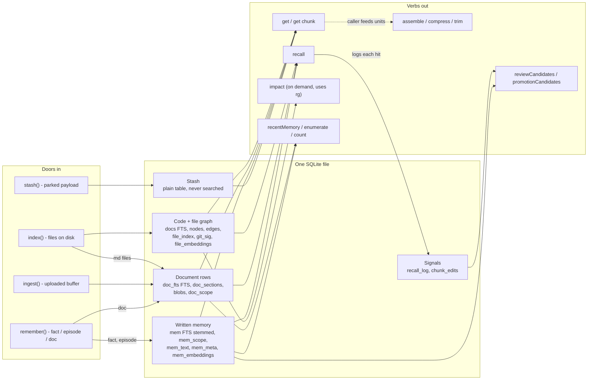
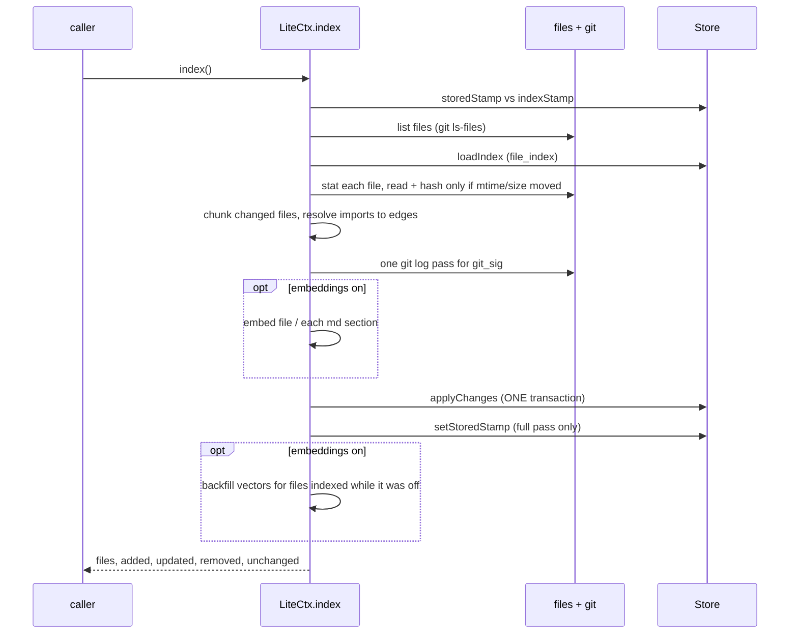
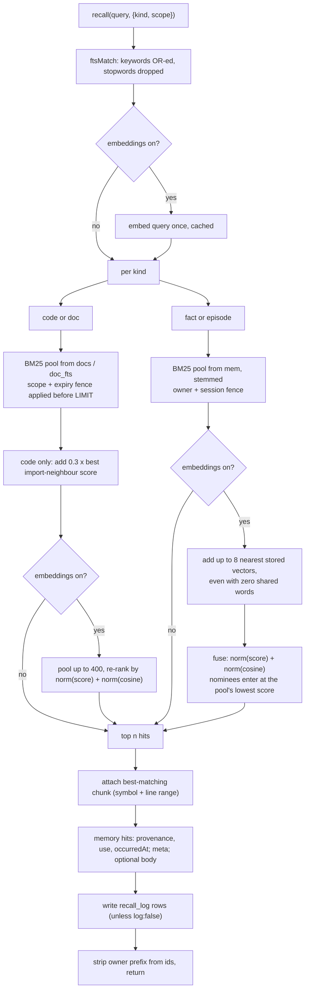
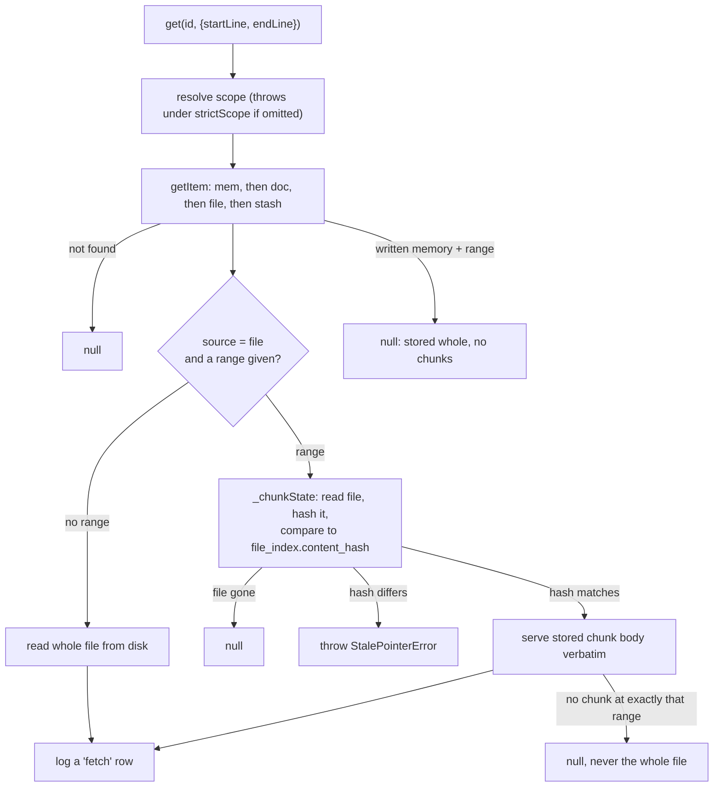
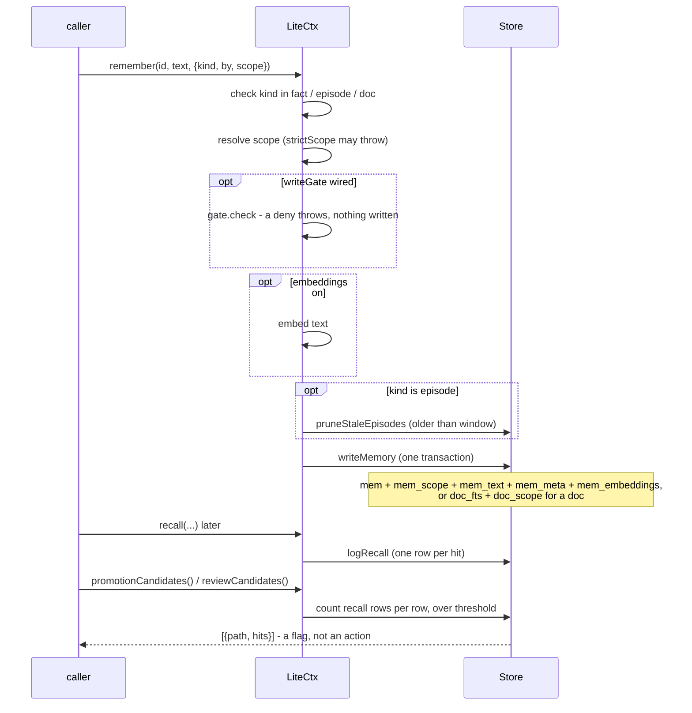
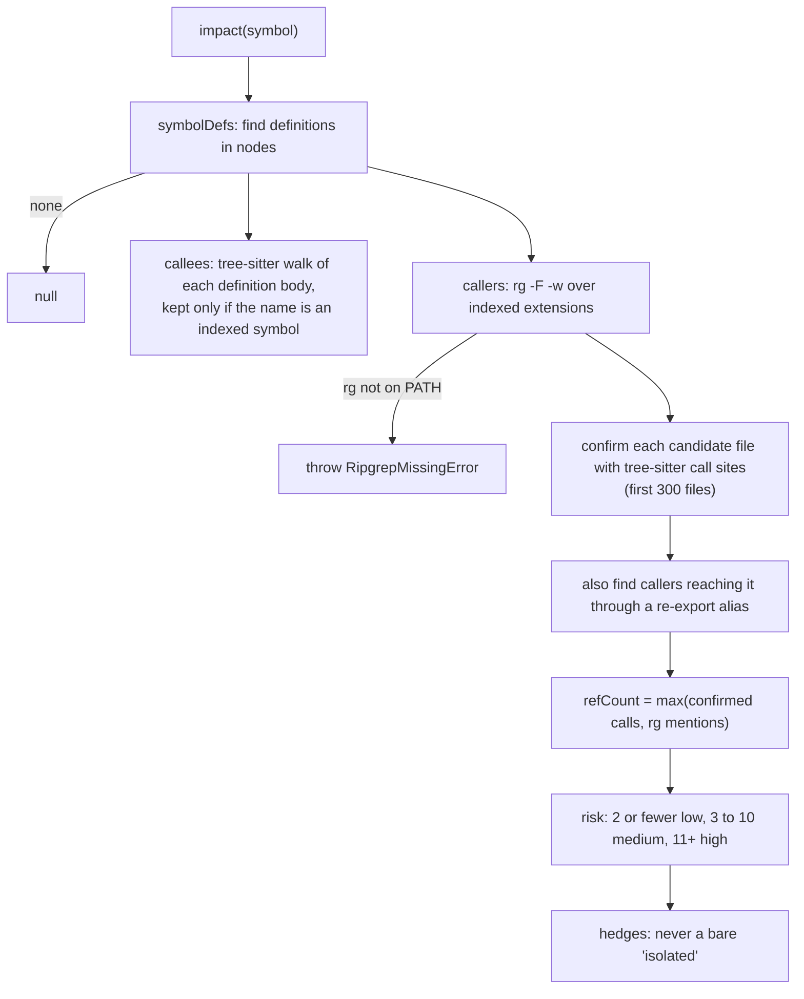

# litectx layers — how context is stored and moved

> Repo-only doc (not shipped to npm). Written for the owner, to understand "the index".
> Every claim cites `file:line` in the code as of this writing. Where a doc and the code disagree, the code
> is what this page describes, and the disagreement is listed in [Doc vs code](#6-doc-vs-code).
> Plain terms used here: **FTS5** = SQLite's built-in full-text search table; **BM25** = the keyword-relevance
> score FTS5 computes; **chunk** = one function, class, or heading section of a file; **embedding** =
> a list of numbers (a vector) that stands for the meaning of a text; **cosine** = how close two such
> vectors are, from -1 to 1.

## 1. Overview and architecture

litectx keeps everything in one SQLite file (`.litectx/index.db`, `src/index.js:269`). Three doors let
content in: `index()` reads files from disk, `ingest()` takes an uploaded buffer, `remember()` takes a
sentence from the agent. Content is then stored as rows in a handful of table groups. A set of verbs reads it
back out: `recall` (ranked search), `get` (fetch by id or by line range), `impact` (who calls this),
`recentMemory` / `enumerate` / `count` (list without a query), and `assemble` (fit a transcript to a token budget).

There is no model inside. Ranking is keyword relevance, plus a small boost for files that import each other,
plus meaning-similarity only if you switch the embeddings tier on (`src/index.js:733-737`, `src/index.js:906-946`).

Sources for the diagram: schema `src/store.js:146-288`; write routing `src/store.js:887-976`; file routing
`src/store.js:840-855`; recall logging `src/index.js:762,778`; stash fallback in `get` `src/store.js:1678-1684`.

## 2. The layers, in plain memory terms

Six layers. The first is mostly *not* litectx's; the last cuts across all the others.

| Layer | Plain meaning | Lives in | How long it lives |
|---|---|---|---|
| Working memory | what the agent is holding right now | the harness, not litectx | one run |
| Indexed knowledge | code and docs that exist as files or uploads | `docs`, `doc_fts`, `nodes`, `edges` | until the file changes or goes away |
| Episodic memory | "what happened" notes | `mem` (kind `episode`) | rolling window, default 30 days |
| Abstract memory | durable facts | `mem` (kind `fact`) | until you `forget` it |
| Signals / logs | a record of what was asked and edited | `recall_log`, `chunk_edits`, `git_sig` | until the row they point at is deleted |
| Scope / tenancy | a fence on who sees what | `mem_scope`, `doc_scope` | same as the row it fences |

### 2.1 Working memory

**Holds.** litectx does **not** hold the agent's current context. The conversation transcript belongs to
the harness (the program driving the model). litectx only offers tools for managing that window.

| Tool | What it does | Where |
|---|---|---|
| `stash(id, text)` / `peek(id)` / `evict(sel)` | Park a big payload, keep a handle, preview its head and tail, delete it later. | `src/index.js:1389,1419,1445` |
| `get(id)` on a stash id | Bring the whole payload back. | `src/store.js:1678-1684` |
| `assemble(units, {budget})` | Keep pinned units and the newest, drop the oldest, never split a tool-call/result pair. | `src/assemble.js:88` |
| `compress(node, {level})` | Render a code chunk as full text, signature only, or a name marker. | `src/compress.js:38` |
| `summaryWindow` / `trim` | Fold old turns into a summary the *host* writes; or evict by size or count. | `src/assemble.js:201,293` |
| `get(path, {startLine, endLine})` | Fetch one chunk instead of a whole file. | `src/index.js:1065-1097` |

**How it gets in.** The caller hands litectx a list of "units" (`{id, role, content, ...}`); litectx never
reads the transcript itself. `src/assemble.js:32`.

**How long it lives.** A stash row lives until `evict` (`src/store.js:1073`). It is never pruned and never indexed
(`src/store.js:274-280`). `assemble` stores nothing; it returns a fitted view and a list of what it dropped
(`src/assemble.js:150-160`).

**How it is found.** A stash is found by exact id only. It sits in no FTS table, so `recall` can never return it.

**Tables.** `stash` only. Everything else here is a pure function over what the caller passes in.

### 2.2 Indexed knowledge: code and docs

**Holds.** Files from your repo, split into chunks, plus the import links between files. Two sub-kinds:

- **Code** (`.ts .js .mjs .cjs .py`): one FTS row per file, many `nodes` rows (one per function/class, plus
  a "preamble" chunk for what is left). Default extensions: `src/index.js:26`.
- **Docs**: `.md` files get **one FTS row per heading section** (`src/store.js:840-855`). Uploads via `ingest()`
  are stored as direct doc rows (below).

**How it gets in.**

- `index()` lists files (`git ls-files`, else a directory walk; `src/indexer.js:75-87`), classifies each by
  **extension only** (`src/indexer.js:63-66`), and re-reads only files whose mtime or size moved
  (`src/indexer.js:116-153`).
- The chunker splits code with tree-sitter and attaches the comment block above a function to that function
  (`src/chunker.js:72-98`). Markdown is cut at each `#` heading, with a "preamble" for text before the first
  heading (`src/chunker.js:201-226`). A markdown file with no headings becomes one whole-file chunk
  (`src/chunker.js:204`).
- `ingest(buffer, {filename})` routes by extension (`src/docparse.js:59-70`): `md pdf docx txt text log csv eml`
  are **chunked** into ~800-char segments (`src/docparse.js:26`) and stored as `doc` rows with ids `<id>#<n>`
  (`src/index.js:1340-1342`). Any other type is stored **byte-exact** in `blobs`, with only the filename
  searchable (`src/index.js:1317-1328`, `src/store.js:992-1009`).

**How long it lives.** Until `index()` sees the file change (rows are replaced) or vanish (rows are deleted)
(`src/store.js:813-820`). Written docs and blobs live until `forget`, or until their optional `expiresAt` passes and
`purge()` reclaims them (`src/store.js:1274-1291`). Expired rows are hidden from `recall`/`get` immediately,
before `purge` runs (`src/store.js:2088-2089`).

**How it is found.** `recall(q, {kind:"code"})` or `{kind:"doc"}`: keyword match, then a small boost from import
neighbours for code. See flow 4.2. `get(path)` reads the file fresh from disk. `impact(symbol)` for callers.

**Tables.** Code: `docs`, `nodes`, `edges`, `file_index`, `git_sig`, `file_embeddings`. Docs: `doc_fts`,
`doc_sections`, `doc_scope`, `blobs`, `mem_text`, `mem_meta`, `mem_embeddings`. Details in section 3.

**Impact (the "who calls this" view).** Computed on demand, never stored. Callees come from a tree-sitter
walk of the symbol's body; callers come from `rg -w` (ripgrep, whole-word) confirmed with tree-sitter
(`src/impact.js:131-200`). Risk is `low` for 2 or fewer references, `medium` for 3-10, `high` for 11+
(`src/impact.js:92-96`), using the larger of confirmed calls and raw text mentions. A missing `rg` throws
instead of reporting "0 callers" (`src/impact.js:29`, `src/impact.js:66`). Only **import** edges are persisted
(`src/store.js:796`); call relationships are never stored.

### 2.3 Episodic memory (episodes)

**Holds.** Short "this happened" notes the agent writes, e.g. "deploy failed on missing env var".

**How it gets in.** `remember(id, text, {kind:"episode"})`. The write stamps `occurred_at` (default now)
(`src/index.js:1168`) and records the instance's `session` in `mem_scope` (`src/store.js:924-928`). Optionally embeds the
text first (`src/index.js:1172`).

**How long it lives.** A rolling window, default 30 days, set by `episodeWindowDays`
(`src/index.js:50,286`; a non-positive value is rejected at `src/index.js:282-285`). Old episodes are deleted
**on the next episode write**, before the new row is inserted, so a write never evicts itself
(`src/index.js:1178-1179`, `src/store.js:1461-1481`). The delete cascades to the text, meta, scope, embedding, and
recall-log rows of those episodes. There is no timer; nothing prunes if nobody writes an episode.

**How it is found.** `recall({kind:"episode"})`, `recentMemory({kind:"episode"})`, `enumerate({kind:"episode"})`.
Episodes are also fenced by `session`: a reader with a session set sees its own episodes plus session-less ones
(`src/store.js:2131`).

**Tables.** `mem` (stemmed FTS), `mem_scope`, `mem_text`, `mem_meta`, `mem_embeddings`.

### 2.4 Abstract memory (facts) and the promotion ladder

**Holds.** Durable statements: "user prefers dark mode", "auth uses JWT".

**How it gets in.** `remember(id, text, {kind:"fact", by:"human"|"agent"})`. `by` is stored as `provenance`
(who asserted it). Re-`remember`ing the same id under the same scope **replaces** the row in place
(`src/store.js:909`, key built at `src/store.js:899`).

**How long it lives.** Until `forget`. Facts are never pruned by time. A per-fact `expiresAt` is silently ignored
for facts; expiry exists on the doc axis only (`src/index.js:1179` passes it, but `src/store.js:908-929` never reads it for `mem`).

**How it is found.** `recall({kind:"fact"})`. With embeddings on, the 8 stored vectors nearest the query are
added to the candidate pool even if they share no word with it (`src/index.js:40,913`; `src/store.js:2469-2489`).

**The ladder: litectx flags, a human or the host decides.** There is no code that turns an episode into a fact.

| Step | What litectx does | Where |
|---|---|---|
| Every recall hit is logged | one `recall_log` row per hit | `src/index.js:762`, `src/store.js:1301` |
| An agent episode recalled 10+ times inside the window | listed by `promotionCandidates()` | `src/store.js:1435-1459`, threshold `src/index.js:51` |
| An agent fact recalled 5+ times | listed by `reviewCandidates()` | `src/store.js:1400-1419` |
| Consumer acts | writes a new fact (`remember`), or re-`remember`s with `by:"human"`, or `forget`s | caller's job |

The count uses only `action='recall'` rows. A `get` writes a separate `'fetch'` row that these two lists ignore
(`src/store.js:1409,1442`; `src/index.js:1095`), so reading a hit after finding it does not double-count.
The window is the same value for pruning and for promotion eligibility (`src/index.js:1524`), so a window shorter than the
time an episode needs to earn 10 recalls starves promotion.

**Tables.** Same as episodes.

### 2.5 Signals and logs

| Signal | Table | Written by | Read by | Used in ranking? |
|---|---|---|---|---|
| Demand: one row per recall hit; `get` adds a `'fetch'` row | `recall_log` (`src/store.js:207`) | `logRecall` `src/store.js:1301` | review/promotion lists; the `use` count on memory hits (`src/store.js:2316-2335`) | **No** |
| Edits: a chunk's body changed between index passes | `chunk_edits` (`src/store.js:271`) | `applyChanges` `src/store.js:825,854` | `recentActivity()` `src/store.js:1491` | **No** |
| Git: commits and last-commit time per file | `git_sig` (`src/store.js:177`) | `applyChanges`, from `collectGitSig` `src/index.js:465` | attached to hits for display `src/store.js:2293` | **No** |
| Trust: `provenance`, `use`, `occurredAt` | columns on `mem`, derived `use` | `remember`, `recall_log` | shown on memory hits | **No** (display only) |

What **is** used for ranking, in full:

1. BM25 keyword score from the FTS5 table of that kind (`src/store.js:2115-2137` for fact/episode, `src/store.js:2147-2160` for code/doc), min-max scaled per query to [0,1] (top lexical hit = 1; a lone hit = 1) by one helper, `scaleScores`, for every kind.
2. For code only: `+0.3 x` the best normalised score among the file's import neighbours in the same result pool
   (`src/index.js:85`, `src/store.js:2180-2217`). Docs have no import edges, so nothing is added (`src/store.js:2196`).
3. Only if embeddings are on: a cosine term, `norm(score) + weight x norm(cosine)`, weight 1.0
   (`src/index.js:33,939-945`).

`chunk_edits` is only written on an incremental pass over an existing index; a cold build or full rebuild writes
none (`src/index.js:497` passes `prev.size > 0`).

### 2.6 Scope and tenancy (the cross-cutting fence)

Two separate fences, one per axis, plus a switch that makes forgetting a scope an error.

| Axis | Applies to | Fence column | Key shape in the table |
|---|---|---|---|
| Memory | `fact`, `episode` | `mem_scope.owner` (+ `session` for episodes) | `owner<US>id`, or bare `id` for the shared tier (`src/store.js:309-311`) |
| Doc | `doc`, blobs (and ingest) | `doc_scope.scope`, `expires_at` | `scope<RS>id`, or `<RS>id` for the shared tier (`src/store.js:325-327`) |
| Code | files | none (repo-wide) | the file path |

`<US>` is ASCII 0x1F and `<RS>` is 0x1E (`src/store.js:302,319`). They are rejected in any caller id, owner, or scope on
write, so a tenant cannot forge another tenant's key (`src/store.js:344-346`, used at `src/store.js:903-904`).

- **Tenant view.** `ctx.scoped("tenant:a")` returns a `ScopedView` that injects that scope into every call
  (`src/index.js:663-668`, `src/index.js:1734-1800`). Reads see `tenant ∪ shared`.
- **`GLOBAL`.** A symbol meaning "the shared tier only" (`src/index.js:118`). Reads see rows with no scope; writes
  go to the shared tier (`src/index.js:569-575`).
- **Omitted scope.** Falls back to the instance's `owner` (memory axis) or sees everything (doc axis).
- **`strictScope: true`.** An omitted scope **throws** on read and write instead of falling back
  (`src/index.js:278`, `src/index.js:569-575,613-620`).
- **Defense in depth on memory.** A tenant's rows are excluded by the physical key *and* by the `mem_scope.owner`
  join; breaking one does not leak (`src/store.js:2115-2134` joins the owner column; keys are owner-prefixed at `src/store.js:899`).
- **Delete is stricter than read.** A tenant `forget({scope})` removes only that owner's rows, not the shared tier
  (`src/store.js:1198-1269`).

## 3. The index, table by table

All tables are created at open (`src/store.js:381`) and migrated forward additively (`src/store.js:382-418`). WAL mode is on (`src/store.js:376`).

| Table | Kind | Key | Written by | Read by |
|---|---|---|---|---|
| `docs` | FTS5, unstemmed | rowid; `path` is not searchable | `applyChanges` for code files (`src/store.js:767-770`) | `recall` kind `code` (`src/store.js:2147-2158`) |
| `doc_fts` | FTS5, unstemmed | rowid; `path` | `applyChanges` for md sections (`src/store.js:772`), `writeMemory` for direct docs (`src/store.js:933`), `writeBlob` (`src/store.js:1002`) | `recall` kind `doc` via `_docPool` (`src/store.js:2080`) |
| `mem` | FTS5, **porter-stemmed** | `path` = `owner<US>id` | `writeMemory` (`src/store.js:909-912`) | `recall` kind `fact`/`episode` (`src/store.js:2115`) |
| `file_index` | regular | `path` | `applyChanges` (`src/store.js:776-781`) | `loadIndex` for change detection (`src/store.js:717`); `fileHash` for drift checks (`src/store.js:1799`) |
| `nodes` | regular | `id`; indexed on `path` | `applyChanges` (`src/store.js:782`) | `attachChunks`, `get` chunk fetch, `impact` (`src/store.js:2242`, `1786`, `1924`) |
| `edges` | regular | `(type, src_path)` and `(type, dst_path)` | `applyChanges`, only `type='import'` (`src/store.js:796`) | recall spreading, `related` (`src/store.js:2196`, `1991`) |
| `git_sig` | regular | `path` | `applyChanges` (`src/store.js:798-801`) | `attachGit` (`src/store.js:2293`) |
| `file_embeddings` | vector BLOB | `path` | `applyChanges` (`src/store.js:803-806`), backfill `putEmbeddings` (`src/store.js:1905`) | code recall re-rank (`src/store.js:2372`) |
| `mem_embeddings` | vector BLOB | `path` (the physical key) | `writeMemory` (`src/store.js:957-963`) | fact/episode re-rank and KNN (`src/store.js:2469`); direct-doc re-rank |
| `doc_sections` | regular + optional vector BLOB | `doc_rowid` = the `doc_fts` rowid | `applyChanges` (`src/store.js:849`) | `search` (`src/store.js:2166`), `docCandidateVectors` (`src/store.js:2414`) |
| `recall_log` | regular, append-only | `id` | `logRecall` (`src/store.js:1301`) | `reviewCandidates`, `promotionCandidates`, `attachMemMeta` |
| `chunk_edits` | regular, append-only | `id` | `applyChanges` (`src/store.js:854`) | `recentActivity` (`src/store.js:1491`) |
| `mem_text` | regular | `path` | `writeMemory` (`src/store.js:946`) | `get` and `recall({body:true})` return the verbatim text (`src/store.js:1748-1764`) |
| `mem_meta` | regular | `path` | `writeMemory` (`src/store.js:950-956`) | `_attachMeta` (`src/index.js:877`); sealed JSON, never searched |
| `mem_scope` | regular | `path` | `writeMemory` (`src/store.js:924-928`) | the owner/session fence in every memory query |
| `doc_scope` | regular | `path`; `rid` = the `doc_fts` rowid | `setDocScope` (`src/store.js:978`) | the doc fence, expiry, and `created_at` for `recentMemory` |
| `blobs` | regular, BLOB column | `path` | `writeBlob` (`src/store.js:1007`) | `get(id).bytes` (`src/store.js:1754-1764`) |
| `stash` | regular | `path` | `writeStash` (`src/store.js:1028`) | `get` fallback, `peekStash` (`src/store.js:1049`) |

### 3.1 Why there are two FTS tables for text, and a third for docs

- **`docs` vs `mem`: stemming.** `mem` uses `porter unicode61` so "refund policy" finds a fact saying "refunds"
  (`src/store.js:263`). `docs` and `doc_fts` use the default tokenizer, because stemming was measured to hurt code
  and doc recall (comment at `src/store.js:255-262`).
- **`docs` vs `doc_fts`: statistics.** BM25 uses table-wide statistics, so mixing docs into the code table shifted
  code ranking. Code stays in `docs`; every `kind='doc'` row lives in `doc_fts` (`src/store.js:147-152`).
- **One kind, one table, one ranking.** Recall runs one query per kind, so scores from different tables are never
  compared (`src/index.js:766-776`).

### 3.2 `source`: file vs direct

Every `docs`/`doc_fts` row has `source` = `'file'` (from `index()`) or `'direct'` (from `remember`/`ingest`)
(`src/store.js:146`). `index()`'s delete step only touches `file_index` keys and `source='file'` rows, so
written memory survives every index pass, including `force` (`src/index.js:442`, `src/store.js:749-750`, `src/index.js:403-411`). Rows in
`mem` are always written, never file-derived.

### 3.3 Row-number pointers

`docs.path` and `doc_fts.path` are not searchable columns, so finding a row by path would scan every body. To avoid
that, `file_index.code_rowid` points at a file's `docs` row (`src/store.js:156`), `doc_sections.doc_rowid` points at
each md section's `doc_fts` row (`src/store.js:194`), and `doc_scope.rid` points at each direct doc's `doc_fts` row
(`src/store.js:252`). A pointer that went missing (older or foreign writer) is repaired on open and on use
(`src/store.js:586,604`).

### 3.4 Embeddings: file vs mem

Two vector tables with the same shape but different key spaces, so a `remember()` whose id equals a file path can
never overwrite that file's vector (`src/store.js:182-189`). Code gets one vector per file from the first 6000
characters (`src/embedder.js:11,57-58`). Markdown gets one vector **per section** in `doc_sections.vec`, and no
file-level vector (`src/index.js:476-486`). Written memory vectors live in `mem_embeddings`. Doc recall routes
each candidate to the right table by its `source` (`src/store.js:2414-2437`). Vectors are float32 BLOBs, not a vector
index; cosine runs by brute force over the candidate pool only (`src/store.js:179-182`).

### 3.5 Stamps and self-heal

An index goes stale when *litectx itself* changes how it chunks. Two independent stamps catch it.

| Stamp | Where | Catches | On mismatch |
|---|---|---|---|
| Whole-index | `PRAGMA user_version` (`src/store.js:1817-1827`) | this repo's litectx was upgraded | full re-chunk of every file (`src/index.js:405-406`) |
| Per-chunk | `nodes.stamp` (`src/store.js:166`) | a *different-version* litectx wrote some chunks | re-chunk just those files (`src/index.js:436-438`, `src/store.js:1839`) |

The stamp value is a hash of all `src/*.js`, not the package version (`src/indexer.js:32-44`). `0` is reserved to mean
"never stamped, rebuild me", and the hash is forced non-zero (`src/indexer.js:42`).

A scoped pass (`index({paths})`) never wipes files outside its scope and never sets the whole-index stamp
(`src/index.js:403-404,498`). A full rebuild clears file rows *inside* the same transaction as the re-insert, so a
reader never sees an empty index (`src/store.js:812`). A no-op `index()` re-reads nothing: it only stats files.

## 4. Flows

### 4.1 `index()` pass

1. Decide whether to rebuild: `force`, or the stored stamp differs (full passes only) (`src/index.js:403-411`).
2. List files and diff against `file_index`: skip on same mtime+size, else hash; same hash only refreshes mtime
   (`src/index.js:441`, `src/indexer.js:116-153`).
3. Chunk each changed file in one parse and collect import specifiers (`src/index.js:447`); resolve them to repo files
   across the whole current file list (`src/index.js:459-460`).
4. Optionally embed (`src/index.js:474-492`).
5. Apply everything in one transaction: delete gone files, replace changed files' rows, nodes, edges, git row,
   vector, and log `chunk_edits` for chunks whose body changed (`src/index.js:497`, `src/store.js:742-877`).
6. Stamp the index if this was a full pass (`src/index.js:498`). Then backfill missing vectors (`src/index.js:506-541`).

### 4.2 `recall()`: doc and code path vs fact and episode path

1. The query becomes a quoted-keyword OR expression. No usable keyword means an empty result (`src/index.js:734`, `src/tokenize.js:70-82`).
2. Kinds are ranked **separately**. A single `kind` string returns a flat list; no `kind` or an array returns
   `{kind: hits[]}` (`src/index.js:757-779`).
3. Code/doc: BM25 from the kind's table with the scope and expiry fence inside the SQL
   (`src/store.js:2080-2091,2147-2158`). Code then gets the import-neighbour boost (`src/store.js:2180-2217`).
4. With embeddings on, the pool is widened to 400 (`SEMANTIC_POOL`, `src/index.js:32,912`), and cosine re-ranks it.
   Code and doc are **BM25-gated**: cosine only reorders words-matched candidates, it never adds new ones
   (`src/store.js:2470`).
5. Fact/episode: the same, plus up to 8 KNN nominees whose cosine is above 0 and that are not already in the pool
   (`src/index.js:40,913`, `src/store.js:2469-2489`). Nominees get the pool's lowest keyword score and compete on
   cosine alone (`src/index.js:938-940`).
6. The raw cosine is attached to **fact/episode hits only** (`src/index.js:936`). The returned `score` is the fused
   value the list is ordered by (`src/index.js:941-945`), comparable within one result list only.
7. A section hit already names its chunk; a code hit gets the smallest chunk containing the most query terms, never
   a container that wins only by wrapping a matching method (`src/store.js:2242-2290`).
8. Every returned hit is logged to `recall_log` (`src/index.js:762,778`).

### 4.3 `get(path, {startLine, endLine})`: fetching one chunk safely

1. The id is looked up as written memory, then a direct doc, then an indexed file, then a stash
   (`src/store.js:1633-1684`).
2. For an indexed file with a range, `_chunkState` reads the file, hashes it, and compares to the hash recorded at
   index time (`src/index.js:806-818`).
3. **Gone from disk** returns `null`. **Changed** throws `StalePointerError`, because the same line range would now be
   different code (`src/index.js:1088`). **Same** serves the stored body unchanged (`src/index.js:1090`,
   `src/store.js:1786`).
4. The range is an **address, not an instruction**: it must match a stored chunk's start and end exactly, or the
   answer is `null`. It never falls back to the whole file (`src/store.js:1786-1791`).
5. `recall({body:true})` uses the same `_chunkState` check, but nulls a single drifted hit instead of throwing, and
   still serves a chunk whose file was deleted (`src/index.js:838-850`).
6. A successful `get` writes a `'fetch'` log row; `log:false` skips it (`src/index.js:1095`).

### 4.4 `remember()` to prune to promotion candidates

1. Validate kind and `by` (`src/index.js:1142-1146`). Resolve the scope for the right axis (`src/index.js:1152-1153`).
2. A wired write gate can deny before anything happens, so a denied write embeds nothing and prunes nothing
   (`src/index.js:1161-1166`).
3. Embed if the tier is on (`src/index.js:1172`).
4. For an episode, delete episodes older than the window **first** (`src/index.js:1178`), then insert (`src/index.js:1179`).
5. `writeMemory` replaces the row for the same `(scope, id)` and writes all sidecar rows in one transaction
   (`src/store.js:887-976`).
6. Later recalls fill `recall_log`. `promotionCandidates` and `reviewCandidates` read it with the same owner/session
   fence as recall (`src/store.js:1400,1435`).
7. litectx stops at the list. Distilling an episode into a fact is the consumer's job.

### 4.5 `impact(symbol)`

1. Definitions are read from `nodes` (`src/store.js:1924`, `src/impact.js:132-133`).
2. Callees: walk each definition body and keep names that are indexed symbols (`src/impact.js:139-146`).
3. Callers: `rg -F -w --json` for the name (`src/impact.js:239-241`), minus hits inside the definition itself
   (`src/impact.js:155-156`), then tree-sitter confirms real call sites in up to 300 files (`src/impact.js:85,167-181`).
   Re-export aliases are checked separately (`src/impact.js:189-191,279`).
4. `refCount` is the larger of confirmed calls and raw mentions; the bucket comes from that (`src/impact.js:194-195`).
   Over-counting is deliberate: a false "isolated" is the one dangerous answer.
5. Zero references produces a hedge saying "review candidate, not a confirmed isolation" (`src/impact.js:208-214`).
6. A missing `rg` throws (`src/impact.js:29`, `src/impact.js:66`). `recall`, `index`, and `get` never use `rg`.

## 5. What litectx deliberately does not do

| Not done | Why (as the code shows) |
|---|---|
| No LLM inside | Writes and ranking are deterministic; the only model is the optional embedder, and it is injected or lazy-loaded (`src/index.js:289-297`, `src/embedder.js:1-7`). The summary in `summaryWindow` is written by a function the host passes in (`src/assemble.js:164-168`). |
| No LSP | Callers come from `rg -w` plus tree-sitter (`src/impact.js:1-9`). Over-count is accepted. |
| No auto-injecting memory into context | `assemble` fits what the caller hands it; it never runs `recall` for you (`src/assemble.js:19-24`). |
| No ranking on activity | `recall_log`, `chunk_edits`, `git_sig`, provenance and `use` are recorded or displayed only (`src/store.js:1424-1425,1486,2308`). |
| No automatic fact promotion | Only candidate lists (`src/store.js:1400,1435`). |
| No time-based fact expiry | Facts are durable; `expiresAt` is doc-axis only (`src/store.js:252`). |
| Embeddings off by default | The library keeps the install lean and offline-capable (`src/index.js:289-291`). With the tier unavailable, calls fall back to keyword-only with one warning (`src/index.js:323-337`). |
| No call-edge storage | Only `import` edges are written (`src/store.js:796`); call relationships are computed per `impact()` call. |

**Parked.** Deferred and retired work is tracked in `docs/product/tinymem.md` (section "Out of scope and deferred").
Nothing there is built, so none of it is described above.

## 6. Doc vs code

Where the code and a doc disagree, the code is right.

**Still open.** None.

**Fixed on branch `fix/recall-score-order` (2026-10-10).** Hit score vs order: with embeddings on, `score` is now the fused
value the list is ordered by (it used to be the pre-fusion keyword score).

**Fixed on branch `tinymem-sections` (2026-10-09).** Eight smaller mismatches found while writing this page were
corrected in the docs and comments, with no change in behaviour:

- `litectx.context.md` Architecture now names three FTS tables (`docs` code, `doc_fts` docs, `mem` facts and
  episodes), and the `src/store.js` comment says written `doc` rows live in `doc_fts`.
- The `edges` comment in `src/store.js` says `type` is always `'import'`; calls are computed by `impact()`, never stored.
- `src/embedder.js` model size: ~23 MB quantized (q8), not ~90 MB.
- `src/compress.js` savings: ~82% with the doc kept, not 95-98%.
- `summaryWindow` example uses `summaryKeep`, the option the code reads.
- The `ingest` `@when` lists `eml` among the chunked types.
- The `impact` example lists `'medium'`, the value the code returns.
- `src/contextgraph.js` cites `docs/product/litectx-prd.md`.

Not in the repo: the project memory still says `summaryWindow` (C2) is "specced, not built". It ships
(`src/assemble.js:201`); the next `/remember` should correct it.
