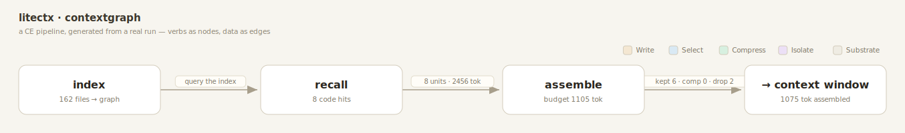

# contextgraph — visualize any CE design built with litectx

Two graphs sit over the same litectx data:

- **codegraph** (`../graph-view`) — the **content** graph: files, `import` edges, risk badges. *What the code is.*
- **contextgraph** (here) — the **pipeline**: the context-engineering verbs a design composes
  (`index` · `recall` · `assemble` · `compress` · `summaryWindow` · `remember` · `impact` …) as nodes,
  and the **data handed between them** as edges. *What a CE design does, end to end.*

It's generated from a **real run**, so it reports what actually happened — units in, tokens, and how
`assemble` resolved the budget (`kept` verbatim · `compressed` to signature · `dropped`) — not a
hand-drawn intent. The graph can't lie about the pipeline.



## Run it

```sh
node examples/contextgraph/contextgraph.mjs
```

Indexes this repo, runs `index → recall → assemble` (a tight budget so FIT, COMPRESS, and drop all
fire), and writes three artifacts next to the script:

| file | what |
|---|---|
| `contextgraph.json` | the **trace** — `{ nodes, edges }`, the primitive's structured output |
| `contextgraph.svg`  | a static render (the image above) |
| `contextgraph.md`   | a **Mermaid** flowchart — agent-readable, renders on GitHub / in any preview |

Open **`index.html`** for the interactive view (click a verb node for its stats). Self-contained, zero deps.

## How it works

Every litectx verb already **returns an accountable result** (`recall` → hits; `assemble` →
`{ units, dropped, tokens }` with `compressed`/`summary` flags). So the recorder in `contextgraph.mjs`
is thin: a node per verb call, an edge per handoff, both read straight from return values — no internal
instrumentation. That recorder is the prototype of a future `contextgraph` library primitive; for now it
lives here as a worked example.

## Adapting it

Swap the pipeline body for your own composition — record a `remember → recall → summaryWindow → assemble`
flow, a sub-agent's `impact`-gated edit, whatever your design is. The verbs are nodes; what each returns
is the edge. (Adopters import from `litectx`; this example imports from `../../src` because it lives in
the repo.)
