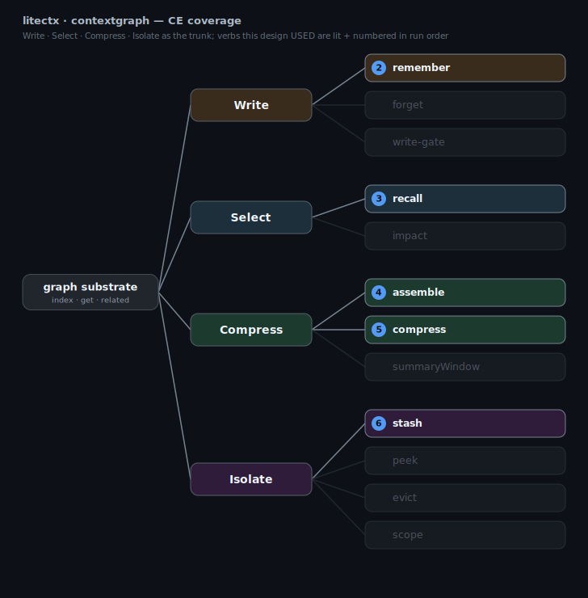

# contextgraph — visualize any CE design built with litectx

Two graphs sit over the same litectx data:

- **codegraph** (`../graph-view`) — the **content** graph: files, `import` edges, risk. *What the code is.*
- **contextgraph** (here) — the **pipeline**: the context-engineering verbs a design composes, as nodes,
  and the data handed between them as edges. *What a CE design does, end to end.*

It's captured from a **real run** (not a hand-drawn build), so it reports what actually happened. Two views:

| view | answers | file |
|---|---|---|
| **flow** | how it ran, in order, with the data on the edges | `*-flow.svg` |
| **tree / coverage** | the **Write · Select · Compress · Isolate** trunk with every verb branching off — the ones this design used are lit + numbered, the rest dim | `*-tree.svg` |



The tree is the diagnostic: drop it next to your build, run, and see which CE primitives you cover, which
you skip, and whether a verb is in the wrong place. The verb→primitive map is source-grounded in the
CE skill-map (`docs/01-product/litectx-prd.md`, Part 2 / Appendix CE-T).

## The drop-in — `observe()`

Wrap your `LiteCtx` once, run your loop normally, read `.trace`. It records every verb call **live** —
it works because each verb returns an accountable result, so the proxy reads args-in + result-out with
**zero** changes to litectx internals.

```js
import { observe } from "./recorder.mjs";
const ctx = observe(new LiteCtx({ root }));
const assemble = ctx.tap("assemble", rawAssemble);   // free-function verbs join the same trace

await ctx.index();  await ctx.recall(q);  await assemble(units, { budget });  ctx.stash(id, payload);

ctx.trace.treeSvg();   // CE coverage
ctx.trace.svg();       // flow
ctx.trace.json();      // the structured trace
```

## Run it

```sh
node examples/contextgraph/pipeline.mjs     # the observe() drop-in — exercises all 4 primitives
node examples/contextgraph/contextgraph.mjs # a minimal index → recall → assemble flow
node examples/contextgraph/from-bench.mjs   # contextgraph applied to poc/assemble-bench.mjs (A/B branch)
```

Then serve the folder and open **`index.html`** for the **interactive** view — toggle flow/tree, click any
verb for its recorded calls:

```sh
cd examples/contextgraph && python3 -m http.server 8011
# → http://127.0.0.1:8011/index.html   (a server is needed; index.html fetches the JSON)
```

## Files

- `recorder.mjs` — the `ContextGraph` recorder (`svg`/`treeSvg`/`mermaid`/`json`), the W/S/C/I taxonomy,
  and `observe()`. The prototype of a future `src/contextgraph.js` lib primitive.
- `pipeline.mjs` · `contextgraph.mjs` · `from-bench.mjs` — three real pipelines that emit the artifacts.
- `index.html` — the zero-dep interactive viewer.
- `contextgraph*.{json,svg,md}` — generated artifacts (re-run a script to refresh).

(Adopters import from `litectx`; these examples import from `../../src` because they live in the repo.)
