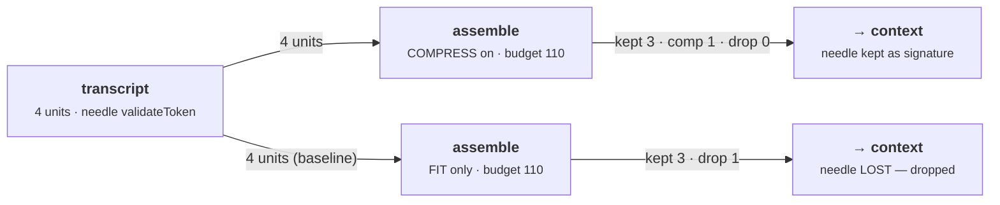

# contextgraph — assemble bench (generated)

```mermaid
flowchart LR
  n0["<b>transcript</b><br/><small>4 units · needle validateToken</small>"]
  n1["<b>assemble</b><br/><small>COMPRESS on · budget 110</small>"]
  n2["<b>→ context</b><br/><small>needle kept as signature</small>"]
  n3["<b>assemble</b><br/><small>FIT only · budget 110</small>"]
  n4["<b>→ context</b><br/><small>needle LOST — dropped</small>"]
  n0 -->|"4 units"| n1
  n1 -->|"kept 3 · comp 1 · drop 0"| n2
  n0 -->|"4 units (baseline)"| n3
  n3 -->|"kept 3 · drop 1"| n4
```
