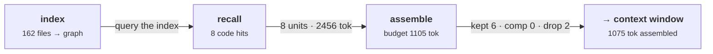

# contextgraph (generated)

```mermaid
flowchart LR
  n0["<b>index</b><br/><small>162 files → graph</small>"]
  n1["<b>recall</b><br/><small>8 code hits</small>"]
  n2["<b>assemble</b><br/><small>budget 1105 tok</small>"]
  n3["<b>→ context window</b><br/><small>1075 tok assembled</small>"]
  n0 -->|"query the index"| n1
  n1 -->|"8 units · 2456 tok"| n2
  n2 -->|"kept 6 · comp 0 · drop 2"| n3
```
